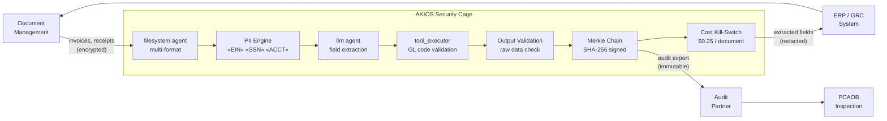

<header class="post-header">
  <div class="post-meta">February 6, 2026 &bull; <span>5 min read</span></div>
  <h1>Building a SOX-Compliant AI Security Cage for Accounting in 15 Seconds</h1>
</header>

<div class="post-content">

The biggest barrier to adopting AI in accounting isn't model capability — it's **confidentiality**. How do you use powerful LLMs like Grok or GPT-4 on quarterly financials containing EINs, bank account numbers, and sensitive audit findings without violating SOX Section 302?

The answer isn't to avoid AI, but to wrap it in a **Security Cage**.

## The Problem

Accounting firms process thousands of financial documents every quarter — invoices, tax returns, bank statements, payroll records. Each one contains data that, if leaked, exposes the firm to malpractice liability and regulatory sanctions. Manual review is slow, expensive, and error-prone. AI can do it in seconds — but traditional AI deployments have no built-in controls for SOX compliance.

AKIOS changes this: AI-powered document analysis with **zero raw data exposure**.

## The Regulatory Landscape

SOX compliance for AI in accounting spans multiple overlapping requirements:

<table>
  <thead>
    <tr><th>Regulation</th><th>Scope</th><th>How AKIOS Enforces</th></tr>
  </thead>
  <tbody>
    <tr>
      <td><strong>SOX Section 302</strong></td>
      <td>CEO/CFO must certify financial reports are accurate and controls are effective</td>
      <td>Merkle audit chain provides cryptographic proof of every AI-assisted analysis</td>
    </tr>
    <tr>
      <td><strong>SOX Section 404</strong></td>
      <td>Internal controls over financial reporting must be documented and tested</td>
      <td>Policy-as-code defines controls before execution. Every control is logged.</td>
    </tr>
    <tr>
      <td><strong>PCAOB AS 2201</strong></td>
      <td>Auditors must evaluate IT general controls for financial systems</td>
      <td>Sandbox isolation + signed policies = demonstrable ITGC compliance</td>
    </tr>
    <tr>
      <td><strong>AICPA / GAAP</strong></td>
      <td>Professional standards govern use of technology in audit engagements</td>
      <td>Deterministic sandbox ensures reproducible results across engagements</td>
    </tr>
    <tr>
      <td><strong>IRS Circular 230</strong></td>
      <td>Tax practitioners must maintain confidentiality of client information</td>
      <td>PII redaction ensures EINs, SSNs, and financial data never reach the model</td>
    </tr>
  </tbody>
</table>

## The Concept: Policy as Code

AKIOS introduces the concept of a "Security Cage" — an ephemeral, sandboxed runtime environment where data is processed under strict, code-defined policies. The cage is destroyed after each execution. No persistent state. No data leakage vector.

## The Workflow: Automated Audit Risk Analysis

<table>
  <thead>
    <tr><th>Step</th><th>What Happens</th><th>Security Control</th></tr>
  </thead>
  <tbody>
    <tr>
      <td><strong>1. Ingestion</strong></td>
      <td>Raw financial review file loaded into the secure workspace</td>
      <td>Read-only filesystem agent. Documents can't be copied outside the cage.</td>
    </tr>
    <tr>
      <td><strong>2. Redaction</strong></td>
      <td>EINs, SSNs, bank account numbers, salary figures redacted in memory</td>
      <td>50+ PII patterns replaced with tokens. Originals never reach the LLM.</td>
    </tr>
    <tr>
      <td><strong>3. Analysis</strong></td>
      <td>AI identifies material misstatements, control weaknesses, going concern indicators</td>
      <td>Budget capped ($0.25/document), no network access, no persistent storage.</td>
    </tr>
    <tr>
      <td><strong>4. Integration</strong></td>
      <td>Sanitized findings deployed to whitelisted ERP/GRC system</td>
      <td>Anomalies flagged for human review. AI cannot approve or file anything.</td>
    </tr>
    <tr>
      <td><strong>5. Audit</strong></td>
      <td>Every extraction, classification, and validation logged with crypto signatures</td>
      <td>Complete chain available for PCAOB and SOX 404 inspection.</td>
    </tr>
  </tbody>
</table>

### Architecture



### Policy Configuration

```yaml
# accounting-sox-policy.yml
security:
  sandbox: strict
  network: isolated
  allowed_endpoints: []
  pii_redaction:
    enabled: true
    patterns: [ssn, ein, bank_account, routing_number, salary, date_of_birth]
    mode: aggressive
  budget:
    max_cost_per_run: 0.25
    currency: USD
  audit:
    merkle_chain: true
    export_format: jsonl
    retention_days: 2555  # 7 years — SOX requirement
```

## What the Auditor Sees

<table>
  <thead>
    <tr><th>Field</th><th>Value</th></tr>
  </thead>
  <tbody>
    <tr><td>Document</td><td>invoice-Q4-2025-****3291.pdf</td></tr>
    <tr><td>Extraction</td><td>Vendor: [REDACTED] | Amount: $47,250.00 | Date: 12/15/2025 | GL Code: 6200</td></tr>
    <tr><td>Validation</td><td>✅ GL 6200 matches Chart of Accounts — Operating Expenses</td></tr>
    <tr><td>Flag</td><td>⚠️ Amount exceeds $25K threshold — routed to partner review per firm policy</td></tr>
    <tr><td>Confidence</td><td>96%</td></tr>
    <tr><td>Audit Hash</td><td><code>a2c7d4...e19b</code></td></tr>
    <tr><td>Raw Data Exposed</td><td>❌ None — all client PII redacted before extraction</td></tr>
  </tbody>
</table>

## Why It Matters

- **Client Data Protected:** EINs, SSNs, and financial data redacted before any AI contact. Even a compromised model can't leak anything.
- **SOX Compliance Built-In:** Every AI action produces a tamper-proof log entry. The Merkle chain ensures no step can be altered.
- **Deterministic Processing:** Same document always produces the same extraction result — essential for audit consistency.
- **Cost Predictability:** Strict per-document budget limits prevent surprises during busy season batch processing.
- **PCAOB Ready:** Complete inference chains are exportable for inspection, meeting 7-year retention requirements.

## Try It Yourself

```bash
pip install akios
akios init accounting-demo
akios run templates/accounting.yml
```

Secure your AI. Build with AKIOS.

</div>

<div class="post-footer">
  <p>Related: <a href="banking-security-cage.html">PCI-DSS Compliant AI for Banking</a> | <a href="../case-studies/accounting-document-processing.html">Accounting Case Study</a></p>
  <div class="share-links">
    <span>Share this post:</span>
    <a href="#" target="_blank">Twitter</a>
    <a href="#" target="_blank">LinkedIn</a>
    <a href="#" target="_blank">Hacker News</a>
  </div>
  <a href="./">← Back to Blog</a>
</div>
