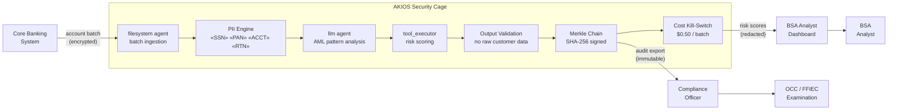

<header class="post-header">
  <div class="post-meta">February 6, 2026 &bull; <span>5 min read</span></div>
  <h1>Building a PCI-DSS Compliant AI Security Cage for Banking in 15 Seconds</h1>
</header>

<div class="post-content">

The biggest barrier to adopting AI in banking isn't model capability — it's **compliance**. How do you use powerful LLMs like Grok or GPT-4 on customer transaction data without triggering a PCI-DSS or BSA/AML violation?

The answer isn't to avoid AI, but to wrap it in a **Security Cage**.

## The Problem

Banks process millions of transactions daily. Fraud detection, AML screening, and suspicious activity reporting are critical but labor-intensive. AI can analyze patterns across thousands of accounts in seconds — but connecting a model to customer data creates a new attack surface. SSNs, account numbers, routing numbers, and transaction histories are all in play. A single leak means regulatory action, lawsuits, and loss of customer trust.

AKIOS lets you deploy AI on transaction data **without exposing any customer identifiers**.

## The Regulatory Landscape

Banking compliance for AI spans overlapping federal and industry requirements:

<table>
  <thead>
    <tr><th>Regulation</th><th>Scope</th><th>How AKIOS Enforces</th></tr>
  </thead>
  <tbody>
    <tr>
      <td><strong>PCI-DSS v4.0</strong></td>
      <td>Cardholder data must be encrypted, access-controlled, and audited</td>
      <td>PII redaction strips card numbers before AI processing. Audit chain proves compliance.</td>
    </tr>
    <tr>
      <td><strong>GLBA / Reg P</strong></td>
      <td>Customer financial information must be protected with documented safeguards</td>
      <td>Cage isolation + policy-as-code = documented, enforceable safeguards.</td>
    </tr>
    <tr>
      <td><strong>BSA / AML</strong></td>
      <td>Banks must detect and report suspicious activity with complete audit trails</td>
      <td>Merkle chain provides tamper-evident record of every AI-assisted analysis.</td>
    </tr>
    <tr>
      <td><strong>OCC / FFIEC</strong></td>
      <td>AI model governance requires explainability and human oversight</td>
      <td>Complete inference chains exportable per analysis. Human review portal for SAR decisions.</td>
    </tr>
    <tr>
      <td><strong>SOX (for public banks)</strong></td>
      <td>Internal controls over financial reporting must be documented and tested</td>
      <td>Every AI action produces a signed log entry with policy provenance.</td>
    </tr>
  </tbody>
</table>

## The Concept: Policy as Code

AKIOS introduces the concept of a "Security Cage" — an ephemeral, sandboxed runtime environment where data is processed under strict, code-defined policies. The cage is destroyed after each execution. No persistent state. No data leakage vector.

## The Workflow: Automated AML Risk Analysis

<table>
  <thead>
    <tr><th>Step</th><th>What Happens</th><th>Security Control</th></tr>
  </thead>
  <tbody>
    <tr>
      <td><strong>1. Ingestion</strong></td>
      <td>Customer account batch loaded into the Security Cage</td>
      <td>SSNs, account numbers, and card data redacted before AI sees anything.</td>
    </tr>
    <tr>
      <td><strong>2. Redaction</strong></td>
      <td>Customer identifiers stripped and replaced with tokens</td>
      <td>50+ PII patterns including PANs, routing numbers, SSNs, DOBs replaced.</td>
    </tr>
    <tr>
      <td><strong>3. Analysis</strong></td>
      <td>AI analyzes transaction patterns for structuring, layering, unusual velocity</td>
      <td>Budget capped ($0.50/batch), network isolated, no persistent storage.</td>
    </tr>
    <tr>
      <td><strong>4. Classification</strong></td>
      <td>Accounts classified as low/medium/high risk with confidence scores</td>
      <td>AI cannot file SARs or freeze accounts. All actions require human confirmation.</td>
    </tr>
    <tr>
      <td><strong>5. Audit</strong></td>
      <td>Every inference and data access signed cryptographically</td>
      <td>OCC examiners can trace the complete decision path for any flagged account.</td>
    </tr>
  </tbody>
</table>

### Architecture



### Policy Configuration

```yaml
# banking-pci-dss-policy.yml
security:
  sandbox: strict
  network: isolated
  allowed_endpoints: []
  pii_redaction:
    enabled: true
    patterns: [ssn, pan, account_number, routing_number, card_cvv, date_of_birth]
    mode: aggressive
  budget:
    max_cost_per_run: 0.50
    currency: USD
  audit:
    merkle_chain: true
    export_format: jsonl
    retention_days: 2555  # 7 years — BSA/AML requirement
  constraints:
    sar_filing: disabled  # AI cannot file Suspicious Activity Reports
    account_freeze: disabled
    human_review: required_for_high_risk
```

## What the BSA Analyst Sees

<table>
  <thead>
    <tr><th>Field</th><th>Value</th></tr>
  </thead>
  <tbody>
    <tr><td>Batch</td><td>AML-2026-0206-****9274 (2,847 accounts)</td></tr>
    <tr><td>High Risk</td><td>12 accounts flagged — structuring pattern detected</td></tr>
    <tr><td>Pattern</td><td>17 cash deposits of $9,500–$9,900 across 3 branches over 14 days (just below $10K CTR threshold)</td></tr>
    <tr><td>Risk Score</td><td>0.94 (critical)</td></tr>
    <tr><td>Recommended</td><td>SAR filing recommended — structured deposits consistent with smurfing</td></tr>
    <tr><td>Confidence</td><td>97%</td></tr>
    <tr><td>Audit Hash</td><td><code>c4e8b2...a73d</code></td></tr>
    <tr><td>Customer Data Exposed</td><td>❌ None — all PII redacted before analysis</td></tr>
  </tbody>
</table>

No SSNs. No account numbers. No card details. Just risk intelligence with a cryptographic proof chain.

## Why It Matters

- **Customer Data Protected:** SSNs, PANs, and account numbers redacted before any AI contact. Even a compromised model can't leak anything.
- **PCI-DSS Compliant:** Cardholder data is never stored, processed, or transmitted outside the cage. The audit chain proves it.
- **BSA/AML Ready:** Complete decision chains are exportable for FinCEN and OCC examination.
- **No Unauthorized Actions:** Hard-coded constraints prevent AI from filing SARs, freezing accounts, or taking any financial action without human confirmation.
- **Cost Controlled:** Per-batch budget limits prevent runaway costs when processing millions of transactions.

## Try It Yourself

```bash
pip install akios
akios init banking-demo
akios run templates/banking.yml
```

Secure your AI. Build with AKIOS.

</div>

<div class="post-footer">
  <p>Related: <a href="accounting-security-cage.html">SOX-Compliant AI for Accounting</a> | <a href="../case-studies/banking-fraud-detection.html">Banking Fraud Detection Case Study</a></p>
  <div class="share-links">
    <span>Share this post:</span>
    <a href="#" target="_blank">Twitter</a>
    <a href="#" target="_blank">LinkedIn</a>
    <a href="#" target="_blank">Hacker News</a>
  </div>
  <a href="./">← Back to Blog</a>
</div>
