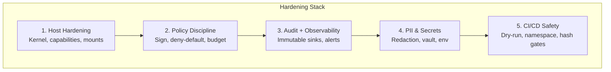

<header class="post-header">
  <div class="post-meta">
    January 26, 2026 &bull; <span>5 min read</span>
  </div>
  <h1>Hardening Checklist for AKIOS 1.0</h1>
</header>

<div class="post-content">

AKIOS is minimal by design, but you still need a few guardrails to keep agents contained in real environments. Use this checklist before you ship to production.

## Why Hardening Matters

AKIOS provides kernel-level isolation out of the box. But the runtime is only one layer. The host, the CI/CD pipeline, the policy management process, and the audit storage all need to be hardened too. A Security Cage is only as strong as the weakest layer in the stack.

This checklist covers the five hardening domains:



## The Checklist

<table>
  <thead>
    <tr><th>Domain</th><th>Check</th><th>Command / Action</th><th>Priority</th></tr>
  </thead>
  <tbody>
    <tr>
      <td rowspan="3"><strong>Host</strong></td>
      <td>Recent Linux kernel with <code>seccomp</code>, <code>userns</code>, <code>cgroups v2</code></td>
      <td><code>uname -r</code> → 5.15+</td>
      <td>🔴 Critical</td>
    </tr>
    <tr>
      <td>Drop unneeded capabilities (<code>NET_ADMIN</code>, <code>SYS_ADMIN</code>)</td>
      <td><code>capsh --print</code></td>
      <td>🔴 Critical</td>
    </tr>
    <tr>
      <td>Mount <code>/tmp</code> as <code>noexec</code></td>
      <td><code>mount -o remount,noexec /tmp</code></td>
      <td>🟡 Recommended</td>
    </tr>
    <tr>
      <td rowspan="3"><strong>Policy</strong></td>
      <td>Sign policies; load only signed artifacts in CI/CD</td>
      <td><code>akios policy sign policy.yml</code></td>
      <td>🔴 Critical</td>
    </tr>
    <tr>
      <td>Default-deny network and filesystem; allowlist exact hosts and paths</td>
      <td>Verify <code>network: isolated</code> in policy</td>
      <td>🔴 Critical</td>
    </tr>
    <tr>
      <td>Per-tool budgets tight; fail closed on budget overflow</td>
      <td><code>budget.max_cost_per_run: 0.50</code></td>
      <td>🟡 Recommended</td>
    </tr>
    <tr>
      <td rowspan="3"><strong>Audit</strong></td>
      <td>Ship audit logs to immutable sink (append-only bucket)</td>
      <td><code>akios audit export --format jsonl</code></td>
      <td>🔴 Critical</td>
    </tr>
    <tr>
      <td>Enable Merkle proofs export; validate in CI smoke tests</td>
      <td><code>akios audit verify</code></td>
      <td>🔴 Critical</td>
    </tr>
    <tr>
      <td>Alert on sandbox escapes, policy denials, kill-switch activations</td>
      <td>Configure alerting in monitoring stack</td>
      <td>🟡 Recommended</td>
    </tr>
    <tr>
      <td rowspan="2"><strong>PII</strong></td>
      <td>Keep PII redaction on for all agents; treat opt-outs as exceptions</td>
      <td><code>pii_redaction: { enabled: true, mode: aggressive }</code></td>
      <td>🔴 Critical</td>
    </tr>
    <tr>
      <td>Store secrets in vault; inject via env with least privilege</td>
      <td>Never put secrets in prompts or policy files</td>
      <td>🔴 Critical</td>
    </tr>
    <tr>
      <td rowspan="3"><strong>CI/CD</strong></td>
      <td>Gate PRs on <code>akios run --dry-run</code></td>
      <td>Add to CI pipeline before merge</td>
      <td>🟡 Recommended</td>
    </tr>
    <tr>
      <td>Run sample workflows in throwaway namespace/VM per PR</td>
      <td>Ephemeral runners in CI</td>
      <td>🟡 Recommended</td>
    </tr>
    <tr>
      <td>Block merges if audit output deviates from expected hash chain</td>
      <td><code>akios audit verify --expected-hash $HASH</code></td>
      <td>🟡 Recommended</td>
    </tr>
  </tbody>
</table>

## Example: Hardened Policy

Here's a production-ready policy with all hardening applied:

```yaml
# hardened-production.yml
version: 1
name: "hardened-production"

security:
  sandbox: strict
  network: isolated
  allowed_endpoints: []  # default-deny

filesystem:
  allow:
    - path: "/workspace/input"
      mode: "r"
    - path: "/workspace/output"
      mode: "w"
  deny_writes: true  # everywhere else

http:
  allow: []  # no HTTP access
  redact_headers: ["authorization", "cookie", "x-api-key"]

llm:
  provider: "openai"
  model: "gpt-4.1"
  max_tokens: 500
  budget_usd: 0.50
  redact_prompts: true
  redact_responses: true

tools:
  allow:
    - name: "jq"
    - name: "grep"
  timeout_sec: 20
  working_dir: "/workspace"

audit:
  merkle: true
  pii_redaction: true
  export_format: jsonl
  retention_days: 2555  # 7 years

pii_redaction:
  enabled: true
  mode: aggressive
  patterns: [ssn, ein, credit_card, bank_account, email, phone, api_key]
```

## Verifying Your Hardening

Run the built-in diagnostics to check your hardening posture:

```bash
# Check system readiness
akios doctor

# Validate policy before deployment
akios run --dry-run templates/my-workflow.yml

# Verify audit chain integrity
akios audit verify

# Generate compliance report
akios compliance report --format detailed
```

Expected output from `akios doctor`:

```
[akios] System Diagnostics
  ✅ Kernel: 6.1.0 (seccomp-bpf supported)
  ✅ cgroups: v2 enabled
  ✅ User namespaces: enabled
  ✅ /tmp: noexec mount
  ✅ Capabilities: minimal set
  ⚠️  Docker: available (fallback mode)
  ✅ PII redaction: enabled (aggressive mode)
  ✅ Audit: Merkle chain initialized
```

## Common Mistakes

1. **Running with `--no-sandbox`** — Never disable the sandbox in production. If you need debugging, use `--dry-run` instead.
2. **Allowing `*` in network policies** — This defeats the purpose. Allowlist specific hosts.
3. **Storing API keys in policy files** — Use environment variables or a secrets vault.
4. **Ignoring audit chain breaks** — A broken chain means something was tampered with. Investigate immediately.
5. **Setting budget to unlimited** — Always set a budget, even if generous. The kill-switch is your last line of defense.

## Try It Yourself

```bash
pip install akios
akios doctor
akios run --dry-run templates/hello-workflow.yml
```

Ship with these basics and you'll keep your security tight while you iterate.

Secure your AI. Build with AKIOS.

</div>

<div class="post-footer">
  <p>Related: <a href="release-notes-v0-1-0.html">AKIOS v1.0 Release Notes</a> | <a href="policy-schema-deep-dive.html">Policy Schema Deep Dive</a></p>
  <div class="share-links">
    <span>Share this post:</span>
    <a href="#" target="_blank">Twitter</a>
    <a href="#" target="_blank">LinkedIn</a>
    <a href="#" target="_blank">Hacker News</a>
  </div>
  <a href="./">← Back to Blog</a>
</div>
