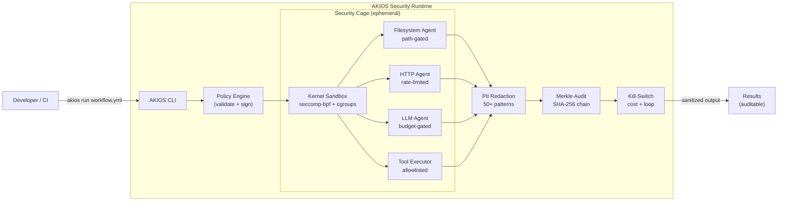

<header class="post-header">
  <div class="post-meta">
    January 14, 2026 &bull; <span>6 min read</span>
  </div>
  <h1>Introducing AKIOS: A Secure Runtime for Untrusted AI Agents</h1>
</header>

<div class="post-content">

Today we are announcing **AKIOS**, a new open-source runtime designed specifically for running untrusted AI agents on local machines.

## The Problem: "curl | sh" for Agents

We are entering an era where developers routinely run AI agents that generate and execute code. Current practices often involve running these agents directly on the host machine or inside loosely configured Docker containers.

This is risky. Agents can hallucinate destructive commands, exfiltrate credentials, or accidentally modify critical system files. We need a runtime that **assumes the agent is untrusted by default**.

The typical "solutions" — Docker containers, VM isolation, or hope — leave critical gaps:

<table>
  <thead>
    <tr><th>Approach</th><th>Network Control</th><th>PII Redaction</th><th>Cost Kill-Switch</th><th>Audit Trail</th><th>Setup Time</th></tr>
  </thead>
  <tbody>
    <tr>
      <td><strong>Bare Metal</strong></td>
      <td>❌ None</td>
      <td>❌ None</td>
      <td>❌ None</td>
      <td>❌ None</td>
      <td>0 sec</td>
    </tr>
    <tr>
      <td><strong>Docker</strong></td>
      <td>⚠️ Manual iptables</td>
      <td>❌ None</td>
      <td>❌ None</td>
      <td>⚠️ Basic logs</td>
      <td>~30 min</td>
    </tr>
    <tr>
      <td><strong>VM (Firecracker)</strong></td>
      <td>⚠️ NAT config</td>
      <td>❌ None</td>
      <td>❌ None</td>
      <td>⚠️ Syslog</td>
      <td>~1 hour</td>
    </tr>
    <tr>
      <td><strong>AKIOS</strong></td>
      <td>✅ Policy-gated</td>
      <td>✅ 50+ patterns</td>
      <td>✅ Per-workflow</td>
      <td>✅ Merkle chain</td>
      <td>15 sec</td>
    </tr>
  </tbody>
</table>

## Enter AKIOS

AKIOS provides a strict sandbox based on `seccomp-bpf` and user namespaces. It follows a **"deny-by-default"** philosophy for both network and filesystem access.

### Architecture Overview



### Key Features

**Strict Sandboxing** — Agents run in isolated environments with minimal privileges. On Linux, this uses kernel-level controls (cgroups v2 + seccomp-bpf). On other platforms, Docker provides strong container isolation.

**Explicit Policies** — You define exactly which domains an agent can contact, which files it can read/write, and what commands it can execute. Everything else is blocked.

```yaml
# Example: minimal policy for a doc-summary agent
version: 1
name: "doc-summary"
filesystem:
  allow:
    - path: "/workspace/docs"
      mode: "r"
http:
  allow:
    - host: "api.openai.com"
      methods: ["POST"]
      rate_limit_per_min: 10
llm:
  provider: "openai"
  model: "gpt-4.1"
  budget_usd: 0.50
audit:
  merkle: true
  pii_redaction: true
```

**Real-Time PII Redaction** — Over 50 patterns detected and redacted in under 50ms — SSNs, credit card numbers, API keys, emails, phone numbers — before they ever reach the agent.

**Tamper-Evident Audit** — Every action is cryptographically logged in a Merkle chain. If even one byte is altered, the chain breaks. This isn't just logging — it's cryptographic proof.

**Cost Kill-Switches** — Hard termination on budget exceed or infinite loops. Set a $1.00 limit per workflow and know it will be enforced.

## How It Works: 30-Second Demo

```bash
# Install
pip install akios

# Initialize a project
akios init my-project
cd my-project

# Run a sandboxed workflow
akios run templates/hello-workflow.yml
```

What you'll see:

```
[akios] sandbox: seccomp-bpf, cgroups v2 (Linux)
[akios] pii: redaction enabled (50+ patterns)
[akios] audit: Merkle trail initialized
[akios] budget: $0.50 limit enforced
[akios] workflow: completed successfully in 1.2s
[akios] audit: chain verified ✓ (hash: a3b7c9...d2e1)
```

## What Makes AKIOS Different

This isn't another AI framework. It's a **security runtime**.

- **Frameworks** give you tools to build agents. AKIOS gives you a cage to run them safely.
- **Docker** gives you container isolation. AKIOS gives you policy-gated, PII-redacted, cost-limited, cryptographically audited execution.
- **Trust-me architectures** rely on developers doing the right thing. AKIOS enforces it at the kernel level.

## What's Next?

This is just the beginning. We are working on:

- **Multi-agent orchestration** — parallel execution with inter-agent policy gates
- **Database connectors** — PostgreSQL, SQLite with query-level policy enforcement
- **Plugin system** — community agents with sandboxed plugin architecture
- **Hardware-accelerated inference** — GPU access within the sandbox with memory isolation

Check out the [Quickstart](../docs/quickstart.html) guide to give it a spin, or browse the [source on GitHub](https://github.com/akios-ai/akios).

## Try It Yourself

```bash
pip install akios
akios init my-project
akios run templates/hello-workflow.yml
```

Secure your AI. Build with AKIOS.

</div>

<div class="post-footer">
  <p>Related: <a href="release-notes-v0-1-0.html">AKIOS v1.0 Release Notes</a> | <a href="secure-agent-communication.html">How AKIOS Isolates Agent Interactions</a></p>
  <div class="share-links">
    <span>Share this post:</span>
    <a href="#" target="_blank">Twitter</a>
    <a href="#" target="_blank">LinkedIn</a>
    <a href="#" target="_blank">Hacker News</a>
  </div>
  <a href="./">← Back to Blog</a>
</div>
