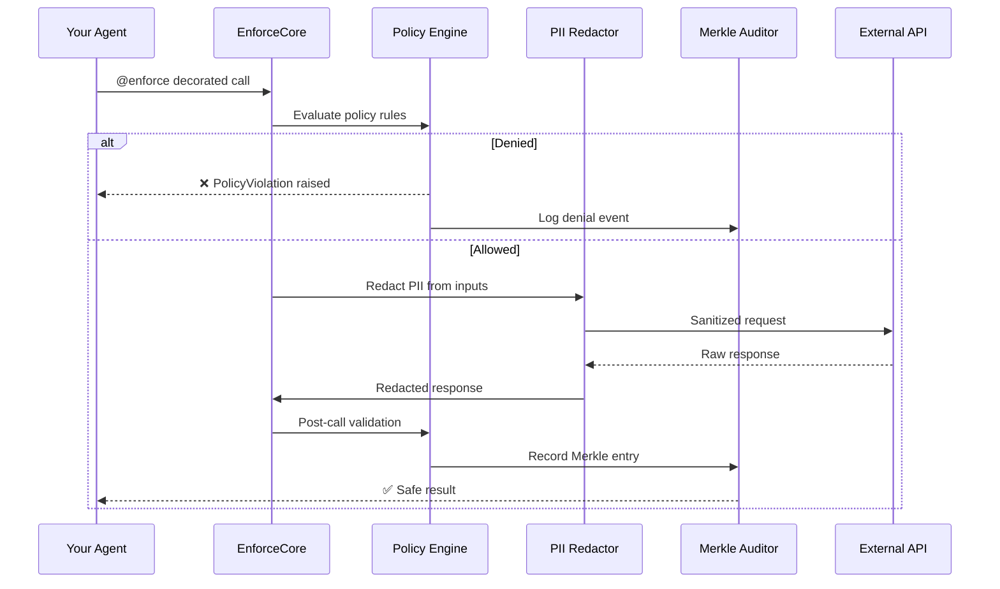
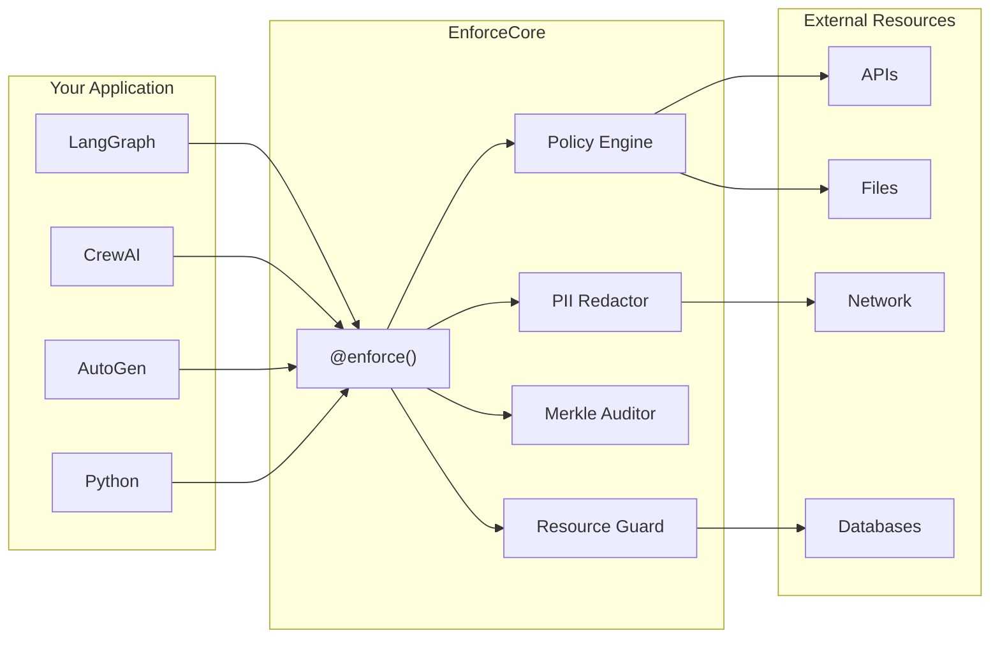
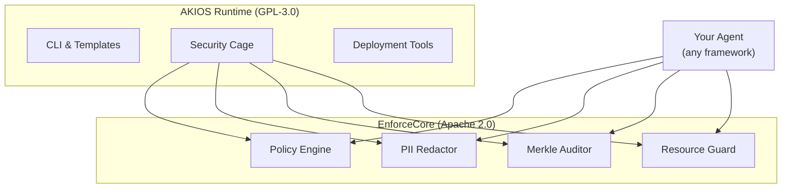

<header class="post-header">
  <div class="post-meta">
    February 20, 2026 &bull; <span>5 min read</span>
  </div>
  <h1>Introducing EnforceCore: Runtime Enforcement for AI Agents</h1>
</header>

<div class="post-content">

Today we are releasing **EnforceCore**, the open-source enforcement framework we designed as the foundation of the [AKIOS](../docs/index.html) security runtime. It is available under the **Apache 2.0** license and works with any Python-based agent framework.

## Why EnforceCore?

Agent frameworks are getting more powerful. LangGraph, CrewAI, AutoGen, Semantic Kernel — every major project is building agents that call tools, browse the web, write files, and execute code.

But almost nobody is building the **control layer**.

Today, when your agent calls a tool, there is no standard way to:
- **Verify** that the call is permitted *before* it executes
- **Redact** sensitive data *before* it reaches external services
- **Prove** to an auditor that violations were structurally impossible

Most "safety" solutions are prompt-level guardrails — instructions to the LLM that can be bypassed, ignored, or jailbroken. They operate at the wrong layer.

**EnforceCore operates at the runtime call boundary — the only layer that cannot be bypassed.**

## How It Works

EnforceCore wraps any external call with a decorator. When the decorated function is invoked, the call passes through a multi-stage enforcement pipeline before it ever reaches the external resource.



Every call passes through the same pipeline: **policy check → PII redaction → sandboxed execution → output redaction → audit logging**. No exceptions.

## Four Components, One Decorator

EnforceCore is built from four independent components that compose through a single `@enforce()` decorator:



### Policy Engine
Declarative YAML policies validated by Pydantic. Define what an agent can and cannot do — evaluated at every call boundary.

### PII Redactor
Real-time detection and redaction across 53 patterns. Inputs are cleaned before they leave your process; outputs are cleaned before they reach your agent. Configurable strategies: mask, hash, remove, or placeholder.

### Merkle Auditor
SHA-256 Merkle tree audit trail for every enforced call. Every entry is cryptographically chained to the previous one. Tamper-proof by design.

### Resource Guard
Cross-platform resource limits: time, memory, cost. Automatic kill-switch when limits are exceeded. Full Linux hardening with seccomp/cgroups when available.

## Getting Started

Install and protect your first function in under a minute:

```bash
pip install enforcecore[all]
```

```python
from enforcecore import enforce

@enforce(policy="my_policy.yaml")
async def call_api(url: str, data: dict):
    return await httpx.post(url, json=data)
```

**Policy file (`my_policy.yaml`):**
```yaml
name: api_access_policy
version: "1.0"
rules:
  - action: http_request
    allow:
      domains: ["api.example.com"]
      methods: ["GET", "POST"]
    deny:
      domains: ["*"]
    redact:
      inputs: true
      outputs: true
```

Every call to `call_api` now passes through policy evaluation, PII redaction, resource constraints, and cryptographic audit — automatically. No changes to your agent code.

## Why Not Prompt-Level Guardrails?

| Approach | Layer | Bypassable? | Auditable? | Framework-locked? |
|----------|-------|-------------|------------|-------------------|
| Prompt instructions | Inside LLM | Yes (jailbreaks) | No | Often |
| Output filters | After execution | Damage already done | Partially | Usually |
| **EnforceCore** | **Call boundary** | **No** | **Yes (Merkle proofs)** | **No** |

Prompt guardrails tell the LLM what not to do. EnforceCore makes it structurally impossible to do it. These are different categories.

## Relationship to AKIOS

We designed EnforceCore as the enforcement foundation that powers AKIOS. Rather than locking enforcement logic inside the runtime, we built it as an independent framework — so the entire ecosystem can benefit.



- **Use EnforceCore** if you're building agents with LangGraph, CrewAI, AutoGen, or your own system and need runtime enforcement.
- **Use AKIOS** if you want a complete secure runtime with CLI, templates, and deployment tooling built on top of EnforceCore.

## Performance

EnforceCore adds minimal overhead to your agent calls:

| Component | Overhead |
|-----------|----------|
| Policy evaluation | < 1ms |
| PII redaction (short) | 5–15ms |
| PII redaction (long) | 15–50ms |
| Audit entry | < 1ms |
| **Total (typical)** | **8–20ms** |

For context, a single GPT-4 API call takes 500ms–3s. EnforceCore adds less than 2% overhead.

## What's Next

- **Framework adapters** — Thin integration layers for LangGraph, CrewAI, and AutoGen
- **Policy composition** — Inherit, override, and merge policies across teams
- **Compliance templates** — Pre-built policies for EU AI Act, SOC 2, HIPAA
- **Dashboard** — Visual policy editor and real-time audit viewer

## Get Started

- **Documentation:** [EnforceCore Docs](../docs/enforcecore.html)
- **GitHub:** [github.com/akios-ai/enforcecore](https://github.com/akios-ai/enforcecore)
- **PyPI:** [pypi.org/project/enforcecore](https://pypi.org/project/enforcecore/)
- **License:** Apache 2.0

```bash
pip install enforcecore[all]
```

Runtime enforcement for AI agents. Open source. Framework-agnostic.

</div>

<div class="post-footer">
  <p>Related: <a href="introducing-akios.html">Introducing AKIOS</a> | <a href="../docs/enforcecore.html">EnforceCore Documentation</a></p>
  <div class="share-links">
    <span>Share this post:</span>
    <a href="#" target="_blank">Twitter</a>
    <a href="#" target="_blank">LinkedIn</a>
    <a href="#" target="_blank">Hacker News</a>
  </div>
  <a href="./">← Back to Blog</a>
</div>
