<header class="post-header">
  <div class="post-meta">
    January 22, 2026 &bull; <span>6 min read</span>
  </div>
  <h1>Policy Schema Deep Dive (v1)</h1>
</header>

<div class="post-content">

The v1 policy schema is intentionally small. But small doesn't mean simple — every key controls a real security boundary. This post explains what each block does, why it exists, and how to use it.

## Why Policy as Code?

Most AI security is enforced by convention: developers promise not to do bad things. AKIOS takes a different approach — security is enforced by **code**, validated before execution, and cryptographically signed. If the policy doesn't allow it, it doesn't happen.

```mermaid
graph LR
    YAML["Policy YAML"] -->|"parse + validate"| Engine["Policy Engine"]
    Engine -->|"sign"| Signed["Signed Policy\n(SHA-256)"]
    Signed -->|"load into cage"| Cage["Security Cage"]

    subgraph CAGE_RUNTIME["Runtime Enforcement"]
        Cage --> FS_CHECK{"Filesystem\nrequest?"}
        Cage --> HTTP_CHECK{"HTTP\nrequest?"}
        Cage --> LLM_CHECK{"LLM\ncall?"}
        Cage --> TOOL_CHECK{"Tool\nexec?"}

        FS_CHECK -->|"allowed path?"| FS_ALLOW["✅ Allow"]
        FS_CHECK -->|"denied"| FS_BLOCK["❌ Block + Log"]
        HTTP_CHECK -->|"allowed host?"| HTTP_ALLOW["✅ Allow"]
        HTTP_CHECK -->|"denied"| HTTP_BLOCK["❌ Block + Log"]
        LLM_CHECK -->|"within budget?"| LLM_ALLOW["✅ Allow"]
        LLM_CHECK -->|"over budget"| LLM_KILL["🛑 Kill-Switch"]
        TOOL_CHECK -->|"allowlisted?"| TOOL_ALLOW["✅ Allow"]
        TOOL_CHECK -->|"denied"| TOOL_BLOCK["❌ Block + Log"]
    end
```



## The Schema Blocks

The v1 policy has six top-level blocks. Here's what each one does:

<table>
  <thead>
    <tr><th>Block</th><th>Controls</th><th>Default</th><th>Security Impact</th></tr>
  </thead>
  <tbody>
    <tr>
      <td><strong>filesystem</strong></td>
      <td>Which paths agents can read/write</td>
      <td>Deny all</td>
      <td>Prevents data exfiltration via local files</td>
    </tr>
    <tr>
      <td><strong>http</strong></td>
      <td>Which hosts/methods/rates are allowed</td>
      <td>Deny all</td>
      <td>Prevents unauthorized network calls</td>
    </tr>
    <tr>
      <td><strong>llm</strong></td>
      <td>Provider, model, tokens, budget</td>
      <td>No default provider</td>
      <td>Prevents cost overruns and model misuse</td>
    </tr>
    <tr>
      <td><strong>tools</strong></td>
      <td>Which commands can execute</td>
      <td>Deny all</td>
      <td>Prevents arbitrary command execution</td>
    </tr>
    <tr>
      <td><strong>audit</strong></td>
      <td>Merkle chain, PII redaction, export</td>
      <td>Enabled</td>
      <td>Provides tamper-evident proof of execution</td>
    </tr>
    <tr>
      <td><strong>pii_redaction</strong></td>
      <td>Which patterns to detect and redact</td>
      <td>Enabled (standard)</td>
      <td>Prevents sensitive data reaching the agent</td>
    </tr>
  </tbody>
</table>

### Filesystem

Controls what the agent can see and modify on disk:

```yaml
filesystem:
  allow:
    - path: "/srv/akios/readme.md"
      mode: "r"           # read-only
    - path: "/workspace/output"
      mode: "w"           # write allowed
  deny_writes: true       # block writes everywhere else
```

**Key rule:** Paths not in the allowlist are invisible to the agent. It can't even detect they exist.

### HTTP

Controls which external services the agent can contact:

```yaml
http:
  allow:
    - host: "api.openai.com"
      methods: ["POST"]
      rate_limit_per_min: 30
    - host: "docs.example.com"
      methods: ["GET"]
      rate_limit_per_min: 60
  redact_headers: ["authorization", "cookie", "x-api-key"]
```

**Key rule:** Every request passes through the PII redaction engine. Even allowed requests have sensitive headers stripped.

### LLM

Controls the AI model and spending:

```yaml
llm:
  provider: "openai"
  model: "gpt-4.1"
  max_tokens: 1200
  budget_usd: 0.25
  redact_prompts: true     # strip PII from prompts
  redact_responses: true   # strip PII from responses
```

**Key rule:** When `budget_usd` is exceeded, the workflow is **killed immediately** — not after the current call finishes. This is a hard kill-switch, not a soft warning.

### Tools (Commands)

Controls what shell commands the agent can execute:

```yaml
tools:
  allow:
    - name: "jq"
      args: ["."]
    - name: "grep"
      args: ["-n", "ERROR"]
  working_dir: "/workspace"
  timeout_sec: 20
```

**Key rule:** Only 17 pre-approved commands are available. Each runs in a sandboxed subprocess with syscall filtering and output size limits (1MB).

### Audit

Controls the tamper-evident logging:

```yaml
audit:
  merkle: true
  pii_redaction: true
  export_format: jsonl     # or json, pdf
  retention_days: 2555     # 7 years
```

**Key rule:** The Merkle chain is append-only. If any entry is modified, the hash chain breaks and verification fails. This is cryptographic proof, not just a log file.

### PII Redaction

Controls which sensitive data patterns are detected:

```yaml
pii_redaction:
  enabled: true
  mode: aggressive         # or standard
  patterns: [ssn, ein, credit_card, bank_account, email, phone, api_key]
```

**Key rule:** In `aggressive` mode, the engine errs on the side of redacting more. False positives are better than data leaks.

## Putting It All Together

Here's a complete production policy:

```yaml
version: 1
name: "doc-summary"

filesystem:
  allow:
    - path: "/workspace/docs"
      mode: "r"
http:
  allow:
    - host: "api.openai.com"
      methods: ["POST"]
      rate_limit_per_min: 10
  redact_headers: ["authorization", "cookie"]
llm:
  provider: "openai"
  model: "gpt-4.1"
  max_tokens: 1500
  budget_usd: 0.30
  redact_prompts: true
  redact_responses: true
tools:
  allow:
    - name: "jq"
    - name: "grep"
  working_dir: "/workspace"
  timeout_sec: 20
audit:
  merkle: true
  pii_redaction: true
  export_format: jsonl
pii_redaction:
  enabled: true
  mode: aggressive
```

## Validating Your Policy

Always validate before deploying:

```bash
# Dry-run validates policy without executing
akios run --dry-run my-workflow.yml

# Sign the policy for production use
akios policy sign my-workflow.yml

# Verify a signed policy
akios policy verify my-workflow.yml.sig
```

## Try It Yourself

```bash
pip install akios
akios init my-project
akios run templates/hello-workflow.yml
```

Keep policies small, explicit, and signed. That's how the cage stays predictable.

Secure your AI. Build with AKIOS.

</div>

<div class="post-footer">
  <p>Related: <a href="hardening-checklist.html">Hardening Checklist</a> | <a href="secure-agent-communication.html">Secure Agent Communication</a></p>
  <div class="share-links">
    <span>Share this post:</span>
    <a href="#" target="_blank">Twitter</a>
    <a href="#" target="_blank">LinkedIn</a>
    <a href="#" target="_blank">Hacker News</a>
  </div>
  <a href="./">← Back to Blog</a>
</div>
