<header class="post-header">
  

    January 25, 2026 &bull; 5 min read
  

  <h1>AKIOS v1.0: The Security Cage is Here</h1>
  

    
    AJ
  

</header>

  

    AKIOS v1.0 is the security runtime you've been waiting for. Run AI agents with confidence — they can't leak data, burn budgets, or escape their sandbox. Everything is auditable, provable, and production-ready.
  

  

    This isn't a general-purpose AI framework. It's <strong>the secure runtime</strong>: kernel-level isolation, real-time PII redaction, tamper-proof audit trails, and enforced budget controls.
  

  <h2>What's New in v1.0</h2>

  <h3>🔒 Hard Kernel Isolation</h3>
  

    AI agents run in a locked-down sandbox. On Linux, this uses kernel-level controls (cgroups + seccomp-bpf) to enforce hard limits on CPU, memory, disk, and network. On other platforms, Docker provides strong container isolation. Either way: default-deny access control means agents can only touch what you explicitly allow.
  

  <h3>🛡️ Real-time PII Redaction</h3>
  

    Over 95% accuracy detecting and redacting sensitive data in under 50ms — <strong>before</strong> it reaches agents. Built-in rule packs for EU AI Act basics and French GDPR presets.
  

  <h3>📊 Tamper-Evident Merkle Audit</h3>
  

    Every action is cryptographically proven with a Merkle ledger. Complete execution traces with clean PDF and JSON export. Full integrity verification built-in.
  

  <h3>💰 Enforced Cost & Loop Kills</h3>
  

    Hard termination on budget exceed or infinite loops. Token monitoring, per-workflow budget enforcement, and automatic kill-switches that actually work.
  

  <h3>🎯 Perfect User Experience</h3>
  

    Terminal width awareness, file discovery commands, enhanced guidance. The CLI just works — no cryptic errors, no hunting through logs.
  

  <h2>Architecture</h2>
  

    AKIOS splits control and data planes so policies stay signed and enforced before any effect takes place.
  

  <figure class="arch-figure">
    
  </figure>

  <h3>How It Works</h3>
  <ol>
    <li><strong>Policies Validated:</strong> Your workflow config is checked and cryptographically signed before execution.</li>
    <li><strong>Security Layers Applied:</strong> Linux kernel sandbox (on native) or container isolation (Docker) → PII redaction → budget controls → audit logging.</li>
    <li><strong>Agent Execution:</strong> Only explicitly allowed operations pass through. Everything else is blocked and logged.</li>
  </ol>

  <h2>What's Included</h2>

  <h3>Core Security Features</h3>
  <ul>
    <li>Process isolation with cgroups v2 + seccomp-bpf (Linux native)</li>
    <li>Strong container-based isolation (Docker on all platforms)</li>
    <li>Real-time PII detection and redaction</li>
    <li>Merkle tamper-evident audit logging</li>
    <li>Hard cost and loop kill-switches</li>
    <li>Default-deny network and filesystem access</li>
  </ul>

  <h3>Four Core Agents</h3>
  <ul>
    <li><strong>LLM Agent:</strong> Token and cost tracking with budget kills</li>
    <li><strong>HTTP Agent:</strong> Rate-limited requests with PII-redacted payloads</li>
    <li><strong>Filesystem Agent:</strong> Allowlisted reads, optional writes with path constraints</li>
    <li><strong>Tool Executor:</strong> Whitelisted commands in sandboxed subprocess</li>
  </ul>

  <h3>Enhanced CLI</h3>
  <pre><code>akios init        # Initialize new project
akios setup       # Configure API keys & settings
akios run         # Execute workflow
akios files       # Discover project files
akios audit       # Export audit reports
akios logs        # View execution logs
akios status      # Check system status
akios templates   # List available templates
akios doctor      # Run diagnostics
akios clean       # Clean old runs
akios compliance  # Generate compliance reports
akios output      # Manage workflow outputs</code></pre>

  <h2>Choose Your Installation Method</h2>
  

    Pick the option that best fits your workflow:
  

  <h3>🐍 Pip Package (Recommended for Linux)</h3>
  
<strong>Best for:</strong> Python developers, CI/CD pipelines, maximum kernel-hard security

  <pre><code>pip install akios
akios init my-project
cd my-project
akios run templates/hello-workflow.yml</code></pre>

  <h3>🐳 Docker (Cross-Platform Teams)</h3>
  
<strong>Best for:</strong> macOS/Windows development, consistent environments, teams

  <pre><code>curl -O https://raw.githubusercontent.com/akios-ai/akios/main/akios
chmod +x akios
./akios init my-project</code></pre>

  <h3>Platform Security Levels</h3>
  
AKIOS provides strong security on all platforms. Choose based on your environment:

  <table>
    <thead>
      <tr>
        <th>Platform</th>
        <th>Security Level</th>
        <th>When to Use</th>
      </tr>
    </thead>
    <tbody>
      <tr>
        <td>Native Linux</td>
        <td><strong>Maximum:</strong> Kernel-hard (seccomp-bpf + cgroups)</td>
        <td>Production servers, regulated environments</td>
      </tr>
      <tr>
        <td>Docker (any OS)</td>
        <td><strong>Strong:</strong> Container isolation + policy enforcement</td>
        <td>Development, macOS/Windows, CI/CD</td>
      </tr>
    </tbody>
  </table>

  <h2>Try It Now (30 Seconds)</h2>
  
Get your first sandboxed AI agent running:

  <pre><code>pip install akios
akios init my-project
cd my-project
akios run templates/hello-workflow.yml</code></pre>

  <h3>What You'll See</h3>
  
AKIOS confirms each security layer as it starts:

  <pre><code>[akios] sandbox: seccomp-bpf, cgroups v2 (Linux)
[akios] pii: redaction enabled
[akios] audit: Merkle trail initialized
[akios] workflow: completed successfully in 1.2s</code></pre>

  <h2>What's Coming Next</h2>
  
Future versions of AKIOS will add:

  <ul>
    <li>Advanced workflow patterns (parallel execution, conditionals, loops)</li>
    <li>More agents (Database, Email, Slack integrations)</li>
    <li>REST API for remote control</li>
    <li>Observability integrations (Prometheus, Jaeger)</li>
  </ul>

  <h2>Ready to Start?</h2>
  

    <strong>AKIOS v1.0 is production-ready.</strong> Install it now and secure your AI agents in minutes:
  

  <ul>
    <li><strong>Quick Start:</strong> <a href="/docs/quickstart/">Get running in 2 minutes</a></li>
    <li><strong>Source Code:</strong> <a href="https://github.com/akios-ai/akios">github.com/akios-ai/akios</a></li>
    <li><strong>Get Help:</strong> Join GitHub Discussions for community support</li>
  </ul>
  

    Questions? Found a bug? <a href="https://github.com/akios-ai/akios/issues">Open an issue</a> or reach out in <a href="https://github.com/akios-ai/akios/discussions">Discussions</a>.
  

  

    Share this post:
    <a href="#" target="_blank">Twitter</a>
    <a href="#" target="_blank">LinkedIn</a>
    <a href="#" target="_blank">Hacker News</a>
  

  <a href="./">← Back to Blog</a>

