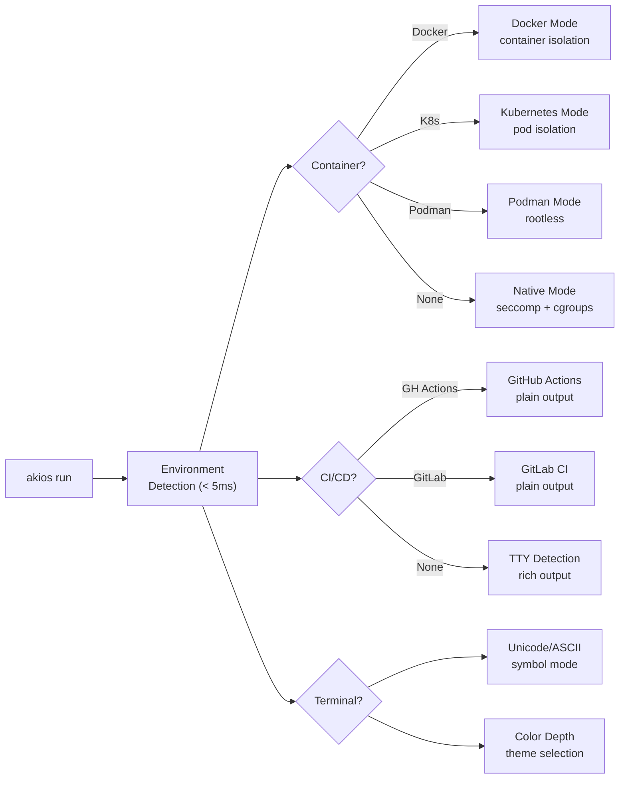

<header class="post-header">
  <div class="post-meta">
    February 7, 2026 &bull; <span>5 min read</span>
  </div>
  <h1>AKIOS v1.0.5: Rich UI, Accessibility, and Critical Fixes</h1>
</header>

<div class="post-content">

AKIOS v1.0.5 brings a rich terminal UI, environment auto-detection, full accessibility support, and a critical fix for the SIGTRAP crash when running with `sudo`.

## What's Changed: v1.0 → v1.0.5

<table>
  <thead>
    <tr><th>Area</th><th>v1.0</th><th>v1.0.5</th></tr>
  </thead>
  <tbody>
    <tr>
      <td><strong>Terminal UI</strong></td>
      <td>Plain text output</td>
      <td>Rich semantic colors, structured dashboards, status badges</td>
    </tr>
    <tr>
      <td><strong>Environment</strong></td>
      <td>Manual configuration</td>
      <td>Auto-detection: Docker, K8s, Podman, CI/CD (< 5ms)</td>
    </tr>
    <tr>
      <td><strong>Accessibility</strong></td>
      <td>Basic</td>
      <td>7 themes, 4 colorblind modes, 3 symbol modes, NO_COLOR</td>
    </tr>
    <tr>
      <td><strong>Diagnostics</strong></td>
      <td>Manual checks</td>
      <td><code>akios doctor</code> — automated system diagnostics</td>
    </tr>
    <tr>
      <td><strong>Compliance</strong></td>
      <td>Manual reports</td>
      <td><code>akios compliance report</code> — basic, detailed, executive</td>
    </tr>
    <tr>
      <td><strong>sudo Execution</strong></td>
      <td>🐛 SIGTRAP crash</td>
      <td>✅ Fixed — seccomp filter updated for privileged syscalls</td>
    </tr>
    <tr>
      <td><strong>PII Config</strong></td>
      <td>On/off toggle</td>
      <td><code>pii_redaction_outputs</code> + <code>pii_redaction_aggressive</code></td>
    </tr>
    <tr>
      <td><strong>Token Default</strong></td>
      <td>1000 max per call</td>
      <td>500 max per call (cost safety)</td>
    </tr>
  </tbody>
</table>

## What's New

### 🎨 Rich Terminal UI

The CLI now uses semantic colors and structured output. Status dashboards, security reports, and workflow results are clearer and easier to scan. Powered by Rich, with full fallback for plain terminals.

```bash
akios status
akios status --security
akios status --budget
```

### 🔍 Environment Auto-Detection

AKIOS now automatically detects its runtime environment at startup (< 5ms):



- **Container type:** native, Docker, Kubernetes, Podman
- **CI/CD:** GitHub Actions, GitLab CI, Jenkins
- **Terminal capabilities:** Unicode support, color depth, TTY

The runtime adjusts symbol modes, colors, and output format automatically. No configuration needed.

### ♿ Accessibility

Full accessibility support for all users:

<table>
  <thead>
    <tr><th>Feature</th><th>Options</th><th>How to Set</th></tr>
  </thead>
  <tbody>
    <tr>
      <td><strong>Symbol Modes</strong></td>
      <td>Unicode (default), ASCII (CI/log-safe), Minimal (screen readers)</td>
      <td><code>AKIOS_SYMBOL_MODE=minimal</code></td>
    </tr>
    <tr>
      <td><strong>Colorblind Modes</strong></td>
      <td>Protanopia, Deuteranopia, Tritanopia, Achromatopsia</td>
      <td><code>AKIOS_COLORBLIND_MODE=deuteranopia</code></td>
    </tr>
    <tr>
      <td><strong>Themes</strong></td>
      <td>Default, Dark, Light, Nord, Solarized Dark/Light, High-Contrast</td>
      <td><code>AKIOS_THEME=nord</code></td>
    </tr>
    <tr>
      <td><strong>Standards</strong></td>
      <td>NO_COLOR, CLICOLOR_FORCE, FORCE_COLOR</td>
      <td>Set env var per spec</td>
    </tr>
  </tbody>
</table>

```bash
# Colorblind mode
export AKIOS_COLORBLIND_MODE=deuteranopia

# Screen reader mode
export NO_COLOR=1
export AKIOS_SYMBOL_MODE=minimal

# Change theme
export AKIOS_THEME=nord
```

### 🩺 New Commands

- **`akios doctor`** — Run system diagnostics (kernel, seccomp, cgroups, Docker)
- **`akios compliance report`** — Generate compliance reports (basic, detailed, executive)
- **`akios output`** — Manage workflow outputs (list, clean, archive)

### 🐛 Critical Bug Fix: SIGTRAP Crash

Fixed a crash when running `sudo akios run` on Linux. The seccomp BPF filter was rejecting essential syscalls during privileged execution. The fix updates the syscall allowlist for the `CAP_SYS_ADMIN` context. **Upgrade immediately if you use `sudo`:**

```bash
sudo pip3 install --upgrade akios
```

## Upgrade

```bash
# Pip
pip install akios==1.0.5

# Docker
docker pull akiosai/akios:v1.0.5

# Verify
akios --version
# akios 1.0.5
```

## Full Changelog

- Rich terminal UI with semantic colors
- Environment auto-detection (Docker, K8s, Podman, CI/CD)
- Accessibility: colorblind modes, symbol modes, themes
- `akios doctor` diagnostics command
- `akios compliance report` command
- `akios output` management command
- SIGTRAP crash fix for `sudo` execution
- Configuration corruption auto-detection
- `pii_redaction_outputs` and `pii_redaction_aggressive` config options
- `max_tokens_per_call` default reduced from 1000 to 500 for cost safety

## Try It Yourself

```bash
pip install akios==1.0.5
akios doctor
akios status --security
```

Secure your AI. Build with AKIOS.

</div>

<div class="post-footer">
  <p>Related: <a href="release-notes-v0-1-0.html">AKIOS v1.0 Release Notes</a> | <a href="hardening-checklist.html">Hardening Checklist</a></p>
  <div class="share-links">
    <span>Share this post:</span>
    <a href="#" target="_blank">Twitter</a>
    <a href="#" target="_blank">LinkedIn</a>
    <a href="#" target="_blank">Hacker News</a>
  </div>
  <a href="./">← Back to Blog</a>
</div>
