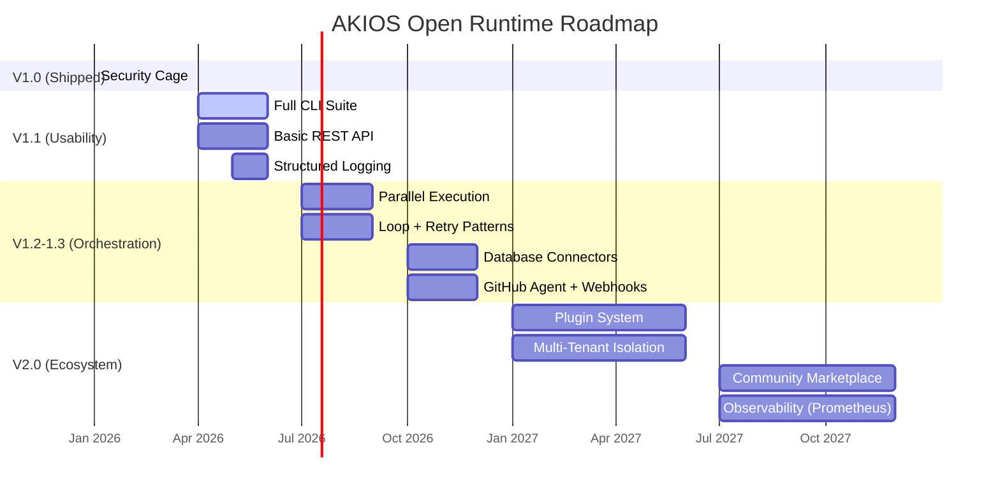

<header class="post-header">
  <div class="post-meta">
    January 19, 2026 &bull; <span>5 min read</span>
  </div>
  <h1>AKIOS Roadmap: 2026 and Beyond</h1>
</header>

<div class="post-content">

This roadmap outlines the future direction for AKIOS Open Runtime (free, GPL-3.0-only). Timelines and priorities may evolve based on community feedback.

## Where We Are Today

AKIOS v1.0 shipped in January 2026 with a minimal, trustworthy security cage. The foundation is solid:

- Kernel-hard sandbox (cgroups + seccomp-bpf)
- Real-time PII redaction (50+ patterns)
- Cryptographic Merkle tamper-evident audit
- Enforced cost & loop kill-switches
- Four core agents (filesystem, HTTP, LLM, tool executor)
- Polished CLI with templates

But v1.0 is just the beginning. Here's where we're going:

## Roadmap Timeline



## Feature Roadmap

<table>
  <thead>
    <tr><th>Version</th><th>Timeline</th><th>Focus</th><th>Key Features</th></tr>
  </thead>
  <tbody>
    <tr>
      <td><strong>V1.0</strong></td>
      <td>Jan 2026 ✅</td>
      <td>Security Foundation</td>
      <td>Kernel sandbox, PII redaction, Merkle audit, cost kill-switches, 4 agents, CLI</td>
    </tr>
    <tr>
      <td><strong>V1.1</strong></td>
      <td>Q2 2026</td>
      <td>Usability</td>
      <td>Full CLI suite (15–23 commands), basic REST API (local-only), structured logging, config reference generator</td>
    </tr>
    <tr>
      <td><strong>V1.2</strong></td>
      <td>Q3 2026</td>
      <td>Orchestration I</td>
      <td>Parallel execution, conditional workflows, loop & retry patterns, fan-out / map-reduce</td>
    </tr>
    <tr>
      <td><strong>V1.3</strong></td>
      <td>Q4 2026</td>
      <td>Integrations</td>
      <td>Database connectors (PostgreSQL, SQLite), GitHub agent, webhooks receiver, email agent</td>
    </tr>
    <tr>
      <td><strong>V2.0</strong></td>
      <td>2027</td>
      <td>Ecosystem</td>
      <td>Plugin system, multi-tenant isolation, community marketplace, Prometheus / Jaeger</td>
    </tr>
  </tbody>
</table>

## V1.1 — Usability (Q2 2026)

The v1.1 release focuses on making AKIOS easier to use day-to-day:

### Full CLI Suite

Expanding from the current 12 commands to 15–23:

```bash
# Current v1.0 commands
akios init | setup | run | files | audit | logs
akios status | templates | doctor | clean | compliance | output

# Coming in v1.1
akios policy sign       # Sign policies for production
akios policy verify     # Verify signed policies
akios config validate   # Validate configuration files
akios agent list        # List available agents
akios agent inspect     # Inspect agent capabilities
akios workflow lint     # Lint workflow files
akios version           # Version and build info
```

### Basic REST API

A local-only REST API for integration with other tools:

```yaml
# akios-api.yml (coming in v1.1)
api:
  enabled: true
  host: "127.0.0.1"    # local only — never exposed
  port: 8080
  auth: "bearer-token"
  endpoints:
    - /api/v1/run       # trigger workflows
    - /api/v1/status    # check execution status
    - /api/v1/audit     # retrieve audit logs
```

## V1.2–V1.3 — Orchestration (Q3–Q4 2026)

### Parallel Execution

Currently, AKIOS runs workflows sequentially. V1.2 adds parallel execution with policy gates between parallel branches:

```yaml
# Parallel workflow (coming in v1.2)
steps:
  - name: "extract"
    agent: "filesystem"
    parallel:
      - file: "report-q1.pdf"
      - file: "report-q2.pdf"
      - file: "report-q3.pdf"
    max_parallel: 3
    policy: "per-branch"  # each branch gets its own cage
```

### Database Connectors

Secure database access with query-level policy enforcement:

```yaml
# Database connector (coming in v1.3)
database:
  type: "postgresql"
  connection: "$DB_URL"  # from vault
  allow:
    - query_type: "SELECT"
      tables: ["invoices", "payments"]
    - query_type: "INSERT"
      tables: ["audit_log"]
  deny:
    - query_type: "DROP"
    - query_type: "DELETE"
  pii_redaction: true
```

## V2.0 — Ecosystem (2027)

### Plugin System

Community agents with sandboxed plugin architecture:

```yaml
# Plugin manifest (coming in v2.0)
plugin:
  name: "slack-agent"
  version: "1.0.0"
  author: "community"
  sandbox: strict       # plugins are sandboxed too
  capabilities:
    - "http:hooks.slack.com"
    - "pii_redaction"
  audit: required        # all plugin actions are audited
```

### Community Marketplace

A curated registry of verified templates, agents, and policies — all signed, all auditable.

## How We Decide What Ships

Every feature must pass the **security bar**:

1. **Does it maintain the deny-by-default posture?** If a feature requires opening a new attack surface, it needs explicit policy controls.
2. **Is it auditable?** Every new capability must produce Merkle-logged audit entries.
3. **Can it be sandboxed?** If it can't run in the security cage, it doesn't ship.
4. **Is PII redaction integrated?** Any feature that touches data must pass through the redaction engine.

## Get Involved

AKIOS is open-source (GPL-3.0). The roadmap is shaped by community feedback:

- **Feature requests:** [GitHub Issues](https://github.com/akios-ai/akios/issues)
- **Discussions:** [GitHub Discussions](https://github.com/akios-ai/akios/discussions)
- **Contribute:** See [CONTRIBUTING.md](https://github.com/akios-ai/akios/blob/main/CONTRIBUTING.md)

## Try It Yourself

```bash
pip install akios
akios init my-project
akios run templates/hello-workflow.yml
```

**Open Runtime** is the technical safety foundation (free). The cage is ready today. The future is secure.

Secure your AI. Build with AKIOS.

</div>

<div class="post-footer">
  <p>Related: <a href="release-notes-v0-1-0.html">AKIOS v1.0 Release Notes</a> | <a href="introducing-akios.html">Introducing AKIOS</a></p>
  <div class="share-links">
    <span>Share this post:</span>
    <a href="#" target="_blank">Twitter</a>
    <a href="#" target="_blank">LinkedIn</a>
    <a href="#" target="_blank">Hacker News</a>
  </div>
  <a href="./">← Back to Blog</a>
</div>
