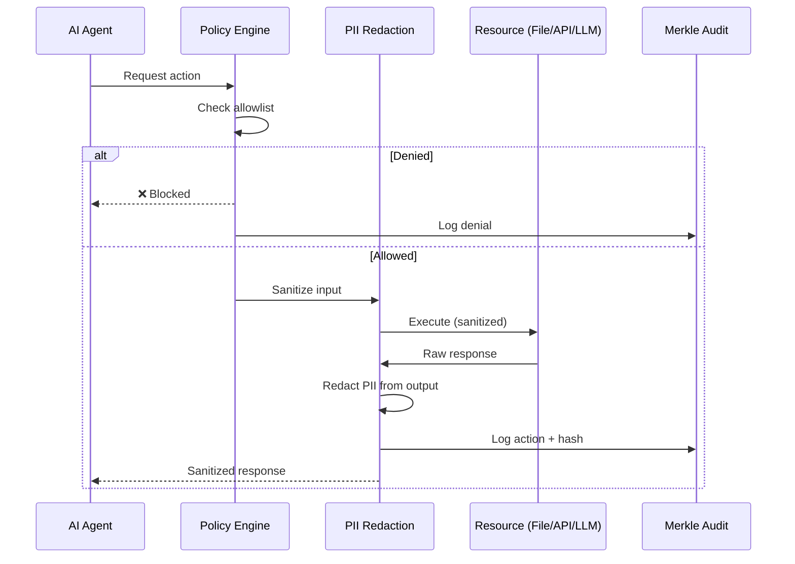

<header class="post-header">
  <div class="post-meta">
    January 20, 2026 &bull; <span>7 min read</span>
  </div>
  <h1>Secure Agent Communication: How AKIOS Isolates Agent Interactions</h1>
</header>

<div class="post-content">

When AI agents interact with external tools and APIs, every data exchange is a potential security boundary. Here's how AKIOS enforces strict controls at every communication point.

## The Problem: Uncontrolled Agent I/O

AI agents that access files, call APIs, and execute commands need to communicate across trust boundaries. Without enforcement, an agent can:

- Read files outside its allowed scope
- Send sensitive data to unauthorized endpoints
- Execute arbitrary commands on the host
- Exfiltrate credentials through LLM prompts

Most runtimes treat agent communication as a plumbing problem. AKIOS treats it as a **security problem**.

## AKIOS Approach: Policy-Gated Communication

In AKIOS, every agent action passes through the Security Cage before execution. There is no direct path from agent to resource — the runtime mediates every interaction.



### How It Works

1. **Policy Check:** Before any action, the runtime validates it against the workflow's allowed operations.
2. **PII Redaction:** Inputs and outputs are scanned for sensitive data patterns (50+ categories).
3. **Audit Logging:** Every action is cryptographically logged in the Merkle audit trail.
4. **Resource Enforcement:** Budget, token limits, rate limits, and timeouts are enforced per-action.

## The Four Agent Types

Each agent type has its own security boundary:

<table>
  <thead>
    <tr><th>Agent</th><th>What It Does</th><th>Security Controls</th><th>Default State</th></tr>
  </thead>
  <tbody>
    <tr>
      <td><strong>Filesystem</strong></td>
      <td>Reads/writes files</td>
      <td>Path allowlisting, mode enforcement (r/w), PII scan on content</td>
      <td>Deny all paths</td>
    </tr>
    <tr>
      <td><strong>HTTP</strong></td>
      <td>Makes API calls</td>
      <td>Host allowlisting, rate limiting (10/min), header redaction, SSL required</td>
      <td>Deny all hosts</td>
    </tr>
    <tr>
      <td><strong>LLM</strong></td>
      <td>Calls AI models</td>
      <td>Budget kill-switch, token limits, prompt/response PII redaction</td>
      <td>No provider (must configure)</td>
    </tr>
    <tr>
      <td><strong>Tool Executor</strong></td>
      <td>Runs shell commands</td>
      <td>Command allowlisting (17 pre-approved), output limits (1MB), timeout (30s)</td>
      <td>Deny all commands</td>
    </tr>
  </tbody>
</table>

### Filesystem Agent: Path-Gated Access

The filesystem agent can only access explicitly allowed paths. All content passes through PII redaction:

```yaml
# Policy: filesystem access control
filesystem:
  allow:
    - path: "./workflows/"
      mode: "r"
    - path: "./templates/"
      mode: "r"
    - path: "./data/input/"
      mode: "r"
    - path: "./data/output/"
      mode: "w"
  deny_writes: true  # everywhere else
```

Any attempt to read outside these paths is blocked and logged as a security event. The agent can't even detect that other files exist.

### HTTP Agent: Rate-Limited & Redacted

The HTTP agent enforces strict controls on every request:

```yaml
# Policy: HTTP access control
http:
  allow:
    - host: "api.openai.com"
      methods: ["POST"]
      rate_limit_per_min: 10
  redact_headers: ["authorization", "cookie", "x-api-key"]
  ssl_required: true
  timeout_sec: 30
```

Every request and response body is scanned for PII. Sensitive headers are stripped before logging.

### LLM Agent: Budget-Gated Calls

Every LLM call is tracked for token usage and cost. The budget kill-switch terminates the workflow immediately if costs exceed the configured limit:

```yaml
# Policy: LLM budget control
llm:
  provider: "openai"
  model: "gpt-4.1"
  max_tokens: 1200
  budget_usd: 1.00
  redact_prompts: true
  redact_responses: true
```

The kill-switch is a **hard termination** — not a warning. When the budget hits zero, the workflow stops.

### Tool Executor: Command Allowlisting

Only pre-approved commands can be executed. Each runs in a sandboxed subprocess:

```yaml
# Policy: tool execution control
tools:
  allow:
    - name: "jq"
      args: ["."]
    - name: "grep"
      args: ["-n", "ERROR"]
    - name: "wc"
      args: ["-l"]
  working_dir: "/workspace"
  timeout_sec: 20
```

Syscall filtering via seccomp-bpf ensures even allowed commands can't escalate privileges or access unauthorized resources.

## Performance: Security Without Sacrifice

Policy-gated communication adds minimal overhead:

<table>
  <thead>
    <tr><th>Operation</th><th>Without AKIOS</th><th>With AKIOS</th><th>Overhead</th></tr>
  </thead>
  <tbody>
    <tr>
      <td>File read (1MB)</td>
      <td>2ms</td>
      <td>4ms</td>
      <td>+2ms (PII scan)</td>
    </tr>
    <tr>
      <td>HTTP request</td>
      <td>150ms</td>
      <td>153ms</td>
      <td>+3ms (policy check)</td>
    </tr>
    <tr>
      <td>LLM call</td>
      <td>1200ms</td>
      <td>1205ms</td>
      <td>+5ms (budget check + audit)</td>
    </tr>
    <tr>
      <td>Tool execution</td>
      <td>50ms</td>
      <td>55ms</td>
      <td>+5ms (sandbox setup)</td>
    </tr>
    <tr>
      <td>PII redaction (50+ patterns)</td>
      <td>N/A</td>
      <td>< 50ms</td>
      <td>N/A (new capability)</td>
    </tr>
  </tbody>
</table>

The overhead is negligible compared to the actual operation time. For LLM calls, the 5ms overhead is less than 0.5% of total latency.

## The Result

With AKIOS, agent communication is never "open." Every interaction is:

- **Validated** against explicit policies before execution
- **Redacted** for PII before data leaves the sandbox
- **Audited** with cryptographic integrity via Merkle chain
- **Bounded** by budgets, rate limits, and timeouts

This is what makes AKIOS different from running agents in a loose Docker container. The cage doesn't just contain — it **mediates**.

## Try It Yourself

```bash
pip install akios
akios init my-project
akios run templates/hello-workflow.yml
```

Secure your AI. Build with AKIOS.

</div>

<div class="post-footer">
  <p>Related: <a href="policy-schema-deep-dive.html">Policy Schema Deep Dive</a> | <a href="hardening-checklist.html">Hardening Checklist</a></p>
  <div class="share-links">
    <span>Share this post:</span>
    <a href="#" target="_blank">Twitter</a>
    <a href="#" target="_blank">LinkedIn</a>
    <a href="#" target="_blank">Hacker News</a>
  </div>
  <a href="./">← Back to Blog</a>
</div>
