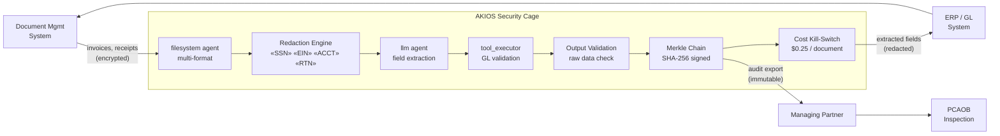

<header class="post-header">
  <div class="post-meta">February 9, 2026 · Engineering / Accounting · 5 min read</div>
  <h1>Secure AI for Accounting: Automated Document Processing Under SOX Controls</h1>
</header>

<div class="post-content">

Accounting firms process thousands of financial documents — invoices, tax returns, bank statements — every quarter. AI can extract and classify this data in seconds. But financial documents contain some of the most sensitive data in existence: **SSNs, EINs, bank routing numbers, salary figures.**

How do you automate document processing without putting client data at risk?

AKIOS provides a Security Cage: an ephemeral, sandboxed runtime where AI processes financial documents under strict, auditable controls.

## The Problem

Busy season means thousands of documents per engagement: invoices, W-2s, K-1s, bank statements. AI can read, classify, and extract key fields in seconds — but every one of those documents contains data whose leakage exposes the firm to malpractice liability, regulatory sanctions, and reputational damage. The traditional approach? Manual processing that's slow, expensive, and error-prone.

AKIOS gives you AI-powered document extraction **without the data risk**.

## The Regulatory Landscape

Accounting and financial reporting in the US are governed by strict, overlapping frameworks:

<table>
  <thead>
    <tr><th>Regulation</th><th>Scope</th><th>How AKIOS Enforces It</th></tr>
  </thead>
  <tbody>
    <tr>
      <td><strong>SOX (Sarbanes-Oxley)</strong></td>
      <td>Internal controls over financial reporting — any AI process must produce auditable, tamper-proof records</td>
      <td>Merkle-chained audit trail — every extraction cryptographically signed and immutable.</td>
    </tr>
    <tr>
      <td><strong>PCAOB Standards</strong></td>
      <td>Audit evidence including AI-generated work papers must be verifiable and retained</td>
      <td>Complete inference chain exported per document. Every extraction includes its provenance.</td>
    </tr>
    <tr>
      <td><strong>AICPA / GAAP</strong></td>
      <td>Professional standards requiring automated processes to maintain the same rigor as manual procedures</td>
      <td>Deterministic sandbox — same document always produces same extraction result.</td>
    </tr>
    <tr>
      <td><strong>IRS Circular 230</strong></td>
      <td>Tax preparers must exercise due diligence — AI-assisted preparation must be fully traceable</td>
      <td>Full decision path logged per document. Human review gate for all tax-related extractions.</td>
    </tr>
    <tr>
      <td><strong>State Board Rules</strong></td>
      <td>State CPA boards regulate technology use — work paper retention, client confidentiality</td>
      <td>Policy templates per jurisdiction. Client data never leaves the cage boundary.</td>
    </tr>
  </tbody>
</table>

AKIOS enforces these requirements at the runtime level.

## The Concept: Policy as Code

AKIOS introduces the concept of a "Security Cage" — an ephemeral, sandboxed runtime environment where data is processed under strict, code-defined policies. The cage is destroyed after each run. No persistent state. No data leakage vector.

## The Workflow: Financial Document Extraction

<table>
  <thead>
    <tr><th>Step</th><th>What Happens</th><th>Security Control</th></tr>
  </thead>
  <tbody>
    <tr>
      <td><strong>1. Ingestion</strong></td>
      <td>Scanned invoices, receipts, or tax documents loaded into the cage</td>
      <td>Read-only filesystem agent. Documents cannot be copied outside the cage.</td>
    </tr>
    <tr>
      <td><strong>2. Redaction</strong></td>
      <td>Client identifiers (SSN, EIN, account numbers) redacted in-memory</td>
      <td>50+ PII patterns replaced with tokens. The original never reaches the LLM.</td>
    </tr>
    <tr>
      <td><strong>3. AI Extraction</strong></td>
      <td>LLM identifies key fields — amounts, dates, vendor names, tax categories</td>
      <td>Budget capped ($0.25/document), no network access, no persistent storage.</td>
    </tr>
    <tr>
      <td><strong>4. Validation</strong></td>
      <td>Extracted data cross-referenced against Chart of Accounts and tax code tables</td>
      <td>Anomalies flagged for human review. AI cannot approve or file anything.</td>
    </tr>
    <tr>
      <td><strong>5. Audit</strong></td>
      <td>Every extraction, classification, and validation logged with cryptographic signatures</td>
      <td>Complete chain available for PCAOB inspection. Immutable and exportable.</td>
    </tr>
  </tbody>
</table>

### Architecture



### Policy Configuration

The entire compliance posture is defined in a single YAML file:

```yaml
# accounting-sox-policy.yml
security:
  sandbox: strict
  network: isolated
  allowed_endpoints: []  # zero network access
  pii_redaction:
    enabled: true
    patterns: [ssn, ein, account_number, routing_number, salary, dob]
    mode: aggressive
  budget:
    max_cost_per_run: 0.25
    currency: USD
  audit:
    merkle_chain: true
    export_format: jsonl
    retention_days: 2555  # 7 years — SOX/PCAOB retention requirement
```

## What the Auditor Sees

At the end of the workflow, the audit team receives a structured report:

<table>
  <thead>
    <tr><th>Field</th><th>Value</th></tr>
  </thead>
  <tbody>
    <tr><td>Document</td><td>invoice-Q4-2025-****3291.pdf</td></tr>
    <tr><td>Extraction</td><td>Vendor: [REDACTED] | Amount: $47,250.00 | Date: 2025-12-15 | GL Code: 6200</td></tr>
    <tr><td>Validation</td><td>✅ GL code 6200 matches Chart of Accounts — Operating Expenses</td></tr>
    <tr><td>Anomaly Flag</td><td>⚠️ Amount exceeds $25K threshold — routed to partner review per firm policy</td></tr>
    <tr><td>Confidence</td><td>96%</td></tr>
    <tr><td>Audit Hash</td><td><code>a2c7d4...e19b</code></td></tr>
    <tr><td>Raw Data Exposed</td><td>❌ None — all client PII redacted before extraction</td></tr>
  </tbody>
</table>

No SSNs. No EINs. No raw financial figures beyond what was extracted. Just structured accounting data with a cryptographic proof chain.

## Why It Matters

- **Client Data Protection**: SSNs, EINs, and financial figures are redacted before the AI touches them. Even a compromised model cannot leak client financials.
- **SOX Compliance Built-In**: Every AI action produces a tamper-proof log entry. The Merkle chain ensures no step can be altered or deleted after the fact.
- **Deterministic Processing**: The same document always produces the same extraction result — critical for audit consistency across engagements.
- **Cost Predictability**: Hard budget limits per document prevent surprises when processing thousands of invoices during busy season.
- **PCAOB Ready**: Complete inference chains are exportable for PCAOB inspection, satisfying the 7-year retention requirement.

## Try It Yourself

```bash
pip install akios
akios init my-project
akios run templates/file_analysis.yml
```

Secure your AI. Build with AKIOS.

</div>

<div class="post-footer">
  <p>Related: <a href="accounting-security-cage.html">SOX-Compliant AI Security Cage</a> | <a href="legal-contract-review.html">AI for Legal Contract Review</a></p>
  <a href="./">← Back to Case Studies</a>
</div>
