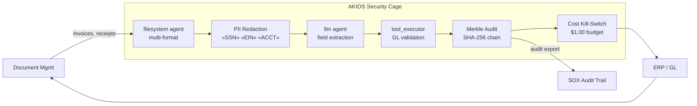

<header class="post-header">
  <div class="post-meta">February 9, 2026 · Engineering / Accounting · 5 min read</div>
  <h1>Secure AI for Accounting: Automated Document Processing Under SOX Controls</h1>
  <div class="post-author">
    
    <span>AJ</span>
  </div>
</header>

<div class="post-content">

Accounting firms process thousands of financial documents — invoices, tax returns, bank statements — every quarter. AI can extract and classify this data in seconds. But financial documents contain some of the most sensitive data in existence: **SSNs, EINs, bank routing numbers, salary figures.**

How do you automate document processing without putting client data at risk?

AKIOS provides a Security Cage: an ephemeral, sandboxed runtime where AI processes financial documents under strict, auditable controls.

## The Regulatory Landscape

Accounting and financial reporting in the US are governed by:

- **SOX (Sarbanes-Oxley)** — Requires internal controls over financial reporting. Any AI-assisted process must produce auditable, tamper-proof records.
- **PCAOB Standards** — Public Company Accounting Oversight Board standards mandate that audit evidence — including AI-generated work papers — be verifiable and retained.
- **AICPA / GAAP** — Professional standards require that automated processes maintain the same rigor as manual procedures.
- **IRS Circular 230** — Tax preparers must exercise due diligence. AI-assisted tax preparation must be fully traceable.

AKIOS enforces these requirements at the runtime level.

## The Workflow: Financial Document Extraction

1. **Ingestion**: Scanned invoices, receipts, or tax documents are loaded into the Security Cage. Client identifiers (SSN, EIN) are redacted in-memory before AI processing.
2. **The Cage**: AKIOS initializes with the accounting policy: no network access, $0.25 budget cap per document, and SOX-compliant immutable logging.
3. **Extraction**: The sandboxed AI agent identifies key fields — amounts, dates, vendor names, tax categories — from the redacted documents. It cannot access the original unredacted data.
4. **Validation**: Extracted data is cross-referenced against known schemas (Chart of Accounts, tax code tables). Anomalies are flagged for human review.
5. **Audit**: Every extraction, classification, and validation step is logged with cryptographic signatures. The complete chain is available for PCAOB inspection.

### Architecture



## Why It Matters

- **Client Data Protection**: SSNs, EINs, and financial figures are redacted before the AI touches them. Even a compromised model cannot leak client financials.
- **SOX Compliance Built-In**: Every AI action produces a tamper-proof log entry. The Merkle chain ensures no step can be altered or deleted after the fact.
- **Deterministic Processing**: The same document always produces the same extraction result — critical for audit consistency across engagements.
- **Cost Predictability**: Hard budget limits per document prevent surprises when processing thousands of invoices during busy season.

## Try It Yourself

```bash
pip install akios
akios init my-project
akios run templates/file_analysis.yml
```

Secure your AI. Build with AKIOS.

</div>

<div class="post-footer">
  <a href="./">← Back to Case Studies</a>
</div>
