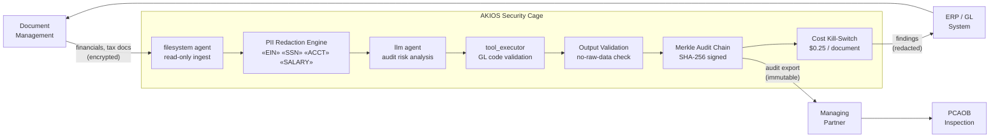

<header class="post-header">
  <div class="post-meta">February 6, 2026 · Engineering / Accounting · 5 min read</div>
  <h1>Building a SOX-Compliant AI Security Cage for Accounting in 15 Seconds</h1>
</header>

<div class="post-content">

The biggest barrier to adopting AI in accounting isn't model capability — it's **confidentiality**. How do you use powerful LLMs like Grok or GPT-4 on quarterly financials containing EINs, bank account numbers, and sensitive audit findings without violating SOX Section 302?

The answer isn't to avoid AI, but to wrap it in a **Security Cage**.

## The Problem

Audit season means thousands of documents: financial statements, tax returns, client correspondence. AI can read, classify, and flag anomalies in seconds — but every one of those documents contains data that, if leaked, exposes the firm to malpractice liability, regulatory sanctions, and reputational ruin.

AKIOS gives you AI-powered audit analysis **without the data risk**.

## The Regulatory Landscape

Accounting and financial reporting are governed by strict, overlapping frameworks:

<table>
  <thead>
    <tr><th>Regulation</th><th>Scope</th><th>How AKIOS Enforces It</th></tr>
  </thead>
  <tbody>
    <tr>
      <td><strong>SOX (Sarbanes-Oxley)</strong></td>
      <td>Internal controls over financial reporting. Auditable, tamper-proof records required.</td>
      <td>Merkle chain audit — every AI action cryptographically signed. No step can be altered or deleted.</td>
    </tr>
    <tr>
      <td><strong>PCAOB Standards</strong></td>
      <td>Audit evidence — including AI-generated work papers — must be verifiable and retained.</td>
      <td>Complete inference chain exported per document. Deterministic outputs for reproducibility.</td>
    </tr>
    <tr>
      <td><strong>AICPA / GAAP</strong></td>
      <td>Automated processes must maintain the same rigor as manual procedures.</td>
      <td>Same input always produces same output. Human-in-the-loop for all flagged items.</td>
    </tr>
    <tr>
      <td><strong>IRS Circular 230</strong></td>
      <td>Tax preparers must exercise due diligence. AI-assisted prep must be traceable.</td>
      <td>Full provenance chain: which data was read, which model was called, what was produced.</td>
    </tr>
    <tr>
      <td><strong>State Board Rules</strong></td>
      <td>CPA confidentiality obligations — client data cannot be shared with third parties.</td>
      <td>Network isolation. No data leaves the cage. LLM API calls use redacted data only.</td>
    </tr>
  </tbody>
</table>

AKIOS enforces these requirements at the runtime level — not as a policy document, but as executable code.

## The Concept: Policy as Code

AKIOS introduces the concept of a "Security Cage" — an ephemeral, sandboxed runtime where data is processed under strict, code-defined policies. The cage is destroyed after each run. No persistent state. No data leakage vectors.

## The Workflow: Automated Audit Risk Analysis

<table>
  <thead>
    <tr><th>Step</th><th>What Happens</th><th>Security Control</th></tr>
  </thead>
  <tbody>
    <tr>
      <td><strong>1. Ingestion</strong></td>
      <td>Financial review files (EINs, bank accounts, employee names) loaded into cage</td>
      <td>Read-only filesystem agent. Documents cannot be copied outside the cage.</td>
    </tr>
    <tr>
      <td><strong>2. PII Redaction</strong></td>
      <td>Client identifiers stripped in-memory before AI processing</td>
      <td>EINs, SSNs, account numbers replaced with tokens. LLM never sees originals.</td>
    </tr>
    <tr>
      <td><strong>3. AI Analysis</strong></td>
      <td>LLM identifies material misstatements, control weaknesses, going concern indicators</td>
      <td>Budget cap ($0.25/document), zero network access, no persistent storage.</td>
    </tr>
    <tr>
      <td><strong>4. Validation</strong></td>
      <td>Extracted data cross-referenced against Chart of Accounts and tax code tables</td>
      <td>Anomalies flagged for human review. AI cannot approve or file anything.</td>
    </tr>
    <tr>
      <td><strong>5. Audit</strong></td>
      <td>Every extraction, classification, and validation step logged with cryptographic signatures</td>
      <td>Complete chain available for PCAOB inspection. Immutable and exportable.</td>
    </tr>
  </tbody>
</table>

### Architecture



### Policy Configuration

The entire compliance posture is defined in a single YAML file:

```yaml
# accounting-sox-policy.yml
security:
  sandbox: strict
  network: isolated
  allowed_endpoints: []  # no network access at all
  pii_redaction:
    enabled: true
    patterns: [ssn, ein, account_number, routing_number, salary, dob]
    mode: aggressive
  budget:
    max_cost_per_run: 0.25
    currency: USD
  audit:
    merkle_chain: true
    export_format: jsonl
    retention_days: 2555  # 7 years — SOX requirement
```

## What the Auditor Sees

When the workflow completes, the audit team receives a structured report:

<table>
  <thead>
    <tr><th>Field</th><th>Value</th></tr>
  </thead>
  <tbody>
    <tr><td>Document</td><td>Q4-2025-financials-****3291.pdf</td></tr>
    <tr><td>Finding</td><td>Material misstatement — Revenue recognized before delivery (ASC 606 violation)</td></tr>
    <tr><td>Severity</td><td>🔴 High — material to financial statements</td></tr>
    <tr><td>GL Account</td><td>4100 — Revenue</td></tr>
    <tr><td>Amount Affected</td><td>$[REDACTED] (available in source document)</td></tr>
    <tr><td>Confidence</td><td>91%</td></tr>
    <tr><td>Audit Hash</td><td><code>d7e2a1...f4c8</code></td></tr>
    <tr><td>Raw Data Exposed</td><td>❌ None — all client PII redacted before analysis</td></tr>
  </tbody>
</table>

No client SSNs. No EINs. No raw financial figures in the AI output. Just actionable audit findings with a cryptographic proof chain that PCAOB inspectors can verify.

## Why It Matters

- **Client Data Protection**: SSNs, EINs, and financial figures are redacted before the AI touches them. Even a compromised model cannot leak client financials.
- **SOX Compliance Built-In**: Every AI action produces a tamper-proof log entry. The Merkle chain ensures no step can be altered or deleted after the fact.
- **Deterministic Processing**: The same document always produces the same extraction result — critical for audit consistency across engagements.
- **Cost Predictability**: Hard budget limits per document prevent surprises when processing thousands of invoices during busy season.
- **Partner-Level Accountability**: The full audit chain is available for managing partner review and PCAOB inspection. AI becomes a tool the firm can stand behind.

## Try It Yourself

AKIOS is open-source. You can run this exact workflow today:

```bash
pip install akios
akios init my-project
akios run templates/file_analysis.yml
```

Secure your AI. Build with AKIOS.

</div>

<div class="post-footer">
  <p>Related: <a href="banking-security-cage.html">PCI-DSS Compliant AI Security Cage for Banking</a> | <a href="healthcare-hipaa-security-cage.html">HIPAA-Compliant AI Security Cage for Healthcare</a></p>
  <a href="./">← Back to Case Studies</a>
</div>
