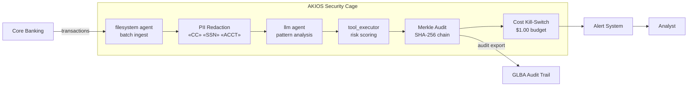

<header class="post-header">
  <div class="post-meta">February 8, 2026 · Engineering / Banking · 5 min read</div>
  <h1>Sandboxed AI for Banking: Fraud Detection Without Data Exposure</h1>
  <div class="post-author">
    
    <span>AJ</span>
  </div>
</header>

<div class="post-content">

Banks handle millions of transactions daily. AI can detect fraud patterns humans miss — but only if it can access transaction data. The problem: **how do you give an AI agent access to financial records without creating a new attack surface?**

AKIOS solves this with the Security Cage: an ephemeral, sandboxed runtime where AI processes data under strict, code-defined policies.

## The Regulatory Landscape

Financial institutions in the US operate under some of the most demanding regulatory frameworks:

- **GLBA (Gramm-Leach-Bliley Act)** — Requires financial institutions to protect consumer financial data and explain information-sharing practices.
- **SOX (Sarbanes-Oxley)** — Mandates accurate financial reporting with auditable trails for any automated processes.
- **OCC / FFIEC Guidelines** — Require model risk management, third-party oversight, and information security programs for AI/ML systems.
- **BSA / AML** — Anti-money laundering obligations require full audit trails for suspicious activity detection.

AKIOS enforces these at the runtime level — the AI agent never operates outside the compliance boundary.

## The Workflow: Transaction Fraud Analysis

1. **Ingestion**: A batch of transaction records is loaded into the Security Cage. Account numbers and personal identifiers are redacted before the AI sees them.
2. **The Cage**: AKIOS initializes with the banking policy: network isolation, $0.50 budget cap per analysis batch, and SOX-compliant audit logging.
3. **Analysis**: The sandboxed AI agent scans transaction patterns for anomalies — velocity checks, geographic inconsistencies, amount deviations — using only redacted data.
4. **Flagging**: Suspicious transactions are flagged with confidence scores and rule citations. The AI cannot modify or move funds.
5. **Audit**: Every inference, data access, and output is cryptographically signed into a Merkle chain. Regulators can verify the complete decision path.

### Architecture



## Why It Matters

- **Zero Data Exposure**: Account numbers and PII are redacted before the AI processes anything. Even if the model is compromised, there's nothing to leak.
- **Auditable Decisions**: Every fraud flag includes a cryptographic proof chain. OCC examiners can trace exactly how a decision was made.
- **Cost Containment**: Hard budget limits per batch prevent runaway API costs — a real concern when scanning millions of transactions.
- **Model Risk Management**: The sandbox prevents the AI from taking actions beyond its scope. It can flag, but it cannot move money, close accounts, or modify records.

## Try It Yourself

```bash
pip install akios
akios init my-project
akios run templates/file_analysis.yml
```

Secure your AI. Build with AKIOS.

</div>

<div class="post-footer">
  <a href="./">← Back to Case Studies</a>
</div>
