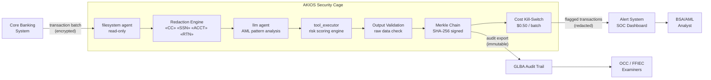

<header class="post-header">
  <div class="post-meta">February 8, 2026 · Engineering / Banking · 5 min read</div>
  <h1>Sandboxed AI for Banking: Fraud Detection Without Data Exposure</h1>
</header>

<div class="post-content">

Banks handle millions of transactions daily. AI can detect fraud patterns humans miss — but only if it can access transaction data. The problem: **how do you give an AI agent access to financial records without creating a new attack surface?**

AKIOS solves this with the Security Cage: an ephemeral, sandboxed runtime where AI processes data under strict, code-defined policies.

## The Problem

Fraud detection is an arms race. Manual review teams can't keep up with transaction volumes, and rule-based systems generate too many false positives. AI can scan millions of transactions in minutes — but connecting a model to your core banking system creates an entirely new category of risk. If the model is compromised, it could exfiltrate account numbers, routing numbers, and personally identifiable financial information.

AKIOS lets you deploy AI on transaction data **without giving it access to raw identifiers**.

## The Regulatory Landscape

Financial institutions in the US operate under some of the most demanding regulatory frameworks:

<table>
  <thead>
    <tr><th>Regulation</th><th>Scope</th><th>How AKIOS Enforces It</th></tr>
  </thead>
  <tbody>
    <tr>
      <td><strong>GLBA (Gramm-Leach-Bliley)</strong></td>
      <td>Requires financial institutions to protect consumer financial data and explain sharing practices</td>
      <td>Redaction at ingestion. AI never sees raw account numbers, SSNs, or routing numbers.</td>
    </tr>
    <tr>
      <td><strong>SOX (Sarbanes-Oxley)</strong></td>
      <td>Mandates accurate financial reporting with auditable trails for automated processes</td>
      <td>Merkle-chained audit trail — every AI decision cryptographically signed and immutable.</td>
    </tr>
    <tr>
      <td><strong>BSA / AML</strong></td>
      <td>Anti-money laundering obligations require full audit trails for suspicious activity detection</td>
      <td>Complete decision path exported per analysis batch. Every flag includes its provenance.</td>
    </tr>
    <tr>
      <td><strong>OCC / FFIEC Guidelines</strong></td>
      <td>Model risk management, third-party oversight, and infosec programs for AI/ML systems</td>
      <td>Deterministic sandbox — same input always produces same output. No model drift inside the cage.</td>
    </tr>
    <tr>
      <td><strong>PCI-DSS</strong></td>
      <td>Payment Card Industry data security standards for cardholder data</td>
      <td>Card numbers tokenized before AI processing. Network isolation prevents data exfiltration.</td>
    </tr>
  </tbody>
</table>

AKIOS enforces these at the runtime level — the AI agent never operates outside the compliance boundary.

## The Concept: Policy as Code

AKIOS introduces the concept of a "Security Cage" — an ephemeral, sandboxed runtime environment where data is processed under strict, code-defined policies. The cage is destroyed after each run. No persistent state. No data leakage vector.

## The Workflow: Transaction Fraud Analysis

<table>
  <thead>
    <tr><th>Step</th><th>What Happens</th><th>Security Control</th></tr>
  </thead>
  <tbody>
    <tr>
      <td><strong>1. Ingestion</strong></td>
      <td>Batch of transaction records loaded into the Security Cage</td>
      <td>Data enters via read-only filesystem agent. No copies outside the cage.</td>
    </tr>
    <tr>
      <td><strong>2. Redaction</strong></td>
      <td>Account numbers, SSNs, and card numbers tokenized before AI processing</td>
      <td>50+ PII patterns replaced with tokens. The original never reaches the LLM.</td>
    </tr>
    <tr>
      <td><strong>3. AI Analysis</strong></td>
      <td>LLM scans transaction patterns — velocity checks, geographic inconsistencies, amount deviations</td>
      <td>Budget capped ($0.50/batch), network isolated, no persistent storage.</td>
    </tr>
    <tr>
      <td><strong>4. Flagging</strong></td>
      <td>Suspicious transactions flagged with confidence scores and rule citations</td>
      <td>AI cannot modify or move funds. Read-only output only.</td>
    </tr>
    <tr>
      <td><strong>5. Audit</strong></td>
      <td>Every inference, data access, and output cryptographically signed</td>
      <td>Merkle chain — if any entry is altered, the entire chain is invalidated.</td>
    </tr>
  </tbody>
</table>

### Architecture



### Policy Configuration

The entire compliance posture is defined in a single YAML file:

```yaml
# banking-fraud-policy.yml
security:
  sandbox: strict
  network: isolated
  allowed_endpoints:
    - core-banking-api.internal:443
  pii_redaction:
    enabled: true
    patterns: [credit_card, ssn, account_number, routing_number, dob]
    mode: aggressive
  budget:
    max_cost_per_run: 0.50
    currency: USD
  audit:
    merkle_chain: true
    export_format: jsonl
    retention_days: 1825  # 5 years — BSA/AML retention requirement
```

## What the Analyst Sees

At the end of the workflow, the BSA/AML analyst receives a structured report:

<table>
  <thead>
    <tr><th>Field</th><th>Value</th></tr>
  </thead>
  <tbody>
    <tr><td>Transaction ID</td><td>TXN-2026-0208-****9143</td></tr>
    <tr><td>Risk Score</td><td>0.91 / 1.00 (Critical)</td></tr>
    <tr><td>Pattern Detected</td><td>Structuring — 6 deposits of $9,800 across 3 branches in 48 hours</td></tr>
    <tr><td>Regulatory Reference</td><td>31 CFR § 1010.314 — Structuring transactions to evade reporting</td></tr>
    <tr><td>Confidence</td><td>91%</td></tr>
    <tr><td>Audit Hash</td><td><code>e7f3b2...a41c</code></td></tr>
    <tr><td>Raw Data Exposed</td><td>❌ None — all PII redacted before analysis</td></tr>
  </tbody>
</table>

No account numbers. No SSNs. No raw financial data. Just actionable intelligence with a cryptographic proof chain.

## Why It Matters

- **Zero Data Exposure**: Account numbers and PII are redacted before the AI processes anything. Even if the model is compromised, there's nothing to leak.
- **Auditable Decisions**: Every fraud flag includes a cryptographic proof chain. OCC examiners can trace exactly how a decision was made.
- **Cost Containment**: Hard budget limits per batch prevent runaway API costs — a real concern when scanning millions of transactions.
- **Model Risk Management**: The sandbox prevents the AI from taking actions beyond its scope. It can flag, but it cannot move money, close accounts, or modify records.
- **BSA/AML Retention**: Merkle chain logs are exportable in JSONL format, satisfying the 5-year BSA/AML record retention requirement.

## Try It Yourself

```bash
pip install akios
akios init my-project
akios run templates/file_analysis.yml
```

Secure your AI. Build with AKIOS.

</div>

<div class="post-footer">
  <p>Related: <a href="banking-security-cage.html">PCI-DSS Compliant AI Security Cage</a> | <a href="insurance-claims-processing.html">Secure AI for Insurance Claims</a></p>
  <a href="./">← Back to Case Studies</a>
</div>
