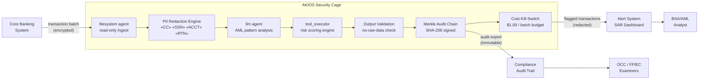

<header class="post-header">
  <div class="post-meta">February 6, 2026 · Engineering / Financial Services · 5 min read</div>
  <h1>Building a PCI-DSS Compliant AI Security Cage for Banking in 15 Seconds</h1>
</header>

<div class="post-content">

The biggest barrier to adopting AI in banking isn't model capability — it's **compliance**. How do you use powerful LLMs like Grok or GPT-4 on customer transaction data without triggering a PCI-DSS or BSA/AML violation?

The answer isn't to avoid AI, but to wrap it in a **Security Cage**.

## The Problem

Every compliance officer in banking knows the dilemma: AI models need data to be useful, but the data they need — account numbers, routing numbers, transaction histories — is exactly what regulations say you must protect. Traditional approaches force a choice: **use AI and accept risk**, or **stay compliant and stay manual**.

AKIOS eliminates that tradeoff.

## The Regulatory Landscape

Financial institutions operate under some of the most demanding regulatory frameworks in the world:

<table>
  <thead>
    <tr><th>Regulation</th><th>Scope</th><th>How AKIOS Enforces It</th></tr>
  </thead>
  <tbody>
    <tr>
      <td><strong>PCI-DSS v4.0</strong></td>
      <td>Cardholder data protection, network segmentation, access controls</td>
      <td>Network isolation — no outbound connections except whitelisted endpoints. Card numbers redacted before AI processing.</td>
    </tr>
    <tr>
      <td><strong>GLBA</strong></td>
      <td>Consumer financial data protection and information-sharing disclosure</td>
      <td>PII redaction at ingestion. AI never sees raw customer identifiers.</td>
    </tr>
    <tr>
      <td><strong>SOX</strong></td>
      <td>Auditable trails for automated financial processes</td>
      <td>Merkle chain audit log — every AI action cryptographically signed and immutable.</td>
    </tr>
    <tr>
      <td><strong>BSA / AML</strong></td>
      <td>Full audit trails for suspicious activity detection</td>
      <td>Complete decision path exported per analysis batch. Every flag includes provenance.</td>
    </tr>
    <tr>
      <td><strong>OCC / FFIEC</strong></td>
      <td>Model risk management, third-party AI oversight</td>
      <td>Deterministic sandbox — same input always produces same output. No model drift in the cage.</td>
    </tr>
  </tbody>
</table>

AKIOS enforces these at the runtime level — the AI agent never operates outside the compliance boundary.

## The Concept: Policy as Code

AKIOS introduces the concept of a "Security Cage" — an ephemeral, sandboxed runtime environment where data is processed under strict, code-defined policies. Unlike traditional compliance that relies on documentation and trust, the Security Cage makes violations **physically impossible** at the infrastructure level.

## The Workflow: Automated AML Risk Analysis

<table>
  <thead>
    <tr><th>Step</th><th>What Happens</th><th>Security Control</th></tr>
  </thead>
  <tbody>
    <tr>
      <td><strong>1. Ingestion</strong></td>
      <td>Raw customer account file (SSN, account numbers, routing numbers) loaded into cage</td>
      <td>Data enters read-only filesystem agent. No copies made outside cage.</td>
    </tr>
    <tr>
      <td><strong>2. PII Redaction</strong></td>
      <td>50+ PII patterns detected and masked before AI processing</td>
      <td>Account numbers, SSNs, routing numbers replaced with tokens. Original data never reaches LLM.</td>
    </tr>
    <tr>
      <td><strong>3. AI Analysis</strong></td>
      <td>LLM analyzes transaction patterns for AML risk indicators</td>
      <td>Budget cap ($1.00/batch), network isolation, no persistent storage.</td>
    </tr>
    <tr>
      <td><strong>4. Risk Scoring</strong></td>
      <td>Suspicious transactions flagged with confidence scores and rule citations</td>
      <td>AI cannot modify or move funds. Read-only output only.</td>
    </tr>
    <tr>
      <td><strong>5. Audit</strong></td>
      <td>Every byte read, written, and transmitted logged with cryptographic hash</td>
      <td>Merkle chain — if any entry is tampered with, the entire chain invalidates.</td>
    </tr>
  </tbody>
</table>

### Architecture



### Policy Configuration

The entire compliance posture is defined in a single YAML file:

```yaml
# banking-aml-policy.yml
security:
  sandbox: strict
  network: isolated
  allowed_endpoints:
    - core-banking-api.internal:443
  pii_redaction:
    enabled: true
    patterns: [credit_card, ssn, account_number, routing_number, iban]
    mode: aggressive
  budget:
    max_cost_per_run: 1.00
    currency: USD
  audit:
    merkle_chain: true
    export_format: jsonl
    retention_days: 2555  # 7 years — BSA requirement
```

## What the Analyst Sees

When the workflow completes, the BSA/AML analyst receives a clean report:

<table>
  <thead>
    <tr><th>Field</th><th>Value</th></tr>
  </thead>
  <tbody>
    <tr><td>Transaction ID</td><td>TXN-2026-0208-****7832</td></tr>
    <tr><td>Risk Score</td><td>0.87 / 1.00 (High)</td></tr>
    <tr><td>Pattern Detected</td><td>Velocity anomaly — 14 transactions in 3 minutes across 4 states</td></tr>
    <tr><td>Rule Citation</td><td>BSA §5318(g) — Suspicious Activity Reporting</td></tr>
    <tr><td>Confidence</td><td>87%</td></tr>
    <tr><td>Audit Hash</td><td><code>a3f8c2...e91d</code></td></tr>
    <tr><td>Raw Data Exposed</td><td>❌ None — all PII redacted before analysis</td></tr>
  </tbody>
</table>

No SSNs. No account numbers. No raw data. Just actionable intelligence with a cryptographic proof chain.

## Why It Matters

- **Zero Data Exposure**: Account numbers and PII are redacted before the AI processes anything. Even if the model is compromised, there's nothing to leak.
- **Auditable Decisions**: Every fraud flag includes a cryptographic proof chain. OCC examiners can trace exactly how a decision was made.
- **Cost Containment**: Hard budget limits per batch prevent runaway API costs — a real concern when scanning millions of transactions.
- **Model Risk Management**: The sandbox prevents the AI from taking actions beyond its scope. It can flag, but it cannot move money, close accounts, or modify records.
- **7-Year Audit Retention**: Merkle chain logs are exportable in JSONL format, meeting BSA's 7-year retention requirement out of the box.

## Try It Yourself

AKIOS is open-source. You can run this exact workflow today:

```bash
pip install akios
akios init my-project
akios run templates/file_analysis.yml
```

Secure your AI. Build with AKIOS.

</div>

<div class="post-footer">
  <p>Related: <a href="accounting-security-cage.html">SOX-Compliant AI Security Cage for Accounting</a> | <a href="healthcare-hipaa-security-cage.html">HIPAA-Compliant AI Security Cage for Healthcare</a></p>
  <a href="./">← Back to Case Studies</a>
</div>
