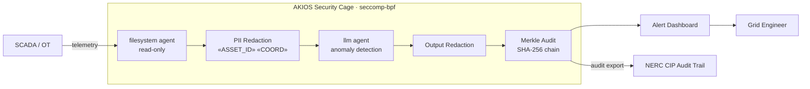

<header class="post-header">
  <div class="post-meta">February 10, 2026 · Engineering / Energy · 5 min read</div>
  <h1>AI for Energy: Securing Critical Infrastructure with AKIOS</h1>
  <div class="post-author">
    
    <span>AJ</span>
  </div>
</header>

<div class="post-content">

Energy utilities manage power grids, pipelines, and generation facilities that serve millions. AI can optimize load balancing, predict equipment failures, and detect cyber threats. The problem: **a compromised AI agent connected to operational technology (OT) systems could cause physical damage to infrastructure or disrupt power delivery to entire regions.**

AKIOS solves this with the Security Cage: an ephemeral, sandboxed runtime where AI analyzes grid data under strict, code-defined policies — with no direct access to control systems.

## The Regulatory Landscape

US energy companies face some of the strictest infrastructure protection requirements:

- **NERC CIP (Critical Infrastructure Protection)** — Mandatory cybersecurity standards for bulk electric systems. AI systems must comply with access controls, electronic security perimeters, and incident reporting.
- **FERC Orders** — Federal Energy Regulatory Commission mandates supply chain risk management and cybersecurity incident reporting for any automated systems touching grid operations.
- **DOE Cybersecurity Guidelines** — Department of Energy guidance on AI/ML in energy systems emphasizes air-gapped architectures, human-in-the-loop controls, and data integrity.
- **TSA Pipeline Security Directives** — For gas and oil pipeline operators, mandatory cybersecurity measures including network segmentation and access controls for automated monitoring.

AKIOS enforces these at the runtime level — the AI agent never operates outside the compliance boundary.

## The Workflow: Grid Anomaly Detection

1. **Ingestion**: SCADA telemetry and sensor readings are loaded into the Security Cage. Asset identifiers, geographic coordinates, and facility details are abstracted before the AI sees them.
2. **The Cage**: AKIOS initializes with the energy policy: complete network isolation from OT networks, read-only data access, no command execution capability, and NERC CIP-compliant audit logging.
3. **Analysis**: The sandboxed AI agent analyzes sensor patterns for anomalies — load imbalances, equipment degradation signatures, unusual access patterns — using only abstracted telemetry.
4. **Alerting**: Anomalies are classified by severity and type with confidence scores. The AI can recommend actions but cannot execute any commands on operational systems.
5. **Audit**: Every inference, data access, and output is cryptographically signed into a Merkle chain. NERC auditors can verify the complete analysis path.

### Architecture



## Why It Matters

- **OT/IT Separation**: The Security Cage is completely air-gapped from operational technology networks. The AI reads telemetry — it can never send commands to control systems.
- **Zero-Persistence Processing**: Sensor data is processed in ephemeral containers that are destroyed after analysis. No grid data is ever stored, cached, or retained by the AI model.
- **NERC CIP Compliance**: The sandbox satisfies electronic security perimeter requirements. Every data access is logged, every output is signed, every session is containerized.
- **Physical Safety**: Hard-coded policy rules prevent the AI from generating or outputting anything resembling a control command. The boundary between analysis and action is absolute.

## Try It Yourself

```bash
pip install akios
akios init my-project
akios run templates/file_analysis.yml
```

Secure your AI. Build with AKIOS.

</div>

<div class="post-footer">
  <a href="./">← Back to Case Studies</a>
</div>
