<header class="post-header">
  <div class="post-meta">February 10, 2026 · Engineering / Energy · 5 min read</div>
  <h1>AI for Energy: Securing Critical Infrastructure with AKIOS</h1>
</header>

<div class="post-content">

Energy utilities manage power grids, pipelines, and generation facilities that serve millions. AI can optimize load balancing, predict equipment failures, and detect cyber threats. The problem: **a compromised AI agent connected to operational technology (OT) systems could cause physical damage to infrastructure or disrupt power delivery to entire regions.**

AKIOS solves this with the Security Cage: an ephemeral, sandboxed runtime where AI analyzes grid data under strict, code-defined policies — with no direct access to control systems.

## The Problem

The energy sector's challenge is unique: unlike banking or healthcare, a breach doesn't just expose data — it can cause **physical harm**. A compromised AI with write access to SCADA systems could open breakers, reroute power, or mask equipment failures. Traditional cybersecurity tools were designed for IT networks, not for the OT/IT convergence that modern smart grids demand.

AKIOS enforces an absolute boundary between AI analysis and operational control.

## The Regulatory Landscape

US energy companies face some of the strictest infrastructure protection requirements:

<table>
  <thead>
    <tr><th>Regulation</th><th>Scope</th><th>How AKIOS Enforces It</th></tr>
  </thead>
  <tbody>
    <tr>
      <td><strong>NERC CIP</strong></td>
      <td>Mandatory cybersecurity standards for bulk electric systems — access controls, electronic security perimeters, incident reporting</td>
      <td>Sandbox satisfies electronic security perimeter requirements. Every data access logged, every output signed.</td>
    </tr>
    <tr>
      <td><strong>FERC Orders</strong></td>
      <td>Supply chain risk management and cybersecurity incident reporting for automated systems</td>
      <td>AI runs in ephemeral containers with no supply chain dependencies. Zero third-party data transmission.</td>
    </tr>
    <tr>
      <td><strong>DOE Cybersecurity Guidelines</strong></td>
      <td>Air-gapped architectures, human-in-the-loop controls, and data integrity for AI/ML in energy</td>
      <td>Complete network isolation from OT networks. AI can recommend but never execute control commands.</td>
    </tr>
    <tr>
      <td><strong>TSA Pipeline Security</strong></td>
      <td>Mandatory cybersecurity measures including network segmentation for pipeline operators</td>
      <td>Policy-enforced network segmentation — pipeline telemetry enters read-only, no write path exists.</td>
    </tr>
    <tr>
      <td><strong>ICS-CERT Advisories</strong></td>
      <td>CISA advisories on industrial control system vulnerabilities and AI-specific threat vectors</td>
      <td>Seccomp-bpf filters block all syscalls that could interact with control system protocols.</td>
    </tr>
  </tbody>
</table>

AKIOS enforces these at the runtime level — the AI agent never operates outside the compliance boundary.

## The Concept: Policy as Code

AKIOS introduces the concept of a "Security Cage" — an ephemeral, sandboxed runtime where data is processed under strict, code-defined policies. For energy, the key innovation is the **absolute read-only boundary**: the AI can read telemetry, but the cage is physically incapable of sending commands to control systems.

## The Workflow: Grid Anomaly Detection

<table>
  <thead>
    <tr><th>Step</th><th>What Happens</th><th>Security Control</th></tr>
  </thead>
  <tbody>
    <tr>
      <td><strong>1. Ingestion</strong></td>
      <td>SCADA telemetry and sensor readings loaded into the cage</td>
      <td>Asset IDs, coordinates, and facility details abstracted. Read-only filesystem agent.</td>
    </tr>
    <tr>
      <td><strong>2. Abstraction</strong></td>
      <td>Critical infrastructure identifiers replaced with generic tokens</td>
      <td>Substation names, GPS coordinates, and asset serial numbers never reach the LLM.</td>
    </tr>
    <tr>
      <td><strong>3. AI Analysis</strong></td>
      <td>LLM analyzes sensor patterns — load imbalances, degradation signatures, unusual access patterns</td>
      <td>Budget capped ($0.75/scan), complete OT network isolation, no command execution capability.</td>
    </tr>
    <tr>
      <td><strong>4. Alerting</strong></td>
      <td>Anomalies classified by severity and type with confidence scores</td>
      <td>AI can recommend actions but cannot execute any commands on operational systems.</td>
    </tr>
    <tr>
      <td><strong>5. Audit</strong></td>
      <td>Every inference and data access cryptographically signed into a Merkle chain</td>
      <td>NERC auditors can verify the complete analysis path for any alert generated.</td>
    </tr>
  </tbody>
</table>

### Architecture

```mermaid
graph LR
    SCADA["SCADA / OT\nControl Systems"] -->|"telemetry only\n(one-way diode)"| FS["filesystem agent\nread-only"]

    subgraph CAGE["AKIOS Security Cage · seccomp-bpf"]
        FS --> PII["Abstraction Engine\n«ASSET_ID» «COORD» «SERIAL»"]
        PII --> LLM["llm agent\nanomaly detection"]
        LLM --> TE["tool_executor\nseverity classification"]
        TE --> VALID["Output Validation\nno control commands"]
        VALID --> MERKLE["Merkle Chain\nSHA-256 signed"]
        MERKLE --> COST["Cost Kill-Switch\n$0.75 / scan"]
    end

    COST -->|"anomaly alerts\n(abstracted)"| Alert["Alert Dashboard\nSOC / NOC"]
    Alert --> Engineer["Grid\nEngineer"]
    MERKLE -->|"audit export\n(immutable)"| NERC["NERC CIP\nAudit Trail"]
    NERC --> FERC["FERC\nCompliance"]
```



### Policy Configuration

The entire compliance posture is defined in a single YAML file:

```yaml
# energy-nerc-cip-policy.yml
security:
  sandbox: strict
  network: isolated
  allowed_endpoints: []  # zero network access — absolute OT/IT separation
  pii_redaction:
    enabled: true
    patterns: [asset_id, gps_coordinates, serial_number, substation_name]
    mode: aggressive
  budget:
    max_cost_per_run: 0.75
    currency: USD
  audit:
    merkle_chain: true
    export_format: jsonl
    retention_days: 1095  # 3 years — NERC CIP retention requirement
  constraints:
    block_control_commands: true  # hard-coded: AI cannot generate SCADA commands
    read_only: true
```

## What the Grid Engineer Sees

At the end of the workflow, the grid engineer receives a structured alert:

<table>
  <thead>
    <tr><th>Field</th><th>Value</th></tr>
  </thead>
  <tbody>
    <tr><td>Alert ID</td><td>GRID-2026-0210-****6721</td></tr>
    <tr><td>Severity</td><td>🟠 High — Equipment degradation signature</td></tr>
    <tr><td>Pattern Detected</td><td>Transformer harmonic distortion increasing 12% over 72 hours — consistent with insulation breakdown</td></tr>
    <tr><td>Recommended Action</td><td>Schedule preventive maintenance inspection within 14 days</td></tr>
    <tr><td>Confidence</td><td>88%</td></tr>
    <tr><td>Audit Hash</td><td><code>c9d4e7...b23a</code></td></tr>
    <tr><td>Infrastructure Data Exposed</td><td>❌ None — all asset identifiers abstracted before analysis</td></tr>
  </tbody>
</table>

No substation names. No GPS coordinates. No equipment serial numbers. Just actionable maintenance intelligence with a cryptographic proof chain.

## Why It Matters

- **OT/IT Separation**: The Security Cage is completely air-gapped from operational technology networks. The AI reads telemetry — it can never send commands to control systems.
- **Zero-Persistence Processing**: Sensor data is processed in ephemeral containers destroyed after analysis. No grid data is ever stored, cached, or retained by the AI model.
- **NERC CIP Compliance**: The sandbox satisfies electronic security perimeter requirements. Every data access is logged, every output is signed, every session is containerized.
- **Physical Safety**: Hard-coded policy rules prevent the AI from generating or outputting anything resembling a control command. The boundary between analysis and action is absolute.
- **Predictive Maintenance**: AI can identify equipment degradation patterns weeks before failure, enabling proactive maintenance without exposing critical infrastructure details.

## Try It Yourself

```bash
pip install akios
akios init my-project
akios run templates/file_analysis.yml
```

Secure your AI. Build with AKIOS.

</div>

<div class="post-footer">
  <p>Related: <a href="government-airgap-deployment.html">Air-Gapped AI for Government</a> | <a href="healthcare-hipaa-security-cage.html">HIPAA-Compliant AI for Healthcare</a></p>
  <a href="./">← Back to Case Studies</a>
</div>
