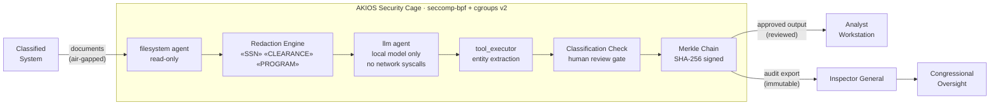

<header class="post-header">
  <div class="post-meta">February 10, 2026 · Engineering / Government · 5 min read</div>
  <h1>Air-Gapped AI for Government: FedRAMP-Ready Deployments with AKIOS</h1>
</header>

<div class="post-content">

Government agencies are under pressure to adopt AI for everything from citizen services to intelligence analysis. But federal systems operate under constraints that commercial AI tools weren't built for: **air-gapped networks, security clearances, and strict data sovereignty requirements.**

You can't just point GPT-4 at classified documents and hope for the best. You need a runtime that was designed for this threat model from day one.

AKIOS provides exactly that: a Security Cage that runs entirely on-premise, with no external network dependencies, and produces audit trails that satisfy federal compliance frameworks.

## The Problem

Federal agencies face a unique paradox: they have some of the highest-value data in the world (intelligence, law enforcement, citizen records) and some of the strictest rules about how that data can be processed. Commercial AI tools assume cloud connectivity, third-party APIs, and data sharing — all of which are non-starters for classified environments.

AKIOS was designed for the **zero-trust, air-gapped threat model** from the ground up.

## The Regulatory Landscape

Government AI in the United States is governed by some of the strictest security frameworks in the world:

<table>
  <thead>
    <tr><th>Regulation</th><th>Scope</th><th>How AKIOS Enforces It</th></tr>
  </thead>
  <tbody>
    <tr>
      <td><strong>FedRAMP</strong></td>
      <td>Standardized security assessment for cloud services used by federal agencies</td>
      <td>AKIOS runs entirely on-premise. No cloud dependency. Sidesteps FedRAMP cloud concerns.</td>
    </tr>
    <tr>
      <td><strong>NIST SP 800-53</strong></td>
      <td>The gold standard for federal security controls — AC, AU, SC, SI control families</td>
      <td>AKIOS maps directly to Access Control, Audit, System Communications, and System Integrity families.</td>
    </tr>
    <tr>
      <td><strong>FISMA</strong></td>
      <td>Continuous monitoring and risk management for federal information systems</td>
      <td>Merkle-chained audit logs provide continuous evidence of authorized AI use.</td>
    </tr>
    <tr>
      <td><strong>EO 14110</strong></td>
      <td>AI executive order mandating safety testing, red-teaming, and transparency</td>
      <td>Deterministic sandbox enables reproducible safety testing. Full transparency via audit chain.</td>
    </tr>
    <tr>
      <td><strong>ITAR / EAR</strong></td>
      <td>Export control regulations requiring certain data never leaves US soil</td>
      <td>Zero network access at kernel level. Data sovereignty enforced by infrastructure, not policy.</td>
    </tr>
  </tbody>
</table>

## The Concept: Policy as Code

AKIOS introduces the concept of a "Security Cage" — an ephemeral, sandboxed runtime where data is processed under strict, code-defined policies. For government deployments, the key feature is **kernel-level network blocking**: not application-level firewalls, but seccomp-bpf filters that make network syscalls physically impossible.

## The Workflow: Classified Document Analysis

<table>
  <thead>
    <tr><th>Step</th><th>What Happens</th><th>Security Control</th></tr>
  </thead>
  <tbody>
    <tr>
      <td><strong>1. Ingestion</strong></td>
      <td>Documents loaded into the cage on an air-gapped workstation. No network connection.</td>
      <td>Read-only filesystem agent. Data cannot be copied outside the cage boundary.</td>
    </tr>
    <tr>
      <td><strong>2. Redaction</strong></td>
      <td>Classified markers, clearance levels, and PII stripped before AI processing</td>
      <td>SSN, clearance codes, program names replaced with tokens. Originals never reach the LLM.</td>
    </tr>
    <tr>
      <td><strong>3. AI Analysis</strong></td>
      <td>Local model processes documents — summarization, entity extraction, cross-referencing</td>
      <td>All network syscalls blocked at kernel level. No external data transmission possible.</td>
    </tr>
    <tr>
      <td><strong>4. Classification Review</strong></td>
      <td>Outputs checked against classification guidelines before leaving the cage</td>
      <td>Anything flagged as potentially classified goes to human review. AI cannot declassify.</td>
    </tr>
    <tr>
      <td><strong>5. Audit</strong></td>
      <td>Every operation logged into a Merkle-chained audit trail</td>
      <td>Tamper-evident proof for Inspector General reviews and congressional oversight.</td>
    </tr>
  </tbody>
</table>

### Architecture



### Policy Configuration

The entire compliance posture is defined in a single YAML file:

```yaml
# government-airgap-policy.yml
security:
  sandbox: strict
  network: blocked  # all network syscalls blocked at kernel level
  allowed_endpoints: []  # zero network access
  pii_redaction:
    enabled: true
    patterns: [ssn, clearance_level, program_name, agency_code, badge_number]
    mode: aggressive
  budget:
    max_cost_per_run: 0.00  # local model — zero API cost
    currency: USD
  audit:
    merkle_chain: true
    export_format: jsonl
    retention_days: 2555  # 7 years — federal records retention
  constraints:
    local_model_only: true
    classification_review: mandatory
```

## What the Analyst Sees

At the end of the workflow, the intelligence analyst receives a structured report:

<table>
  <thead>
    <tr><th>Field</th><th>Value</th></tr>
  </thead>
  <tbody>
    <tr><td>Document</td><td>brief-2026-0210-****8492.pdf</td></tr>
    <tr><td>Summary</td><td>Regional threat assessment — 3 entities identified, 2 cross-references to existing reporting</td></tr>
    <tr><td>Entities Extracted</td><td>12 organizations, 8 locations, 4 dates (all abstracted)</td></tr>
    <tr><td>Classification Flag</td><td>⚠️ Output contains potential FOUO references — routed to human review</td></tr>
    <tr><td>Confidence</td><td>86%</td></tr>
    <tr><td>Audit Hash</td><td><code>f1a8d3...c72e</code></td></tr>
    <tr><td>Network Access Attempted</td><td>❌ None — all network syscalls blocked at kernel level</td></tr>
  </tbody>
</table>

No classified content in AI output. No network exfiltration. Just structured analysis with a tamper-evident proof chain.

## Why It Matters

- **True Air-Gap**: AKIOS blocks all network syscalls at the kernel level — not just at the application layer. Even a jailbroken model cannot phone home.
- **No Cloud Dependency**: The entire runtime runs locally. No external API calls, no telemetry, no third-party services.
- **NIST 800-53 Mapping**: AKIOS audit logs map directly to federal control families. Compliance officers can generate evidence reports for Authority to Operate (ATO) reviews.
- **Inspector General Ready**: The Merkle-chained audit trail provides tamper-evident proof that AI was used within authorized boundaries.
- **Data Sovereignty**: ITAR/EAR compliance is enforced by infrastructure, not by policy documents. Data physically cannot leave the workstation.

## Try It Yourself

```bash
pip install akios
akios init my-project
akios run templates/batch_processing.yml
```

Secure your AI. Build with AKIOS.

</div>

<div class="post-footer">
  <p>Related: <a href="energy-grid-security.html">AI for Critical Infrastructure</a> | <a href="healthcare-hipaa-security-cage.html">HIPAA-Compliant AI for Healthcare</a></p>
  <a href="./">← Back to Case Studies</a>
</div>
