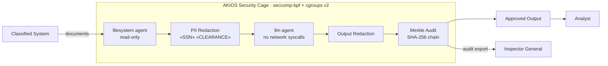

<header class="post-header">
  <div class="post-meta">February 10, 2026 · Engineering / Government · 5 min read</div>
  <h1>Air-Gapped AI for Government: FedRAMP-Ready Deployments with AKIOS</h1>
  <div class="post-author">
    
    <span>AJ</span>
  </div>
</header>

<div class="post-content">

Government agencies are under pressure to adopt AI for everything from citizen services to intelligence analysis. But federal systems operate under constraints that commercial AI tools weren't built for: **air-gapped networks, security clearances, and strict data sovereignty requirements.**

You can't just point GPT-4 at classified documents and hope for the best. You need a runtime that was designed for this threat model from day one.

AKIOS provides exactly that: a Security Cage that runs entirely on-premise, with no external network dependencies, and produces audit trails that satisfy federal compliance frameworks.

## The Regulatory Landscape

Government AI in the United States is governed by some of the strictest security frameworks in the world:

- **FedRAMP** — Federal Risk and Authorization Management Program requires standardized security assessment for cloud services. AKIOS runs on-premise, sidestepping cloud concerns entirely.
- **NIST SP 800-53** — The gold standard for federal security controls. AKIOS maps directly to AC (Access Control), AU (Audit), SC (System Communications), and SI (System Integrity) control families.
- **FISMA** — Federal Information Security Modernization Act requires continuous monitoring and risk management. AKIOS audit logs provide continuous evidence.
- **Executive Order 14110** — The 2023 AI executive order mandates safety testing, red-teaming, and transparency for government AI use.
- **ITAR / EAR** — Export control regulations require that certain data never leaves US soil. AKIOS enforces this at the runtime level.

## The Workflow: Classified Document Analysis

1. **Ingestion**: Documents are loaded into the Security Cage on an air-gapped workstation. No network connection exists — by design.
2. **The Cage**: AKIOS initializes with the government policy: all network syscalls blocked at the kernel level, strict memory limits, and NIST 800-53-aligned audit logging.
3. **Analysis**: The sandboxed AI agent processes documents — summarization, entity extraction, cross-referencing — using a local model. No data is transmitted externally.
4. **Classification Review**: Outputs are checked against classification guidelines before leaving the cage. Anything flagged as potentially classified goes to human review.
5. **Audit**: Every operation is logged into a Merkle-chained audit trail. The chain provides tamper-evident proof for Inspector General reviews and congressional oversight.

### Architecture



## Why It Matters

- **True Air-Gap**: AKIOS blocks all network syscalls at the kernel level — not just at the application layer. Even a jailbroken model cannot phone home.
- **No Cloud Dependency**: The entire runtime runs locally. No external API calls, no telemetry, no third-party services. This satisfies the strictest data sovereignty requirements.
- **NIST 800-53 Mapping**: AKIOS audit logs map directly to federal control families. Compliance officers can generate evidence reports for Authority to Operate (ATO) reviews.
- **Inspector General Ready**: The Merkle-chained audit trail provides tamper-evident proof that AI was used within authorized boundaries. If a log entry is modified, the chain breaks.

## Try It Yourself

```bash
pip install akios
akios init my-project
akios run templates/batch_processing.yml
```

Secure your AI. Build with AKIOS.

</div>

<div class="post-footer">
  <a href="./">← Back to Case Studies</a>
</div>
