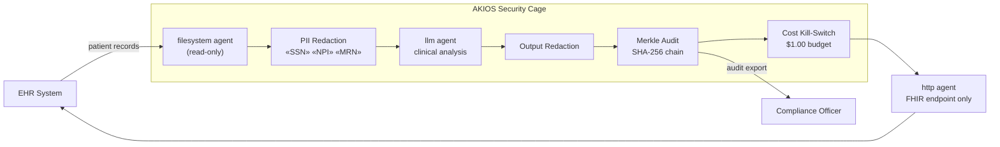

<header class="post-header">
  <div class="post-meta">February 6, 2026 · Engineering / Healthcare · 5 min read</div>
  <h1>Building a HIPAA-Compliant AI Security Cage in 15 Seconds</h1>
  <div class="post-author">
    
    <span>AJ</span>
  </div>
</header>

<div class="post-content">

The biggest barrier to adopting AI in healthcare isn't model capability — it's **safety**. How do you use powerful LLMs like Grok or GPT-4 on sensitive patient records without risking a HIPAA violation?

The answer isn't to avoid AI, but to wrap it in a **Security Cage**.

## The Regulatory Landscape

Healthcare AI in the United States must comply with multiple overlapping frameworks:

- **HIPAA / HITECH** — Strict rules on Protected Health Information (PHI) storage, transmission, and access.
- **EU AI Act (High-Risk)** — AI systems used in healthcare are classified as high-risk, requiring conformity assessments, human oversight, and full audit trails.
- **21 CFR Part 11** — FDA requirements for electronic records and signatures.

AKIOS enforces these at the runtime level — not as a checklist, but as code.

## The Concept: Policy as Code

AKIOS introduces the concept of a "Security Cage" — an ephemeral, sandboxed runtime environment where data is processed under strict, code-defined policies.

In our latest demo, we show a common workflow: **Automated PII Redaction**.

### The Workflow

1. **Ingestion**: A raw patient admission record (containing SSN, Name, Address) is loaded into the secure workspace.
2. **The Cage**: The AKIOS runtime initializes. It blocks all unauthorized network calls, enforces a strict budget (e.g., $1.00 limit), and loads the HIPAA redaction policy.
3. **Execution**: An AI agent is granted temporary access to the text *only* to identify and redact PII. It cannot save the raw data elsewhere.
4. **Integration**: The sanitized, verified output is securely deployed to a whitelisted EHR API (e.g., Epic Systems via FHIR/HL7) via the Network Agent.
5. **Audit**: Every byte read, written, and transmitted is logged with a cryptographic hash. If the audit trail breaks, the workflow fails.

### Architecture



## Why It Matters

Traditional compliance involves manual reviews and "trust me" architecture. AKIOS changes this to **"verify me"** architecture.

- **Deterministic**: The same input always yields the same audited result.
- **Local-First**: Run this on your laptop or in an air-gapped server. PHI never leaves your infrastructure.
- **Cost-Controlled**: Kill-switches prevent runaway API bills — critical when processing thousands of patient records.
- **EU AI Act Ready**: Full audit trails and human-in-the-loop controls satisfy high-risk AI requirements.

## Try It Yourself

AKIOS is open-source. You can run this exact workflow today:

```bash
pip install akios
akios init my-project
akios run templates/file_analysis.yml
```

Secure your AI. Build with AKIOS.

</div>

<div class="post-footer">
  <a href="./">← Back to Case Studies</a>
</div>
