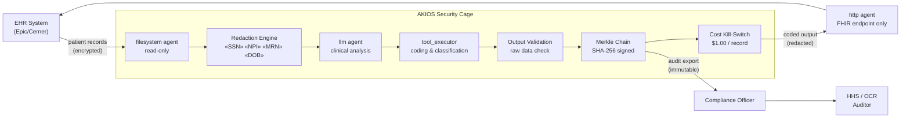

<header class="post-header">
  <div class="post-meta">February 6, 2026 · Engineering / Healthcare · 5 min read</div>
  <h1>Building a HIPAA-Compliant AI Security Cage in 15 Seconds</h1>
</header>

<div class="post-content">

The biggest barrier to adopting AI in healthcare isn't model capability — it's **safety**. How do you use powerful LLMs like Grok or GPT-4 on sensitive patient records without risking a HIPAA violation?

The answer isn't to avoid AI, but to wrap it in a **Security Cage**.

## The Problem

Every healthcare CIO faces the same dilemma: AI models need data to be useful, but the data they need — Social Security numbers, medical record numbers, diagnoses, lab results — is exactly the data that regulations demand you protect. Traditional approaches force a choice: **use AI and accept the risk**, or **stay compliant and stay manual**.

AKIOS eliminates that trade-off.

## The Regulatory Landscape

Healthcare AI in the United States must comply with multiple overlapping frameworks:

<table>
  <thead>
    <tr><th>Regulation</th><th>Scope</th><th>How AKIOS Enforces It</th></tr>
  </thead>
  <tbody>
    <tr>
      <td><strong>HIPAA / HITECH</strong></td>
      <td>Strict rules on Protected Health Information (PHI) storage, transmission, and access</td>
      <td>In-memory redaction at ingestion. The AI never sees raw patient identifiers.</td>
    </tr>
    <tr>
      <td><strong>21 CFR Part 11</strong></td>
      <td>FDA requirements for electronic records and electronic signatures</td>
      <td>Merkle-chained audit trail with cryptographic signatures satisfies e-signature requirements.</td>
    </tr>
    <tr>
      <td><strong>EU AI Act (High-Risk)</strong></td>
      <td>AI systems in healthcare classified as high-risk, requiring conformity assessments</td>
      <td>Full audit trails and human-in-the-loop controls satisfy high-risk AI requirements.</td>
    </tr>
    <tr>
      <td><strong>HITECH Breach Notification</strong></td>
      <td>Mandatory breach notification within 60 days if PHI is exposed</td>
      <td>Zero-exposure architecture — PHI is redacted before AI processing, so there is nothing to breach.</td>
    </tr>
    <tr>
      <td><strong>State Privacy Laws</strong></td>
      <td>California CCPA, Texas HB 300, New York SHIELD Act — state-level health data protections</td>
      <td>Policy templates per jurisdiction ensure the cage enforces the strictest applicable rules.</td>
    </tr>
  </tbody>
</table>

AKIOS enforces these at the runtime level — not as a checklist, but as code.

## The Concept: Policy as Code

AKIOS introduces the concept of a "Security Cage" — an ephemeral, sandboxed runtime environment where data is processed under strict, code-defined policies. Unlike traditional compliance built on documentation and trust, the Security Cage makes violations **physically impossible** at the infrastructure level.

## The Workflow: Automated PHI Redaction

<table>
  <thead>
    <tr><th>Step</th><th>What Happens</th><th>Security Control</th></tr>
  </thead>
  <tbody>
    <tr>
      <td><strong>1. Ingestion</strong></td>
      <td>Raw patient admission record (SSN, Name, Address, MRN) loaded into the cage</td>
      <td>Data enters via read-only filesystem agent. No copies outside the cage.</td>
    </tr>
    <tr>
      <td><strong>2. Redaction</strong></td>
      <td>50+ PHI patterns detected and masked before AI processing</td>
      <td>SSN, MRN, NPI, DOB replaced with tokens. The original never reaches the LLM.</td>
    </tr>
    <tr>
      <td><strong>3. AI Analysis</strong></td>
      <td>LLM performs clinical analysis on redacted content — coding, summarization, risk flags</td>
      <td>Budget capped ($1.00/record), network isolated, no persistent storage.</td>
    </tr>
    <tr>
      <td><strong>4. Integration</strong></td>
      <td>Sanitized output deployed to whitelisted EHR API (Epic/Cerner via FHIR/HL7)</td>
      <td>HTTP agent locked to approved FHIR endpoints only. No other destinations allowed.</td>
    </tr>
    <tr>
      <td><strong>5. Audit</strong></td>
      <td>Every byte read, written, and transmitted logged with cryptographic hash</td>
      <td>Merkle chain — if any entry is altered, the entire chain is invalidated.</td>
    </tr>
  </tbody>
</table>

### Architecture



### Policy Configuration

The entire compliance posture is defined in a single YAML file:

```yaml
# healthcare-hipaa-policy.yml
security:
  sandbox: strict
  network: isolated
  allowed_endpoints:
    - ehr-fhir.internal:443
  pii_redaction:
    enabled: true
    patterns: [ssn, mrn, npi, dob, phone, address, insurance_id]
    mode: aggressive
  budget:
    max_cost_per_run: 1.00
    currency: USD
  audit:
    merkle_chain: true
    export_format: jsonl
    retention_days: 2190  # 6 years — HIPAA retention requirement
```

## What the Compliance Officer Sees

At the end of the workflow, the compliance team receives a structured report:

<table>
  <thead>
    <tr><th>Field</th><th>Value</th></tr>
  </thead>
  <tbody>
    <tr><td>Record</td><td>admission-2026-0206-****4281.pdf</td></tr>
    <tr><td>Clinical Code</td><td>ICD-10: E11.9 — Type 2 Diabetes Mellitus without complications</td></tr>
    <tr><td>Risk Flags</td><td>Drug interaction alert — metformin + contrast dye imaging scheduled</td></tr>
    <tr><td>Confidence</td><td>94%</td></tr>
    <tr><td>Audit Hash</td><td><code>b4a7c1...d82f</code></td></tr>
    <tr><td>PHI Exposed</td><td>❌ None — all identifiers redacted before analysis</td></tr>
    <tr><td>FHIR Submission</td><td>✅ Coded output submitted to Epic FHIR R4 endpoint</td></tr>
  </tbody>
</table>

No SSNs. No patient names. No raw medical records. Just clinically actionable output with a cryptographic proof chain.

## Why It Matters

- **Zero PHI Exposure**: Patient identifiers are redacted before any AI processing. Even if the model is compromised, there is nothing to leak.
- **Auditable Decisions**: Every clinical code and risk flag includes a cryptographic proof chain. HHS/OCR auditors can trace exactly how a decision was made.
- **Cost Control**: Hard budget limits per record prevent runaway API bills — critical when processing thousands of patient admissions.
- **HIPAA Retention**: Merkle chain logs are exportable in JSONL format, satisfying the 6-year HIPAA retention requirement.
- **EU AI Act Ready**: Full audit trails and human-in-the-loop controls satisfy high-risk AI classification requirements.

## Try It Yourself

AKIOS is open-source. You can run this exact workflow today:

```bash
pip install akios
akios init my-project
akios run templates/file_analysis.yml
```

Secure your AI. Build with AKIOS.

</div>

<div class="post-footer">
  <p>Related: <a href="banking-security-cage.html">PCI-DSS Compliant AI for Banking</a> | <a href="pharma-clinical-trials.html">FDA-Controlled AI for Pharma</a></p>
  <a href="./">← Back to Case Studies</a>
</div>
