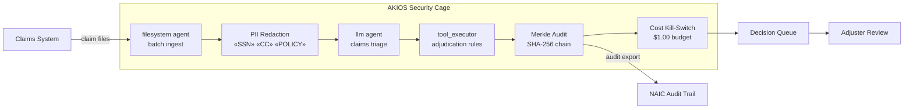

<header class="post-header">
  <div class="post-meta">February 10, 2026 · Engineering / Insurance · 5 min read</div>
  <h1>Secure AI for Insurance: Claims Processing Without Exposing Policyholder Data</h1>
  <div class="post-author">
    
    <span>AJ</span>
  </div>
</header>

<div class="post-content">

Insurance companies process thousands of claims daily — property damage, medical bills, liability disputes. AI can accelerate adjudication, flag fraud, and reduce cycle times. The challenge: **policyholder data includes medical records, financial details, and personally identifiable information that must never leak.**

AKIOS solves this with the Security Cage: an ephemeral, sandboxed runtime where AI processes claims under strict, code-defined policies.

## The Regulatory Landscape

US insurance companies face a unique regulatory stack:

- **State Insurance Regulations** — Each state has its own data protection and claims handling requirements. NAIC Model Laws provide a baseline, but compliance is per-state.
- **HIPAA** — Health insurance claims involve PHI. AI processing must maintain the same protections as the insurer's core systems.
- **NAIC Model Audit Rule** — Insurers must maintain auditable records of all automated decision-making affecting policyholders.
- **FCRA (Fair Credit Reporting Act)** — When AI uses credit-related data for underwriting, adverse action requirements apply.

AKIOS enforces these at the runtime level — the AI agent never operates outside the compliance boundary.

## The Workflow: Automated Claims Adjudication

1. **Ingestion**: A batch of new claims is loaded into the Security Cage. SSNs, policy numbers, and medical record identifiers are redacted before the AI sees them.
2. **The Cage**: AKIOS initializes with the insurance policy: network isolation, $0.30 budget cap per claim, and NAIC-compliant audit logging.
3. **Analysis**: The sandboxed AI agent evaluates claims against policy terms — damage assessments, coverage verification, medical necessity review — using only redacted data.
4. **Classification**: Claims are classified as approve, deny, or escalate with confidence scores and rule citations. The AI cannot authorize payments.
5. **Audit**: Every inference, data access, and output is cryptographically signed into a Merkle chain. State regulators can verify the complete decision path.

### Architecture



## Why It Matters

- **Zero Data Exposure**: SSNs, medical records, and policy details are redacted before AI processing. Even if the model is compromised, there's nothing to leak.
- **State-Level Compliance**: Policy templates can be configured per state, ensuring the AI respects jurisdiction-specific claims handling rules.
- **Fraud Detection**: The sandbox can cross-reference claims patterns without exposing individual policyholder data across claims.
- **Auditable Decisions**: Every classification includes a cryptographic proof chain. State insurance commissioners can trace exactly how a decision was made.

## Try It Yourself

```bash
pip install akios
akios init my-project
akios run templates/batch_processing.yml
```

Secure your AI. Build with AKIOS.

</div>

<div class="post-footer">
  <a href="./">← Back to Case Studies</a>
</div>
