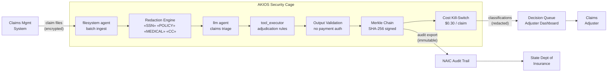

<header class="post-header">
  <div class="post-meta">February 10, 2026 · Engineering / Insurance · 5 min read</div>
  <h1>Secure AI for Insurance: Claims Processing Without Exposing Policyholder Data</h1>
</header>

<div class="post-content">

Insurance companies process thousands of claims daily — property damage, medical bills, liability disputes. AI can accelerate adjudication, flag fraud, and reduce cycle times. The challenge: **policyholder data includes medical records, financial details, and personally identifiable information that must never leak.**

AKIOS solves this with the Security Cage: an ephemeral, sandboxed runtime where AI processes claims under strict, code-defined policies.

## The Problem

Claims processing is a bottleneck. Manual adjudication is slow, inconsistent, and expensive. AI can evaluate a claim in seconds — but connecting a model to policyholder data creates a new risk vector. Medical records, SSNs, policy numbers, and financial details are all at stake. A data breach doesn't just mean regulatory fines — it means class-action lawsuits and lost customer trust.

AKIOS lets you deploy AI on claims data **without exposing any policyholder identifiers**.

## The Regulatory Landscape

US insurance companies face a unique regulatory stack:

<table>
  <thead>
    <tr><th>Regulation</th><th>Scope</th><th>How AKIOS Enforces It</th></tr>
  </thead>
  <tbody>
    <tr>
      <td><strong>State Insurance Regulations</strong></td>
      <td>Each state has its own data protection and claims handling requirements (NAIC Model Laws as baseline)</td>
      <td>Policy templates per state ensure the cage enforces jurisdiction-specific rules.</td>
    </tr>
    <tr>
      <td><strong>HIPAA</strong></td>
      <td>Health insurance claims involve PHI — same protections as core healthcare systems</td>
      <td>Medical record identifiers redacted before AI processing. Zero PHI exposure.</td>
    </tr>
    <tr>
      <td><strong>NAIC Model Audit Rule</strong></td>
      <td>Insurers must maintain auditable records of all automated decision-making affecting policyholders</td>
      <td>Merkle-chained audit trail — every classification cryptographically signed and immutable.</td>
    </tr>
    <tr>
      <td><strong>FCRA</strong></td>
      <td>When AI uses credit-related data for underwriting, adverse action requirements apply</td>
      <td>Complete decision provenance exported per claim. Adverse action explanations included in output.</td>
    </tr>
    <tr>
      <td><strong>CCPA / State Privacy</strong></td>
      <td>Consumer data rights — access, deletion, opt-out of automated decision-making</td>
      <td>All PII redacted before AI processing. Audit trail proves no personal data retained by model.</td>
    </tr>
  </tbody>
</table>

AKIOS enforces these at the runtime level — the AI agent never operates outside the compliance boundary.

## The Concept: Policy as Code

AKIOS introduces the concept of a "Security Cage" — an ephemeral, sandboxed runtime environment where data is processed under strict, code-defined policies. For insurance, the key feature is **per-state policy templates**: compliance rules can be configured per jurisdiction, ensuring the AI respects state-specific claims handling requirements.

## The Workflow: Automated Claims Adjudication

<table>
  <thead>
    <tr><th>Step</th><th>What Happens</th><th>Security Control</th></tr>
  </thead>
  <tbody>
    <tr>
      <td><strong>1. Ingestion</strong></td>
      <td>Batch of new claims loaded into the Security Cage</td>
      <td>SSNs, policy numbers, and medical IDs redacted before AI sees them.</td>
    </tr>
    <tr>
      <td><strong>2. Redaction</strong></td>
      <td>Policyholder identifiers stripped and replaced with tokens</td>
      <td>50+ PII patterns including medical codes, financial accounts, addresses replaced.</td>
    </tr>
    <tr>
      <td><strong>3. AI Analysis</strong></td>
      <td>LLM evaluates claims against policy terms — damage assessment, coverage verification, medical necessity</td>
      <td>Budget capped ($0.30/claim), network isolated, no persistent storage.</td>
    </tr>
    <tr>
      <td><strong>4. Classification</strong></td>
      <td>Claims classified as approve, deny, or escalate with confidence scores and rule citations</td>
      <td>AI cannot authorize payments. All approvals require human confirmation.</td>
    </tr>
    <tr>
      <td><strong>5. Audit</strong></td>
      <td>Every inference, data access, and output cryptographically signed</td>
      <td>State regulators can verify the complete decision path for any claim.</td>
    </tr>
  </tbody>
</table>

### Architecture



### Policy Configuration

The entire compliance posture is defined in a single YAML file:

```yaml
# insurance-claims-policy.yml
security:
  sandbox: strict
  network: isolated
  allowed_endpoints: []  # zero network access
  pii_redaction:
    enabled: true
    patterns: [ssn, policy_number, medical_record, credit_card, address, dob]
    mode: aggressive
  budget:
    max_cost_per_run: 0.30
    currency: USD
  audit:
    merkle_chain: true
    export_format: jsonl
    retention_days: 2555  # 7 years — NAIC record retention
  constraints:
    payment_authorization: disabled  # AI cannot approve payments
    human_review: required_for_denials
```

## What the Claims Adjuster Sees

At the end of the workflow, the claims adjuster receives a structured report:

<table>
  <thead>
    <tr><th>Field</th><th>Value</th></tr>
  </thead>
  <tbody>
    <tr><td>Claim ID</td><td>CLM-2026-0210-****5847</td></tr>
    <tr><td>Classification</td><td>⚠️ Escalate — Coverage ambiguity detected</td></tr>
    <tr><td>Analysis</td><td>Water damage claim cites "sudden and accidental" but description indicates gradual seepage over 3 months</td></tr>
    <tr><td>Policy Reference</td><td>Section 4.2.1 — Exclusion for gradual deterioration</td></tr>
    <tr><td>Fraud Indicators</td><td>None detected (0.12 risk score)</td></tr>
    <tr><td>Confidence</td><td>89%</td></tr>
    <tr><td>Audit Hash</td><td><code>d8f2a1...c47b</code></td></tr>
    <tr><td>Policyholder Data Exposed</td><td>❌ None — all PII redacted before analysis</td></tr>
  </tbody>
</table>

No SSNs. No policy numbers. No medical details. Just adjudication intelligence with a cryptographic proof chain.

## Why It Matters

- **Zero Data Exposure**: SSNs, medical records, and policy details are redacted before AI processing. Even if the model is compromised, there's nothing to leak.
- **State-Level Compliance**: Policy templates can be configured per state, ensuring the AI respects jurisdiction-specific claims handling rules.
- **Fraud Detection**: The sandbox can cross-reference claims patterns without exposing individual policyholder data across claims.
- **Auditable Decisions**: Every classification includes a cryptographic proof chain. State insurance commissioners can trace exactly how a decision was made.
- **No Unauthorized Payments**: Hard-coded constraints prevent the AI from authorizing any payments. All financial actions require human confirmation.

## Try It Yourself

```bash
pip install akios
akios init my-project
akios run templates/batch_processing.yml
```

Secure your AI. Build with AKIOS.

</div>

<div class="post-footer">
  <p>Related: <a href="healthcare-hipaa-security-cage.html">HIPAA-Compliant AI for Healthcare</a> | <a href="banking-fraud-detection.html">Fraud Detection for Banking</a></p>
  <a href="./">← Back to Case Studies</a>
</div>
