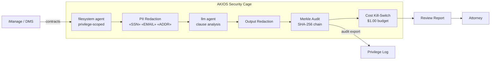

<header class="post-header">
  <div class="post-meta">February 9, 2026 · Engineering / Legal · 5 min read</div>
  <h1>AI-Powered Contract Review Under Attorney-Client Privilege</h1>
  <div class="post-author">
    
    <span>AJ</span>
  </div>
</header>

<div class="post-content">

Law firms sit on mountains of documents: contracts, depositions, discovery materials. AI can review them orders of magnitude faster than paralegals. But legal documents carry an obligation no other industry faces: **attorney-client privilege.**

If an AI system leaks privileged communications or sends client data to a third-party API, the privilege may be waived — permanently. This isn't a fine. It can lose cases.

AKIOS solves this with a Security Cage where AI processes legal documents without ever exposing privileged content outside the boundary.

## The Regulatory Landscape

Legal AI in the United States must navigate:

- **ABA Model Rules (1.6, 5.3)** — Lawyers have a duty to protect confidential information and supervise any technology assistants (including AI).
- **CCPA / State Privacy Laws** — Client personal data in legal documents is subject to privacy regulations.
- **Federal Rules of Civil Procedure (FRCP)** — eDiscovery processes require defensible, auditable workflows.
- **SOC 2 Type II** — Many corporate clients require their law firms to demonstrate auditable security controls.

AKIOS enforces these requirements at the runtime level — privilege never leaves the cage.

## The Workflow: Privileged Document Review

1. **Ingestion**: A set of contracts or discovery documents is loaded into the Security Cage. Names, account numbers, and client identifiers are redacted in-memory.
2. **The Cage**: AKIOS initializes with the legal policy: complete network isolation (no data leaves the machine), $0.50 budget cap per document set, and privilege-aware logging.
3. **Review**: The sandboxed AI agent classifies documents by relevance, identifies key clauses (indemnification, liability caps, change of control), and flags potential issues — all on redacted content.
4. **Privilege Check**: Before any output leaves the cage, AKIOS verifies no privileged content is included in the results. Flagged items go to human review.
5. **Audit**: Every document access, classification, and output is logged with cryptographic signatures. The complete chain proves the review was conducted within privilege boundaries.

### Architecture



## Why It Matters

- **Privilege Preserved**: Complete network isolation means privileged documents never leave the local machine. No data is sent to external APIs — ever.
- **ABA Compliant Supervision**: The immutable audit log proves the attorney maintained oversight of the AI tool, satisfying Rule 5.3.
- **Defensible eDiscovery**: Every step in the review process is cryptographically signed. If challenged, the firm can prove exactly how documents were processed.
- **Cost Control for Clients**: Hard budget limits per document set make AI-assisted review predictably priced — a major selling point for clients tired of billable hour surprises.

## Try It Yourself

```bash
pip install akios
akios init my-project
akios run templates/file_analysis.yml
```

Secure your AI. Build with AKIOS.

</div>

<div class="post-footer">
  <a href="./">← Back to Case Studies</a>
</div>
