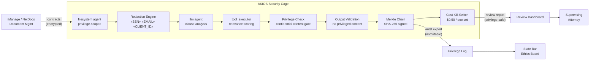

<header class="post-header">
  <div class="post-meta">February 9, 2026 · Engineering / Legal · 5 min read</div>
  <h1>AI-Powered Contract Review Under Attorney-Client Privilege</h1>
</header>

<div class="post-content">

Law firms sit on mountains of documents: contracts, depositions, discovery materials. AI can review them orders of magnitude faster than paralegals. But legal documents carry an obligation no other industry faces: **attorney-client privilege.**

If an AI system leaks privileged communications or sends client data to a third-party API, the privilege may be waived — permanently. This isn't a fine. It can lose cases.

AKIOS solves this with a Security Cage where AI processes legal documents without ever exposing privileged content outside the boundary.

## The Problem

Document review is one of the most expensive parts of litigation. A single eDiscovery matter can involve millions of documents. AI can classify, summarize, and flag relevant documents in hours instead of weeks — but the moment you connect an AI model to privileged communications, you're creating a waiver risk. One API call to an external service with privileged content, and opposing counsel will argue the privilege has been breached.

AKIOS ensures that **privileged content never leaves the local machine**.

## The Regulatory Landscape

Legal AI in the United States must navigate unique professional obligations:

<table>
  <thead>
    <tr><th>Regulation</th><th>Scope</th><th>How AKIOS Enforces It</th></tr>
  </thead>
  <tbody>
    <tr>
      <td><strong>ABA Model Rules (1.6, 5.3)</strong></td>
      <td>Duty to protect confidential information and supervise technology assistants including AI</td>
      <td>Immutable audit log proves attorney maintained oversight of AI tool (Rule 5.3 compliance).</td>
    </tr>
    <tr>
      <td><strong>FRCP (eDiscovery)</strong></td>
      <td>Federal Rules of Civil Procedure require defensible, auditable eDiscovery workflows</td>
      <td>Every classification step cryptographically signed. Defensible chain of custody.</td>
    </tr>
    <tr>
      <td><strong>CCPA / State Privacy</strong></td>
      <td>Client personal data in legal documents subject to state privacy regulations</td>
      <td>All PII redacted before AI processing. No personal data retained by model.</td>
    </tr>
    <tr>
      <td><strong>SOC 2 Type II</strong></td>
      <td>Many corporate clients require law firms to demonstrate auditable security controls</td>
      <td>Merkle-chained audit trail satisfies SOC 2 evidence requirements for AI-assisted review.</td>
    </tr>
    <tr>
      <td><strong>State Bar Ethics</strong></td>
      <td>State-specific ethics opinions on AI use — many require disclosure and competent supervision</td>
      <td>Complete transparency: audit trail shows exactly what AI did, when, and on what content.</td>
    </tr>
  </tbody>
</table>

AKIOS enforces these requirements at the runtime level — privilege never leaves the cage.

## The Concept: Policy as Code

AKIOS introduces the concept of a "Security Cage" — an ephemeral, sandboxed runtime where data is processed under strict, code-defined policies. For legal, the key innovation is **complete network isolation**: no data leaves the local machine, making privilege waiver through external API calls physically impossible.

## The Workflow: Privileged Document Review

<table>
  <thead>
    <tr><th>Step</th><th>What Happens</th><th>Security Control</th></tr>
  </thead>
  <tbody>
    <tr>
      <td><strong>1. Ingestion</strong></td>
      <td>Contracts or discovery documents loaded into the cage</td>
      <td>Names, account numbers, and client identifiers redacted in-memory.</td>
    </tr>
    <tr>
      <td><strong>2. Redaction</strong></td>
      <td>Client PII and potentially privileged markers stripped before AI processing</td>
      <td>SSN, email, address, client codes replaced with tokens. Originals never reach the LLM.</td>
    </tr>
    <tr>
      <td><strong>3. AI Review</strong></td>
      <td>LLM classifies documents, identifies key clauses, flags potential issues — all on redacted content</td>
      <td>Complete network isolation. Budget capped ($0.50/document set). No persistent storage.</td>
    </tr>
    <tr>
      <td><strong>4. Privilege Check</strong></td>
      <td>Before output leaves the cage, AKIOS verifies no privileged content is included</td>
      <td>Flagged items go to human review. AI cannot waive privilege.</td>
    </tr>
    <tr>
      <td><strong>5. Audit</strong></td>
      <td>Every document access, classification, and output logged with cryptographic signatures</td>
      <td>Complete chain proves review was conducted within privilege boundaries.</td>
    </tr>
  </tbody>
</table>

### Architecture



### Policy Configuration

The entire compliance posture is defined in a single YAML file:

```yaml
# legal-privilege-policy.yml
security:
  sandbox: strict
  network: blocked  # absolute network isolation — no API calls
  allowed_endpoints: []
  pii_redaction:
    enabled: true
    patterns: [ssn, email, address, phone, client_code, case_number]
    mode: aggressive
  budget:
    max_cost_per_run: 0.50
    currency: USD
  audit:
    merkle_chain: true
    export_format: jsonl
    retention_days: 3650  # 10 years — litigation hold support
  constraints:
    privilege_check: mandatory
    network_access: blocked_at_kernel
```

## What the Attorney Sees

At the end of the workflow, the supervising attorney receives a structured report:

<table>
  <thead>
    <tr><th>Field</th><th>Value</th></tr>
  </thead>
  <tbody>
    <tr><td>Document Set</td><td>matter-2026-0209-****7163 (142 documents)</td></tr>
    <tr><td>Relevant</td><td>23 documents flagged as highly relevant to breach of contract claim</td></tr>
    <tr><td>Key Clause</td><td>Indemnification cap of $5M identified in Section 8.2 — inconsistent with $10M cap in Amendment 3</td></tr>
    <tr><td>Risk Flag</td><td>🔴 Change of control clause triggered — merger notification deadline is 30 days (expires March 12)</td></tr>
    <tr><td>Privilege Flag</td><td>⚠️ 3 documents contain potential privileged content — routed to attorney review</td></tr>
    <tr><td>Confidence</td><td>92%</td></tr>
    <tr><td>Audit Hash</td><td><code>b7e4c2...d91a</code></td></tr>
    <tr><td>Network Access Attempted</td><td>❌ None — all network syscalls blocked at kernel level</td></tr>
  </tbody>
</table>

No client names. No case details. No privileged content in output. Just contract intelligence with a defensible proof chain.

## Why It Matters

- **Privilege Preserved**: Complete network isolation means privileged documents never leave the local machine. No data is sent to external APIs — ever.
- **ABA Compliant Supervision**: The immutable audit log proves the attorney maintained oversight of the AI tool, satisfying Rule 5.3.
- **Defensible eDiscovery**: Every step in the review process is cryptographically signed. If challenged, the firm can prove exactly how documents were processed.
- **Cost Control for Clients**: Hard budget limits per document set make AI-assisted review predictably priced — a major selling point for clients tired of billable hour surprises.
- **Ethics Board Ready**: Complete audit trail shows exactly what the AI analyzed and produced, satisfying state bar ethics disclosure requirements.

## Try It Yourself

```bash
pip install akios
akios init my-project
akios run templates/file_analysis.yml
```

Secure your AI. Build with AKIOS.

</div>

<div class="post-footer">
  <p>Related: <a href="government-airgap-deployment.html">Air-Gapped AI for Government</a> | <a href="accounting-document-processing.html">SOX-Controlled AI for Accounting</a></p>
  <a href="./">← Back to Case Studies</a>
</div>
