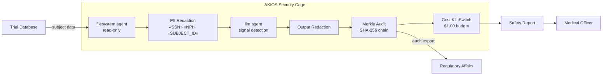

<header class="post-header">
  <div class="post-meta">February 10, 2026 · Engineering / Pharmaceutical · 5 min read</div>
  <h1>Sandboxed AI for Pharma: Accelerating Clinical Trials Under FDA Controls</h1>
  <div class="post-author">
    
    <span>AJ</span>
  </div>
</header>

<div class="post-content">

Pharmaceutical companies spend an average of $2.6 billion and 10–15 years to bring a single drug to market. AI can compress that timeline — analyzing trial data, identifying adverse events, and optimizing patient cohorts. The problem: **clinical trial data contains the most sensitive health information imaginable, and the FDA demands complete reproducibility.**

AKIOS solves this with the Security Cage: an ephemeral, sandboxed runtime where AI processes trial data under strict, code-defined policies.

## The Regulatory Landscape

Pharma in the US operates under a tightly interlocking regulatory stack:

- **21 CFR Part 11** — FDA requirements for electronic records and electronic signatures. Every AI-generated output must be attributable, auditable, and tamper-evident.
- **HIPAA** — Clinical trial participant data is PHI. AI models cannot retain, memorize, or leak individual participant information.
- **ICH E6(R2) / GCP** — Good Clinical Practice requires data integrity, participant confidentiality, and investigator oversight of all automated analyses.
- **FDA AI/ML Guidance** — The FDA's evolving framework for AI in drug development requires transparency, validation, and human-in-the-loop decisions.

AKIOS enforces these at the runtime level — the AI agent never operates outside the compliance boundary.

## The Workflow: Clinical Trial Data Analysis

1. **Ingestion**: Trial data (adverse events, lab results, patient outcomes) is loaded into the Security Cage. Patient identifiers, site codes, and investigator details are redacted before the AI sees them.
2. **The Cage**: AKIOS initializes with the pharma policy: network isolation, no data persistence, 21 CFR Part 11 electronic signature requirements, and GCP-compliant audit logging.
3. **Analysis**: The sandboxed AI agent reviews trial data for safety signals — adverse event clustering, unexpected lab value patterns, efficacy trends — using only de-identified data.
4. **Reporting**: Findings are structured as regulatory-ready reports with confidence intervals, statistical methods, and supporting evidence. The AI cannot modify trial records.
5. **Audit**: Every inference, data access, and output is cryptographically signed into a Merkle chain. FDA auditors can verify the complete analysis path for any submission.

### Architecture



## Why It Matters

- **Zero Data Leakage**: Patient identifiers are stripped before any AI processing. The model never sees who a patient is — only de-identified clinical outcomes.
- **21 CFR Part 11 Compliance**: Every AI output includes electronic signatures and is stored in tamper-evident audit logs that satisfy FDA inspection requirements.
- **Reproducible Analysis**: The Security Cage's deterministic runtime means any analysis can be exactly reproduced months or years later for an FDA audit.
- **Accelerated Timelines**: AI can scan thousands of adverse event reports in minutes, flagging safety signals that would take human reviewers weeks to identify.

## Try It Yourself

```bash
pip install akios
akios init my-project
akios run templates/file_analysis.yml
```

Secure your AI. Build with AKIOS.

</div>

<div class="post-footer">
  <a href="./">← Back to Case Studies</a>
</div>
