<header class="post-header">
  <div class="post-meta">February 10, 2026 · Engineering / Pharmaceutical · 5 min read</div>
  <h1>Sandboxed AI for Pharma: Accelerating Clinical Trials Under FDA Controls</h1>
</header>

<div class="post-content">

Pharmaceutical companies spend an average of $2.6 billion and 10–15 years to bring a single drug to market. AI can compress that timeline — analyzing trial data, identifying adverse events, and optimizing patient cohorts. The problem: **clinical trial data contains the most sensitive health information imaginable, and the FDA demands complete reproducibility.**

AKIOS solves this with the Security Cage: an ephemeral, sandboxed runtime where AI processes trial data under strict, code-defined policies.

## The Problem

Clinical trials generate enormous datasets: adverse event reports, lab results, patient-reported outcomes, imaging data. Human reviewers take weeks to identify safety signals that AI can spot in minutes. But connecting AI to trial data creates a fundamental tension: the FDA requires complete reproducibility and auditability for every analysis, while privacy regulations demand that patient identifiers never be exposed.

AKIOS gives you AI-powered signal detection **with FDA-grade auditability and zero patient data exposure**.

## The Regulatory Landscape

Pharma in the US operates under a tightly interlocking regulatory stack:

<table>
  <thead>
    <tr><th>Regulation</th><th>Scope</th><th>How AKIOS Enforces It</th></tr>
  </thead>
  <tbody>
    <tr>
      <td><strong>21 CFR Part 11</strong></td>
      <td>FDA requirements for electronic records and signatures — AI outputs must be attributable, auditable, tamper-evident</td>
      <td>Merkle-chained audit trail with cryptographic signatures satisfies e-signature and e-record requirements.</td>
    </tr>
    <tr>
      <td><strong>HIPAA</strong></td>
      <td>Trial participant data is PHI — AI models cannot retain, memorize, or leak individual participant info</td>
      <td>Patient identifiers stripped before AI processing. Ephemeral cage destroyed after each run.</td>
    </tr>
    <tr>
      <td><strong>ICH E6(R2) / GCP</strong></td>
      <td>Good Clinical Practice — data integrity, participant confidentiality, investigator oversight of automated analyses</td>
      <td>Deterministic sandbox ensures reproducible analysis. Human-in-the-loop for all safety signals.</td>
    </tr>
    <tr>
      <td><strong>FDA AI/ML Guidance</strong></td>
      <td>Evolving framework for AI in drug development — transparency, validation, human-in-the-loop decisions</td>
      <td>Complete inference chain exported per analysis. Every signal includes its statistical basis.</td>
    </tr>
    <tr>
      <td><strong>GDPR (EU Trials)</strong></td>
      <td>Multi-site trials involving EU participants must comply with GDPR data minimization</td>
      <td>All PII redacted before processing. Data never leaves the cage. Cross-border transfer impossible.</td>
    </tr>
  </tbody>
</table>

AKIOS enforces these at the runtime level — the AI agent never operates outside the compliance boundary.

## The Concept: Policy as Code

AKIOS introduces the concept of a "Security Cage" — an ephemeral, sandboxed runtime environment where data is processed under strict, code-defined policies. For pharma, the key feature is **deterministic reproducibility**: the same dataset processed in the same cage always produces the identical output, satisfying FDA requirements for analysis validation.

## The Workflow: Clinical Trial Data Analysis

<table>
  <thead>
    <tr><th>Step</th><th>What Happens</th><th>Security Control</th></tr>
  </thead>
  <tbody>
    <tr>
      <td><strong>1. Ingestion</strong></td>
      <td>Trial data (adverse events, lab results, patient outcomes) loaded into the cage</td>
      <td>Patient identifiers, site codes, and investigator details redacted before AI sees them.</td>
    </tr>
    <tr>
      <td><strong>2. De-identification</strong></td>
      <td>Subject IDs, site numbers, and investigator names replaced with tokens</td>
      <td>50+ identifier patterns stripped. The LLM sees only de-identified clinical data.</td>
    </tr>
    <tr>
      <td><strong>3. AI Analysis</strong></td>
      <td>LLM reviews trial data for safety signals — AE clustering, unexpected lab patterns, efficacy trends</td>
      <td>Budget capped ($1.00/analysis), network isolated, no data persistence.</td>
    </tr>
    <tr>
      <td><strong>4. Reporting</strong></td>
      <td>Findings structured as regulatory-ready reports with confidence intervals and statistical methods</td>
      <td>AI cannot modify trial records. Output is read-only with human review gate.</td>
    </tr>
    <tr>
      <td><strong>5. Audit</strong></td>
      <td>Every inference, data access, and output cryptographically signed with 21 CFR Part 11 e-signatures</td>
      <td>FDA auditors can verify the complete analysis path for any submission.</td>
    </tr>
  </tbody>
</table>

### Architecture

```mermaid
graph LR
    CTMS["Clinical Trial\nDatabase (EDC)"] -->|"subject data\n(encrypted)"| FS["filesystem agent\nread-only"]

    subgraph CAGE["AKIOS Security Cage"]
        FS --> PII["De-identification Engine\n«SUBJECT_ID» «SITE» «PI_NAME»"]
        PII --> LLM["llm agent\nsafety signal detection"]
        LLM --> TE["tool_executor\nstatistical validation"]
        TE --> VALID["Output Validation\nno raw patient data"]
        VALID --> MERKLE["Merkle Chain\n21 CFR Part 11 signed"]
        MERKLE --> COST["Cost Kill-Switch\n$1.00 / analysis"]
    end

    COST -->|"safety report\n(de-identified)"| Report["Regulatory\nSubmission"]
    Report --> Medical["Medical Officer\n/ Safety Board"]
    MERKLE -->|"audit export\n(immutable)"| QA["Regulatory Affairs"]
    QA --> FDA["FDA / EMA\nInspection"]
```



### Policy Configuration

The entire compliance posture is defined in a single YAML file:

```yaml
# pharma-clinical-trial-policy.yml
security:
  sandbox: strict
  network: isolated
  allowed_endpoints: []  # zero network access
  pii_redaction:
    enabled: true
    patterns: [subject_id, site_code, investigator_name, ssn, dob, mrn]
    mode: aggressive
  budget:
    max_cost_per_run: 1.00
    currency: USD
  audit:
    merkle_chain: true
    export_format: jsonl
    retention_days: 5475  # 15 years — FDA clinical trial retention
    cfr_part_11: true  # electronic signature compliance
  constraints:
    deterministic: true  # same input always produces same output
    trial_record_modification: disabled
```

## What the Medical Officer Sees

At the end of the workflow, the medical safety board receives a structured report:

<table>
  <thead>
    <tr><th>Field</th><th>Value</th></tr>
  </thead>
  <tbody>
    <tr><td>Analysis ID</td><td>TRIAL-2026-0210-****4829</td></tr>
    <tr><td>Safety Signal</td><td>🔴 Hepatotoxicity cluster — 4 Grade 3 ALT elevations in Treatment Arm B (expected: &lt;1)</td></tr>
    <tr><td>Statistical Basis</td><td>Fisher's exact test p=0.003, RR=4.2 (95% CI: 1.4–12.8) vs placebo</td></tr>
    <tr><td>MedDRA Code</td><td>10019670 — Hepatocellular injury</td></tr>
    <tr><td>Recommended Action</td><td>DSMB review recommended — potential dose modification for Arm B</td></tr>
    <tr><td>Confidence</td><td>93%</td></tr>
    <tr><td>Audit Hash</td><td><code>a4d7e2...f81c</code></td></tr>
    <tr><td>Patient Data Exposed</td><td>❌ None — all subject identifiers de-identified before analysis</td></tr>
  </tbody>
</table>

No patient names. No site identifiers. No investigator details. Just clinically actionable safety intelligence with an FDA-grade audit chain.

## Why It Matters

- **Zero Data Leakage**: Patient identifiers are stripped before any AI processing. The model never sees who a patient is — only de-identified clinical outcomes.
- **21 CFR Part 11 Compliance**: Every AI output includes electronic signatures and is stored in tamper-evident audit logs that satisfy FDA inspection requirements.
- **Reproducible Analysis**: The Security Cage's deterministic runtime means any analysis can be exactly reproduced months or years later for an FDA audit.
- **Accelerated Timelines**: AI can scan thousands of adverse event reports in minutes, flagging safety signals that would take human reviewers weeks to identify.
- **Multi-Site Trial Support**: De-identification ensures GDPR compliance for EU trial sites. Data sovereignty is enforced by infrastructure, not policy.

## Try It Yourself

```bash
pip install akios
akios init my-project
akios run templates/file_analysis.yml
```

Secure your AI. Build with AKIOS.

</div>

<div class="post-footer">
  <p>Related: <a href="healthcare-hipaa-security-cage.html">HIPAA-Compliant AI for Healthcare</a> | <a href="insurance-claims-processing.html">Secure AI for Insurance</a></p>
  <a href="./">← Back to Case Studies</a>
</div>
