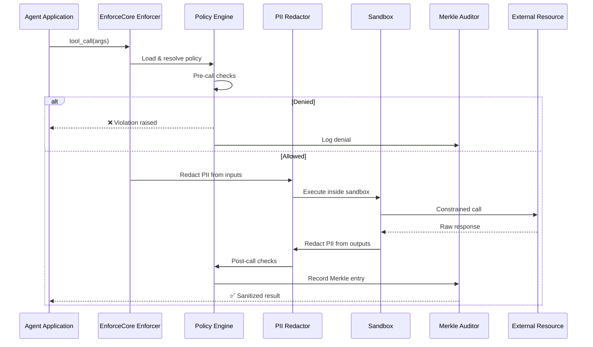
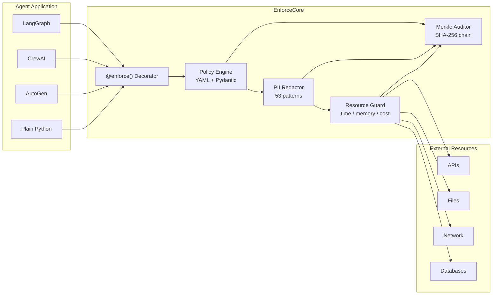
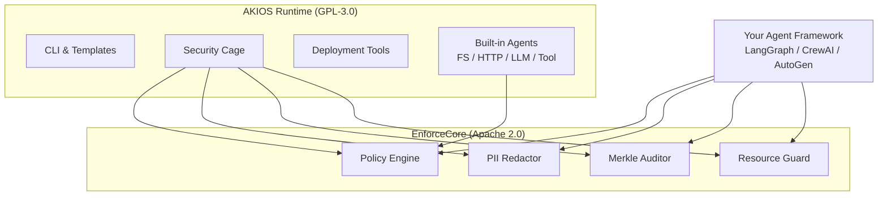

# EnforceCore

<div style="text-align: center; margin: 2rem 0;">
  
</div>

**Runtime enforcement for AI agents. Open source. Framework-agnostic. Apache 2.0.**

EnforceCore is the open-source enforcement framework that powers [AKIOS](index.html). It provides mandatory policy enforcement at every external call boundary — tool calls, API calls, file access, network access — so that violations become structurally impossible, not just discouraged.

## The Problem

Every major agent framework — LangGraph, CrewAI, AutoGen, Semantic Kernel — is building more capable agents. But almost nobody is building the **control layer**.

Today, if an agent calls a tool, there is no standard way to:
- Enforce what it's allowed to do **before** the call executes
- Verify what it **actually did** after the call returns
- Prove to a regulator or auditor that violations were **structurally impossible**

Most "safety" solutions are prompt-level guardrails — suggestions to the LLM that can be bypassed, ignored, or jailbroken. They operate at the wrong layer.

**EnforceCore operates at the runtime boundary — the only layer that cannot be bypassed.**

## Quick Start

Protect any tool-calling function with a decorator and a YAML policy:

```python
from enforcecore import enforce

@enforce(policy="my_policy.yaml")
async def call_external_api(url: str, data: dict):
    return await httpx.post(url, json=data)
```

**Policy file (`my_policy.yaml`):**
```yaml
name: api_access_policy
version: "1.0"
rules:
  - action: http_request
    allow:
      domains: ["api.example.com"]
      methods: ["GET", "POST"]
    deny:
      domains: ["*"]
    redact:
      inputs: true
      outputs: true
```

Every call to `call_external_api` now passes through policy evaluation, PII redaction, resource constraints, and cryptographic audit logging — automatically.

## How It Works



### Component Architecture



## Core Components

### Policy Engine
Declarative YAML policies validated by Pydantic. Define what agents can and cannot do — evaluated at every call boundary. Supports policy composition: inherit, override, merge.

### PII Redactor
Real-time detection and redaction on inputs and outputs. Configurable strategies: mask, hash, remove, or placeholder. Based on Microsoft Presidio with honest performance targets (5–50ms depending on content length).

### Merkle Auditor
SHA-256 Merkle tree audit trail for every enforced call. JSONL storage with tamper-proof verification. Every entry is cryptographically chained to the previous one.

### Resource Guard
Cross-platform resource limits: time, memory, cost. Full hardening on Linux (seccomp/cgroups), POSIX signals on macOS, thread timeout on Windows. Automatic kill-switch when limits are exceeded.

## Core Principles

1. **Enforce, don't suggest** — Policies are mandatory, not advisory. If a call violates policy, it is blocked.
2. **Boundary-first** — Enforcement happens at the call boundary, not inside the LLM or after the fact.
3. **Verify, don't trust** — Every enforced call produces a cryptographic audit entry. The full trail is Merkle-tree verifiable.
4. **Fail closed** — If enforcement logic itself fails, the call is blocked. Never fail open.
5. **Framework-agnostic** — No lock-in. Works everywhere Python runs.

## Why Not Prompt-Level Guardrails?

| Approach | Layer | Bypassable? | Auditable? | Framework-locked? |
|----------|-------|-------------|------------|-------------------|
| Prompt instructions | Inside LLM | Yes (jailbreaks) | No | Often |
| Output filters | After execution | Damage already done | Partially | Usually |
| **EnforceCore** | **Call boundary** | **No** | **Yes (Merkle proofs)** | **No** |

Prompt guardrails and output filters have their place. But they are not enforcement. EnforceCore provides the structural guarantee that regulators and enterprises require.

## Relationship to AKIOS



We designed EnforceCore as the enforcement foundation that powers AKIOS. Rather than building enforcement logic into the runtime and locking it behind GPL-3.0, we built it as an independent, general-purpose framework under Apache 2.0 — so the entire ecosystem can benefit.

- **EnforceCore** = the open foundation we designed (Apache 2.0, general-purpose, works with any agent framework)
- **AKIOS** = the production runtime we built on top of EnforceCore (full security cage, CLI, deployment tools)

If you're building agents with LangGraph, CrewAI, AutoGen, or your own system and need runtime enforcement — use EnforceCore directly. If you want a complete secure runtime with CLI, templates, and deployment tooling — use AKIOS.

## Installation

```bash
pip install enforcecore

# With PII redaction support
pip install enforcecore[pii]

# With Linux hardening (seccomp/cgroups)
pip install enforcecore[linux]

# Everything
pip install enforcecore[all]
```

**Requirements:** Python 3.11+

## Framework Integrations

EnforceCore provides thin adapters (~20–50 lines each) for major agent frameworks:

| Framework | Status | Integration |
|-----------|--------|-------------|
| **LangGraph** | Available | `@enforced_tool` decorator |
| **CrewAI** | Available | `@enforced_tool` decorator |
| **AutoGen** | Available | `@enforced_tool` decorator |
| **Plain Python** | Available | `@enforce()` decorator |

## Use Cases

**EU AI Act Compliance** — High-risk AI systems must demonstrate technical safeguards at runtime. EnforceCore provides measurable, provable, auditable enforcement.

**Enterprise Agent Deployment** — Guarantee that agents cannot exfiltrate data, exceed cost budgets, or access unauthorized resources.

**Multi-Agent Governance** — When Agent A calls Agent B which calls Agent C — EnforceCore sits at every boundary in that chain.

**Research** — A common foundation for studying runtime verification, sandboxing, and formal guarantees in agentic systems.

## Performance

EnforceCore is designed for production workloads with honest performance targets:

| Component | Overhead |
|-----------|----------|
| Policy evaluation | < 1ms |
| PII redaction (short text) | 5–15ms |
| PII redaction (long text) | 15–50ms |
| Audit entry | < 1ms |
| Resource guard setup | < 2ms |
| **Total (typical call)** | **8–20ms** |

## Links

- **GitHub:** [github.com/akios-ai/enforcecore](https://github.com/akios-ai/enforcecore)
- **PyPI:** [pypi.org/project/enforcecore](https://pypi.org/project/enforcecore/)
- **License:** Apache 2.0

## Learn More

- **[AKIOS Quickstart](quickstart.html)** — See EnforceCore in action within AKIOS
- **[Security Features](security.html)** — Deep dive into the security layers EnforceCore provides
- **[Community](../community.html)** — Join the discussion
