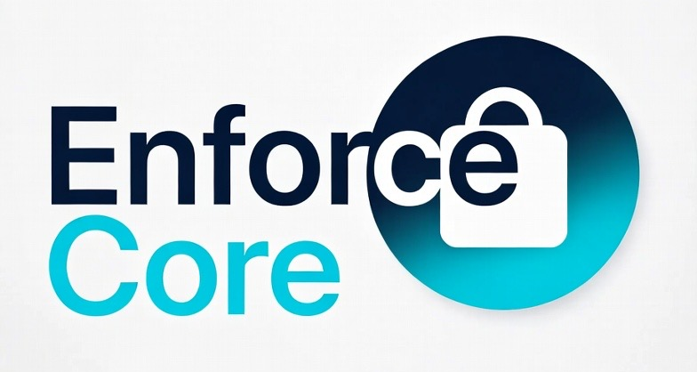
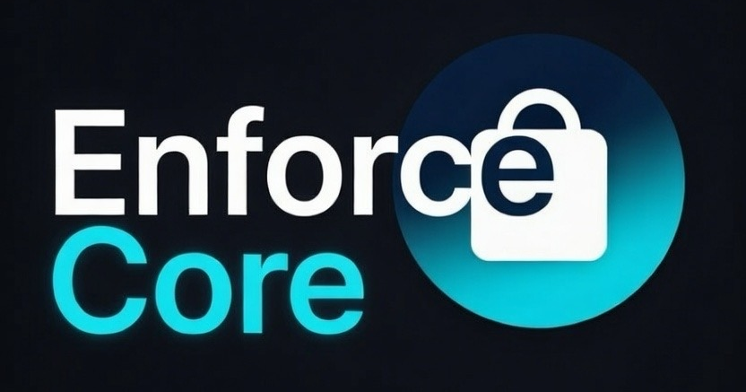
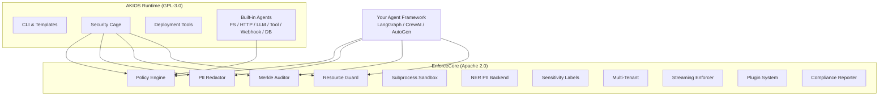

# EnforceCore

<div style="text-align: center; margin: 2rem 0;">
  
  
</div>

**Runtime enforcement for AI agents. Open source. Framework-agnostic. Apache 2.0.**

> **Current release: v1.14.0** — 63-symbol public API, 2,347 tests, 22 formal invariants. See the [full EnforceCore documentation](/enforcecore/) for complete details.

EnforceCore is the open-source enforcement framework that powers [AKIOS](index.html). It provides mandatory policy enforcement at every external call boundary — tool calls, API calls, file access, network access — so that violations become structurally impossible, not just discouraged.

## The Problem

Every major agent framework — LangGraph, CrewAI, AutoGen, Semantic Kernel — is building more capable agents. But almost nobody is building the **control layer**.

Most "safety" solutions are prompt-level guardrails — suggestions to the LLM that can be bypassed, ignored, or jailbroken. They operate at the wrong layer.

**EnforceCore operates at the runtime boundary — the only layer that cannot be bypassed.**

## Get Started

```python
from enforcecore import enforce

@enforce(policy="my_policy.yaml")
async def call_external_api(url: str, data: dict):
    return await httpx.post(url, json=data)
```

Every call now passes through policy evaluation, PII redaction, resource constraints, and cryptographic audit logging. See the [Quickstart](/enforcecore/quickstart) for the full tutorial.

## Core Principles

1. **Enforce, don't suggest** — Policies are mandatory, not advisory. If a call violates policy, it is blocked.
2. **Boundary-first** — Enforcement happens at the call boundary, not inside the LLM or after the fact.
3. **Verify, don't trust** — Every enforced call produces a cryptographic audit entry. The full trail is Merkle-tree verifiable.
4. **Fail closed** — If enforcement logic itself fails, the call is blocked. Never fail open.
5. **Framework-agnostic** — No lock-in. Works everywhere Python runs.

## Relationship to AKIOS


```mermaid
graph TB
    subgraph AKIOS["AKIOS Runtime (GPL-3.0)"]
        CLI["CLI & Templates"]
        CAGE["Security Cage"]
        DEPLOY["Deployment Tools"]
        AGENTS["Built-in Agents\nFS / HTTP / LLM / Tool / Webhook / DB"]
    end

    subgraph ENFORCECORE["EnforceCore (Apache 2.0)"]
        PE2["Policy Engine"]
        PR2["PII Redactor"]
        MA2["Merkle Auditor"]
        RG2["Resource Guard"]
        SS2["Subprocess Sandbox"]
        NER2["NER PII Backend"]
        SL2["Sensitivity Labels"]
        MT2["Multi-Tenant"]
        SR2["Streaming Enforcer"]
        PL2["Plugin System"]
        CR2["Compliance Reporter"]
    end

    CAGE --> PE2
    CAGE --> PR2
    CAGE --> MA2
    CAGE --> RG2
    AGENTS --> PE2

    ANY["Your Agent Framework\nLangGraph / CrewAI / AutoGen"] --> PE2
    ANY --> PR2
    ANY --> MA2
    ANY --> RG2
```

We designed EnforceCore as the enforcement foundation that powers AKIOS. Rather than building enforcement logic into the runtime and locking it behind GPL-3.0, we built it as an independent, general-purpose framework under Apache 2.0 — so the entire ecosystem can benefit.

- **EnforceCore** = the open foundation we designed (Apache 2.0, general-purpose, works with any agent framework)
- **AKIOS** = the production runtime we built on top of EnforceCore (full security cage, CLI, deployment tools)

If you're building agents with LangGraph, CrewAI, AutoGen, or your own system and need runtime enforcement — use EnforceCore directly. If you want a complete secure runtime with CLI, templates, and deployment tooling — use AKIOS.

## Installation

```bash
pip install enforcecore
```

**Requirements:** Python 3.11+. Dependencies: Pydantic v2, PyYAML, structlog, cryptography.

## Full Documentation

- **[Overview](/enforcecore/)** — What EnforceCore is and why it exists
- **[Quickstart](/enforcecore/quickstart)** — Step-by-step tutorial
- **[Architecture](/enforcecore/architecture)** — Design, pipeline, formal invariants, threat model
- **[API Reference](/enforcecore/api-reference)** — Every public symbol, environment variable, and CLI command
- **[Evaluation](/enforcecore/evaluation)** — Adversarial scenarios and benchmarks
- **[Integrations](/enforcecore/integrations)** — LangGraph, CrewAI, AutoGen adapters
- **[Troubleshooting](/enforcecore/troubleshooting)** — Common errors and FAQ
- **[Roadmap](/enforcecore/roadmap)** — Release history and future plans
- **[GitHub](https://github.com/akios-ai/enforcecore)** — Source code (Apache 2.0)
- **[PyPI](https://pypi.org/project/enforcecore/)** — Package registry
