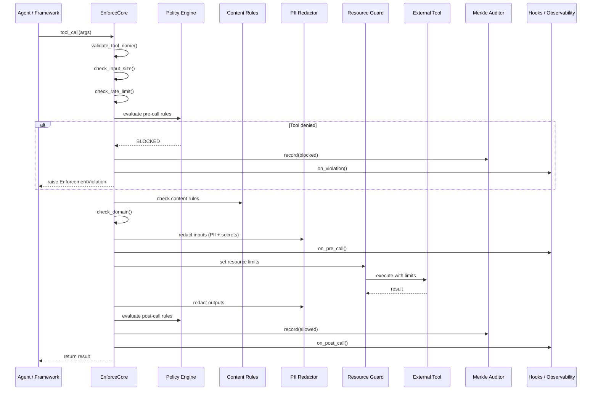

# Architecture

EnforceCore is designed around one core idea: **enforcement at the call boundary**.

Every time an agent makes an external call — invoking a tool, hitting an API, reading a file — that call passes through an enforcement point. At that point, policies are evaluated, data is redacted, resources are constrained, and an audit entry is recorded.

This is fundamentally different from prompt-level guardrails (which can be jailbroken), output filters (which operate after the damage is done), or network firewalls (which operate at the wrong granularity for agent tool calls).

---

## Enforcement Pipeline



---

## Core Components

### 1. Enforcer (Coordinator)

The central orchestrator. Intercepts external calls, coordinates all protection components, and makes the allow/block/redact decision.

- Provides `@enforce()` decorator and `Enforcer.from_file()` factory
- Coordinates the pipeline: pre-call → execute → post-call
- Supports both sync and async patterns
- Raises `EnforcementViolation` on policy breach
- **Lifecycle hooks** — register callbacks via `@on_pre_call`, `@on_post_call`, `@on_violation`, `@on_redaction`
- **Leak detection** — `guard.leaked_thread_count` tracks orphaned threads from prior runs

**Async-first design:** Modern agent frameworks are async-first. EnforceCore runs async internally and provides sync wrappers.

```python
# Decorator pattern
@enforce(policy="policy.yaml")
def sync_tool(args): ...

@enforce(policy="policy.yaml")
async def async_tool(args): ...

# Factory pattern
enforcer = Enforcer.from_file("policy.yaml")
result = enforcer.run(my_tool, args)
```

### 2. Policy Engine

Loads, validates, and evaluates declarative policies.

- YAML policies validated against Pydantic v2 schemas
- Pre-call conditions (before execution)
- Post-call conditions (after execution)
- Composable policies (inherit, override, merge)

```yaml
name: "agent-policy"
version: "1.0"
rules:
  allowed_tools: ["search_web", "calculator"]
  denied_tools: ["execute_shell"]
  pii_redaction:
    enabled: true
    categories: [email, phone, ssn, credit_card, ip_address]
  content_rules:
    enabled: true
    categories: [shell_injection, path_traversal, sql_injection, code_execution]
  rate_limits:
    global_rpm: 60
    per_tool:
      search_web: 30
  network:
    allowed_domains: ["api.example.com"]
    denied_domains: ["*.malicious.io"]
  resource_limits:
    max_call_duration_seconds: 30
    max_cost_usd: 5.00
on_violation: "block"
```

### 3. PII Redactor

Real-time PII detection and redaction on both inputs and outputs.

- **5 categories:** email, phone, SSN, credit card, IP address
- **4 strategies:** placeholder (`<EMAIL>`), mask, hash, remove
- **Compiled regex** — no heavy NLP deps (no spaCy, no Presidio)
- **~0.1–0.5ms per call** — fast enough for production
- **Unicode hardening** — NFC normalization, homoglyph detection, URL/HTML decoding
- **Secret scanner** — 11 built-in categories for credential detection (AWS keys, GitHub tokens, GCP, Azure, database URIs, SSH keys, and more)
- **Custom patterns** — `PatternRegistry` for domain-specific detectors

```python
# Standalone usage
from enforcecore.redactor import Redactor

redactor = Redactor(categories=["email", "phone"])
result = redactor.redact("Call 555-123-4567 or john@example.com")
print(result.text)   # "Call <PHONE> or <EMAIL>"
print(result.count)  # 2
```

### 4. Merkle Auditor

Tamper-proof, cryptographically verifiable audit trails.

- SHA-256 Merkle chain linking each entry to its predecessor
- 14-field audit entries (tool, policy, decision, timing, redaction counts, hashes)
- Cross-session chain continuity
- Tamper detection: modified, deleted, inserted, or reordered entries

```python
from enforcecore import verify_trail

result = verify_trail("audit.jsonl")
assert result.is_valid       # No tampering detected
assert result.chain_intact   # Every hash links correctly
```

### 5. Resource Guard

Cross-platform resource constraints and hard termination.

| Feature | Linux | macOS | Windows |
|---|---|---|---|
| Time limits | ✓ | ✓ | ✓ |
| Memory limits | ✓ (RLIMIT_AS) | ~ (RLIMIT_RSS, advisory) | ✗ |
| Cost tracking | ✓ | ✓ | ✓ |
| KillSwitch | ✓ | ✓ | ✓ |

The Guard uses a platform abstraction that auto-detects the OS and applies the strongest available constraints. On any platform, you always get the Enforcer + Policy + Redactor + Auditor — the security-critical parts.

### 6. Content Rules Engine

Pattern-based detection for dangerous content in tool arguments and outputs.

- **4 built-in categories:** shell injection, path traversal, SQL injection, code execution
- **Rule composition** — combine multiple rules per policy
- **Custom rules** — `ContentRule` dataclass for domain-specific patterns
- Fires `ContentViolationError` on match

### 7. Rate Limiter

Global and per-tool rate limiting with sliding window counters.

- **Global RPM** — cap total calls across all tools
- **Per-tool limits** — different limits for different tools
- **Thread-safe** — uses `threading.Lock` internally
- Fires `RateLimitError` when exceeded

### 8. Network Enforcement

Domain-level allow/deny controls for outbound network calls.

- **Allow list** — only permit specific domains
- **Deny list** — block known-bad domains (supports wildcards)
- **DomainChecker** — standalone utility for domain validation
- Fires `DomainDeniedError` on blocked domain

### 9. Hook System

Lifecycle hooks for extending the enforcement pipeline without modifying core code.

- **4 hook points:** `@on_pre_call`, `@on_post_call`, `@on_violation`, `@on_redaction`
- **Registry-based** — `HookRegistry` manages all registered callbacks
- **Async-compatible** — hooks can be sync or async functions
- Useful for logging, alerting, custom metrics, or integration with external systems

### 10. Observability

OpenTelemetry integration and webhook-based event dispatch.

- **Metrics** — `EnforceCoreMetrics` exports counters and histograms (calls, violations, latency)
- **Tracing** — `EnforceCoreInstrumentor` creates spans for each enforcement step
- **Webhooks** — `WebhookDispatcher` sends events to HTTP endpoints
- Works with any OpenTelemetry-compatible backend (Jaeger, Prometheus, Datadog, etc.)

---

## Module Structure

```
enforcecore/
├── core/
│   ├── types.py          ← Shared types, exceptions, enums
│   ├── policy.py         ← Policy models + engine + merge/composition
│   ├── enforcer.py       ← Main coordinator
│   └── config.py         ← Global configuration
├── redactor/
│   ├── engine.py         ← PII detection + redaction
│   ├── strategies.py     ← Redaction strategies
│   ├── secrets.py        ← Secret scanner (11 categories)
│   └── patterns.py       ← Custom pattern registry
├── auditor/
│   ├── merkle.py         ← Merkle tree implementation
│   ├── logger.py         ← Audit log writer
│   ├── verifier.py       ← Trail verification
│   ├── backends.py       ← JSONL, Null, Callback, Multi backends
│   └── rotation.py       ← Size-based rotation + gzip
├── guard/
│   ├── platform.py       ← Platform detection
│   ├── resource.py       ← Resource limits + shared thread pool
│   └── killswitch.py     ← Hard termination
├── rules/
│   ├── engine.py         ← Content rule engine
│   ├── builtins.py       ← Shell injection, path traversal, SQL, code exec
│   └── ratelimit.py      ← Per-tool + global rate limiter
├── network/
│   └── domain.py         ← Domain allow/deny checker
├── hooks/
│   ├── registry.py       ← Hook registration + dispatch
│   └── decorators.py     ← @on_pre_call, @on_post_call, etc.
├── observability/
│   ├── metrics.py        ← OpenTelemetry counters
│   ├── instrumentor.py   ← OpenTelemetry spans
│   └── webhooks.py       ← HTTP event webhooks
├── integrations/
│   ├── langgraph.py      ← LangGraph adapter
│   ├── crewai.py         ← CrewAI adapter
│   └── autogen.py        ← AutoGen adapter
├── eval/                 ← Evaluation suite (20 scenarios, 15 benchmarks)
├── cli/                  ← CLI commands (info, validate, verify, eval, dry-run, inspect)
└── __init__.py           ← Public API (110 exports)
```

---

## Error Handling

EnforceCore uses a clear exception hierarchy:

```
EnforceCoreError (base)
├── PolicyError
│   ├── PolicyLoadError        ← Invalid/missing policy file
│   ├── PolicyValidationError  ← Policy schema violation
│   └── PolicyEvaluationError  ← Error during rule evaluation
├── EnforcementViolation
│   ├── ToolDeniedError        ← Tool not in allowed list
│   ├── DomainDeniedError      ← Network domain blocked
│   ├── CostLimitError         ← Cost budget exceeded
│   ├── RateLimitError         ← Rate limit exceeded
│   ├── ContentViolationError  ← Content rule violated
│   └── ResourceLimitError     ← Resource limit breached
├── RedactionError             ← PII redaction failure
├── AuditError                 ← Audit logging failure
├── HardeningError
│   ├── InvalidToolNameError   ← Bad tool name
│   ├── InputTooLargeError     ← Payload too large
│   └── EnforcementDepthError  ← Recursive depth exceeded
└── GuardError                 ← Resource guard failure
```

**Key principle:** Enforcement failures **always fail closed** (block the call). If the Policy Engine crashes, the call is blocked. If the Redactor fails, the call is blocked. Safety by default.

---

## Design Decisions

### Fail-closed by default
If anything goes wrong during enforcement, the call is blocked — never allowed through. The `fail_open` setting exists for development only.

### Thread safety
- Policy cache uses `threading.Lock`
- Auditor uses thread-safe append-only log with file locking
- Scope tracking uses `contextvars.ContextVar` (async-safe)

### No heavy dependencies
- PII detection uses compiled regex, not spaCy or Presidio
- Policy validation uses Pydantic v2 (already common in the ecosystem)
- Audit uses stdlib `hashlib` (SHA-256)

---

## Performance

Benchmarked on Python 3.13, 1,000 iterations with 100-iteration warmup:

| Component | P50 (ms) | P99 (ms) |
|---|---|---|
| Policy evaluation | 0.012 | 0.228 |
| PII redaction (short input) | 0.028 | 0.275 |
| PII redaction (~2KB input) | 0.129 | 0.220 |
| Audit entry creation | 0.068 | 0.232 |
| Audit chain verify (100 entries) | 1.114 | 1.457 |
| Resource guard setup | < 0.001 | < 0.001 |
| Rate limiter check | < 0.001 | 0.002 |
| Secret detection | 0.012 | 0.017 |
| **Full E2E pipeline** | **0.056** | **0.892** |
| **E2E + PII** | **0.093** | **0.807** |

Negligible compared to tool call latency (100ms–10s for API calls). Run `enforcecore eval` or `python -m benchmarks.run` to reproduce on your hardware.
