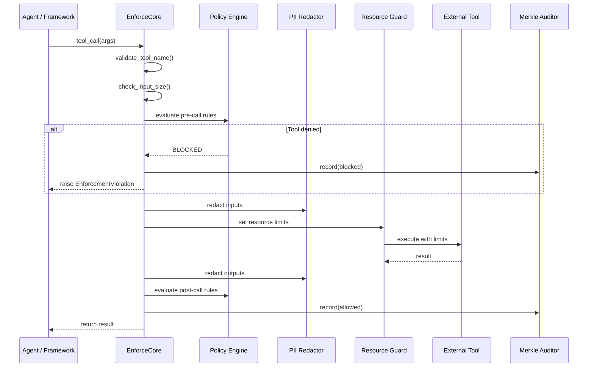

# Architecture

EnforceCore is designed around one core idea: **enforcement at the call boundary**.

Every time an agent makes an external call — invoking a tool, hitting an API, reading a file — that call passes through an enforcement point. At that point, policies are evaluated, data is redacted, resources are constrained, and an audit entry is recorded.

This is fundamentally different from prompt-level guardrails (which can be jailbroken), output filters (which operate after the damage is done), or network firewalls (which operate at the wrong granularity for agent tool calls).

---

## Enforcement Pipeline



---

## Core Components

### 1. Enforcer (Coordinator)

The central orchestrator. Intercepts external calls, coordinates all protection components, and makes the allow/block/redact decision.

- Provides `@enforce()` decorator and `enforce()` context manager
- Coordinates the pipeline: pre-call → execute → post-call
- Supports both sync and async patterns
- Raises `EnforcementViolation` on policy breach

**Async-first design:** Modern agent frameworks are async-first. EnforceCore runs async internally and provides sync wrappers.

```python
# Both patterns work
@enforce(policy="policy.yaml")
def sync_tool(args): ...

@enforce(policy="policy.yaml")
async def async_tool(args): ...
```

### 2. Policy Engine

Loads, validates, and evaluates declarative policies.

- YAML policies validated against Pydantic v2 schemas
- Pre-call conditions (before execution)
- Post-call conditions (after execution)
- Composable policies (inherit, override, merge)

```yaml
name: "agent-policy"
version: "1.0"
rules:
  allowed_tools: ["search_web", "calculator"]
  denied_tools: ["execute_shell"]
  pii_redaction:
    enabled: true
    categories: [email, phone, ssn, credit_card, ip_address]
  resource_limits:
    max_call_duration_seconds: 30
    max_cost_usd: 5.00
on_violation: "block"
```

### 3. PII Redactor

Real-time PII detection and redaction on both inputs and outputs.

- **5 categories:** email, phone, SSN, credit card, IP address
- **4 strategies:** placeholder (`<EMAIL>`), mask, hash, remove
- **Compiled regex** — no heavy NLP deps (no spaCy, no Presidio)
- **~0.1–0.5ms per call** — fast enough for production
- **Unicode hardening** — NFC normalization, homoglyph detection, URL/HTML decoding

```python
# Standalone usage
from enforcecore.redactor import Redactor

redactor = Redactor(categories=["email", "phone"])
result = redactor.redact("Call 555-123-4567 or john@example.com")
print(result.text)   # "Call <PHONE> or <EMAIL>"
print(result.count)  # 2
```

### 4. Merkle Auditor

Tamper-proof, cryptographically verifiable audit trails.

- SHA-256 Merkle chain linking each entry to its predecessor
- 14-field audit entries (tool, policy, decision, timing, redaction counts, hashes)
- Cross-session chain continuity
- Tamper detection: modified, deleted, inserted, or reordered entries

```python
from enforcecore import verify_trail

result = verify_trail("audit.jsonl")
assert result.is_valid       # No tampering detected
assert result.chain_intact   # Every hash links correctly
```

### 5. Resource Guard

Cross-platform resource constraints and hard termination.

| Feature | Linux | macOS | Windows |
|---|---|---|---|
| Time limits | ✓ | ✓ | ✓ |
| Memory limits | ✓ (RLIMIT_AS) | ~ (RLIMIT_RSS, advisory) | ✗ |
| Cost tracking | ✓ | ✓ | ✓ |
| KillSwitch | ✓ | ✓ | ✓ |

The Guard uses a platform abstraction that auto-detects the OS and applies the strongest available constraints. On any platform, you always get the Enforcer + Policy + Redactor + Auditor — the security-critical parts.

---

## Module Structure

```
enforcecore/
├── core/
│   ├── types.py          ← Shared types, exceptions, enums
│   ├── policy.py         ← Policy models + engine
│   ├── enforcer.py       ← Main coordinator
│   └── config.py         ← Global configuration
├── redactor/
│   ├── engine.py         ← PII detection + redaction
│   └── strategies.py     ← Redaction strategies
├── auditor/
│   ├── merkle.py         ← Merkle tree implementation
│   ├── logger.py         ← Audit log writer
│   └── verifier.py       ← Trail verification
├── guard/
│   ├── platform.py       ← Platform detection
│   ├── resource.py       ← Resource limits
│   └── killswitch.py     ← Hard termination
├── integrations/
│   ├── langgraph.py      ← LangGraph adapter
│   ├── crewai.py         ← CrewAI adapter
│   └── autogen.py        ← AutoGen adapter
├── eval/                 ← Evaluation suite
└── __init__.py           ← Public API (68 exports)
```

---

## Error Handling

EnforceCore uses a clear exception hierarchy:

```
EnforceCoreError (base)
├── PolicyError
│   ├── PolicyLoadError        ← Invalid/missing policy file
│   ├── PolicyValidationError  ← Policy schema violation
│   └── PolicyEvaluationError  ← Error during rule evaluation
├── EnforcementViolation
│   ├── ToolDeniedError        ← Tool not in allowed list
│   ├── DomainDeniedError      ← Network domain blocked
│   ├── CostLimitError         ← Cost budget exceeded
│   └── ResourceLimitError     ← Resource limit breached
├── RedactionError             ← PII redaction failure
├── AuditError                 ← Audit logging failure
├── HardeningError
│   ├── InvalidToolNameError   ← Bad tool name
│   ├── InputTooLargeError     ← Payload too large
│   └── EnforcementDepthError  ← Recursive depth exceeded
└── GuardError                 ← Resource guard failure
```

**Key principle:** Enforcement failures **always fail closed** (block the call). If the Policy Engine crashes, the call is blocked. If the Redactor fails, the call is blocked. Safety by default.

---

## Design Decisions

### Fail-closed by default
If anything goes wrong during enforcement, the call is blocked — never allowed through. The `fail_open` setting exists for development only.

### Thread safety
- Policy cache uses `threading.Lock`
- Auditor uses thread-safe append-only log with file locking
- Scope tracking uses `contextvars.ContextVar` (async-safe)

### No heavy dependencies
- PII detection uses compiled regex, not spaCy or Presidio
- Policy validation uses Pydantic v2 (already common in the ecosystem)
- Audit uses stdlib `hashlib` (SHA-256)

---

## Performance

| Component | Overhead |
|---|---|
| Policy evaluation | < 1ms |
| PII redaction (short input) | 0.1–0.5ms |
| PII redaction (long input) | 0.5–5ms |
| Audit entry creation | < 1ms |
| Resource guard setup | < 2ms |
| **Typical total** | **8–20ms** |

These are honest targets. Negligible compared to tool call latency (100ms–10s for API calls).
