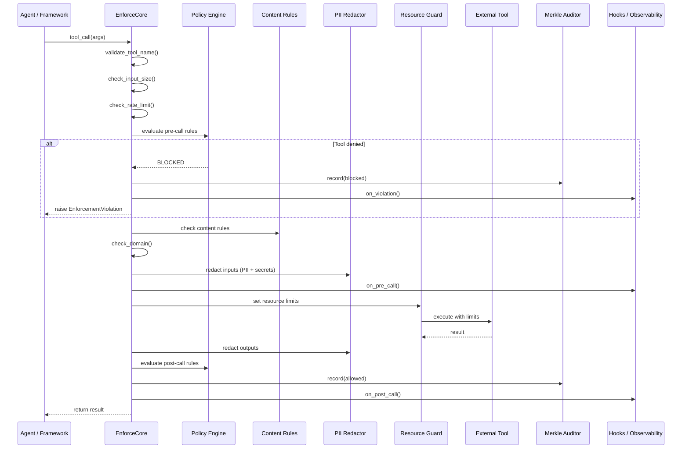

# Architecture

EnforceCore is designed around one core idea: **enforcement at the call boundary**.

Every time an agent makes an external call — invoking a tool, hitting an API, reading a file — that call passes through an enforcement point. At that point, policies are evaluated, data is redacted, resources are constrained, and an audit entry is recorded.

This is fundamentally different from prompt-level guardrails (which can be jailbroken), output filters (which operate after the damage is done), or network firewalls (which operate at the wrong granularity for agent tool calls).

---

## Enforcement Pipeline


```mermaid
sequenceDiagram
    participant Agent as Agent / Framework
    participant EC as EnforceCore
    participant Policy as Policy Engine
    participant Rules as Content Rules
    participant Redactor as PII Redactor
    participant Guard as Resource Guard
    participant Tool as External Tool
    participant Auditor as Merkle Auditor
    participant Hooks as Hooks / Observability

    Agent->>EC: tool_call(args)
    EC->>EC: validate_tool_name()
    EC->>EC: check_input_size()
    EC->>EC: check_rate_limit()
    EC->>Policy: evaluate pre-call rules
    alt Tool denied
        Policy-->>EC: BLOCKED
        EC->>Auditor: record(blocked)
        EC->>Hooks: on_violation()
        EC-->>Agent: raise EnforcementViolation
    end
    EC->>Rules: check content rules
    EC->>EC: check_domain()
    EC->>Redactor: redact inputs (PII + secrets)
    EC->>Hooks: on_pre_call()
    EC->>Guard: set resource limits
    Guard->>Tool: execute with limits
    Tool-->>Guard: result
    EC->>Redactor: redact outputs
    EC->>Policy: evaluate post-call rules
    EC->>Auditor: record(allowed)
    EC->>Hooks: on_post_call()
    EC-->>Agent: return result
```

---

## Core Components

### 1. Enforcer (Coordinator)

The central orchestrator. Intercepts external calls, coordinates all protection components, and makes the allow/block/redact decision.

- Provides `@enforce()` decorator and `Enforcer.from_file()` factory
- Coordinates the pipeline: pre-call → execute → post-call
- Supports both sync and async patterns
- Raises `EnforcementViolation` on policy breach
- **Lifecycle hooks** — register callbacks via `@on_pre_call`, `@on_post_call`, `@on_violation`, `@on_redaction`
- **Leak detection** — `guard.leaked_thread_count` tracks orphaned threads from prior runs

**Async-first design:** Modern agent frameworks are async-first. EnforceCore runs async internally and provides sync wrappers.

```python
# Decorator pattern
@enforce(policy="policy.yaml")
def sync_tool(args): ...

@enforce(policy="policy.yaml")
async def async_tool(args): ...

# Factory pattern
enforcer = Enforcer.from_file("policy.yaml")
result = enforcer.run(my_tool, args)
```

### 2. Policy Engine

Loads, validates, and evaluates declarative policies.

- YAML policies validated against Pydantic v2 schemas
- Pre-call conditions (before execution)
- Post-call conditions (after execution)
- Composable policies (inherit, override, merge)

```yaml
name: "agent-policy"
version: "1.0"
rules:
  allowed_tools: ["search_web", "calculator"]
  denied_tools: ["execute_shell"]
  pii_redaction:
    enabled: true
    categories: [email, phone, ssn, credit_card, ip_address]
  content_rules:
    enabled: true
    categories: [shell_injection, path_traversal, sql_injection, code_execution]
  rate_limits:
    global_rpm: 60
    per_tool:
      search_web: 30
  network:
    allowed_domains: ["api.example.com"]
    denied_domains: ["*.malicious.io"]
  resource_limits:
    max_call_duration_seconds: 30
    max_cost_usd: 5.00
on_violation: "block"
```

### 3. PII Redactor

Real-time PII detection and redaction on both inputs and outputs.

- **6 categories:** email, phone, SSN, credit card, IP address, passport
- **4 strategies:** placeholder (`<EMAIL>`), mask, hash, remove
- **Compiled regex** — no heavy NLP deps by default
- **NER backend** (v1.4.0+) — optional Presidio-based detection via `enforcecore[ner]` for healthcare, financial, and domain-specific PII
- **~0.1–0.5ms per call** — fast enough for production
- **Unicode hardening** — NFC normalization, homoglyph detection, URL/HTML decoding
- **Secret scanner** — 11 built-in categories for credential detection (AWS keys, GitHub tokens, GCP, Azure, database URIs, SSH keys, and more)
- **Custom patterns** — `PatternRegistry` for domain-specific detectors
- **Sensitivity labels** (v1.4.0+) — IFC-inspired flow labels (`PUBLIC`, `INTERNAL`, `CONFIDENTIAL`, `RESTRICTED`)

```python
# Standalone usage
from enforcecore.redactor import Redactor

redactor = Redactor(categories=["email", "phone"])
result = redactor.redact("Call 555-123-4567 or john@example.com")
print(result.text)   # "Call <PHONE> or <EMAIL>"
print(result.count)  # 2
```

### 4. Merkle Auditor

Tamper-proof, cryptographically verifiable audit trails.

- SHA-256 Merkle chain linking each entry to its predecessor
- 14-field audit entries (tool, policy, decision, timing, redaction counts, hashes)
- Cross-session chain continuity
- Tamper detection: modified, deleted, inserted, or reordered entries- **OS-enforced append-only** — `Auditor(immutable=True)` sets `chattr +a` (Linux) or `chflags uappend` (macOS) on the audit file, preventing truncation or chain rebuild even by the file owner
- **Pluggable audit stores** (v1.2.0+) — `JsonlAuditStore`, `SqliteAuditStore`, `PostgresAuditStore` — choose your persistence backend
- **Merkle Bridge** (v1.12.0+) — `external_hash` and `skip_entry_hash` fields for linking with AKIOS audit entries
- **Hash-only remote witness** — `Auditor(witness=...)` publishes entry hashes to a separate backend (`CallbackWitness`, `FileWitness`, `LogWitness`), enabling tamper detection even if an attacker rebuilds the Merkle chain
- **`verify_with_witness()`** — cross-checks trail hashes against witness records to detect chain-rebuild attacks
- **Settings-driven** — enable via `ENFORCECORE_AUDIT_IMMUTABLE=true` and `ENFORCECORE_AUDIT_WITNESS_FILE=/path` without code changes
```python
from enforcecore import verify_trail

result = verify_trail("audit.jsonl")
assert result.is_valid       # No tampering detected
assert result.chain_intact   # Every hash links correctly
```

### 5. Resource Guard

Cross-platform resource constraints and hard termination.

| Feature | Linux | macOS | Windows |
|---|---|---|---|
| Time limits | ✓ | ✓ | ✓ |
| Memory limits | ✓ (RLIMIT_AS) | ~ (RLIMIT_RSS, advisory) | ✗ |
| Cost tracking | ✓ | ✓ | ✓ |
| KillSwitch | ✓ | ✓ | ✓ |

The Guard uses a platform abstraction that auto-detects the OS and applies the strongest available constraints. On any platform, you always get the Enforcer + Policy + Redactor + Auditor — the security-critical parts.

### 6. Content Rules Engine

Pattern-based detection for dangerous content in tool arguments and outputs.

- **4 built-in categories:** shell injection, path traversal, SQL injection, code execution
- **Rule composition** — combine multiple rules per policy
- **Custom rules** — `ContentRule` dataclass for domain-specific patterns
- Fires `ContentViolationError` on match

### 7. Rate Limiter

Global and per-tool rate limiting with sliding window counters.

- **Global RPM** — cap total calls across all tools
- **Per-tool limits** — different limits for different tools
- **Thread-safe** — uses `threading.Lock` internally
- Fires `RateLimitError` when exceeded

### 8. Network Enforcement

Domain-level allow/deny controls for outbound network calls.

- **Allow list** — only permit specific domains
- **Deny list** — block known-bad domains (supports wildcards)
- **DomainChecker** — standalone utility for domain validation
- Fires `DomainDeniedError` on blocked domain

### 9. Hook System

Lifecycle hooks for extending the enforcement pipeline without modifying core code.

- **4 hook points:** `@on_pre_call`, `@on_post_call`, `@on_violation`, `@on_redaction`
- **Registry-based** — `HookRegistry` manages all registered callbacks
- **Async-compatible** — hooks can be sync or async functions
- Useful for logging, alerting, custom metrics, or integration with external systems

### 10. Observability

OpenTelemetry integration and webhook-based event dispatch.

- **Metrics** — `EnforceCoreMetrics` exports counters and histograms (calls, violations, latency)
- **Tracing** — `EnforceCoreInstrumentor` creates spans for each enforcement step
- **Webhooks** — `WebhookDispatcher` sends events to HTTP endpoints
- Works with any OpenTelemetry-compatible backend (Jaeger, Prometheus, Datadog, etc.)

---

## Module Structure

```
enforcecore/
├── core/
│   ├── types.py          ← Shared types, exceptions, enums
│   ├── policy.py         ← Policy models + engine + merge/composition
│   ├── enforcer.py       ← Main coordinator
│   ├── multitenant.py    ← MultiTenantEnforcer (v1.6.0+)
│   ├── policy_server.py  ← PolicyServerClient (v1.7.0+)
│   └── config.py         ← Global configuration
├── redactor/
│   ├── engine.py         ← PII detection + redaction
│   ├── strategies.py     ← Redaction strategies
│   ├── secrets.py        ← Secret scanner (11 categories)
│   ├── patterns.py       ← Custom pattern registry
│   ├── ner.py            ← NER-based PII (Presidio, v1.4.0+)
│   ├── sensitivity.py    ← Sensitivity labels (v1.4.0+)
│   └── streaming.py      ← StreamingRedactor (v1.11.0+)
├── auditor/
│   ├── merkle.py         ← Merkle tree implementation
│   ├── logger.py         ← Audit log writer
│   ├── verifier.py       ← Trail verification
│   ├── backends.py       ← JSONL, Null, Callback, Multi backends
│   ├── stores.py         ← SQLite, PostgreSQL audit stores (v1.2.0+)
│   ├── witness.py        ← CallbackWitness, FileWitness, LogWitness
│   ├── immutable.py      ← OS-enforced append-only (chattr/chflags)
│   └── rotation.py       ← Size-based rotation + gzip
├── guard/
│   ├── platform.py       ← Platform detection
│   ├── resource.py       ← Resource limits + shared thread pool
│   ├── killswitch.py     ← Hard termination
│   └── sandbox.py        ← SubprocessSandbox (v1.3.0+)
├── rules/
│   ├── engine.py         ← Content rule engine
│   ├── builtins.py       ← Shell injection, path traversal, SQL, code exec
│   └── ratelimit.py      ← Per-tool + global rate limiter
├── network/
│   └── domain.py         ← Domain allow/deny checker
├── hooks/
│   ├── registry.py       ← Hook registration + dispatch
│   └── decorators.py     ← @on_pre_call, @on_post_call, etc.
├── observability/
│   ├── metrics.py        ← OpenTelemetry counters + Prometheus
│   ├── instrumentor.py   ← OpenTelemetry spans
│   └── webhooks.py       ← HTTP event webhooks
├── plugins/              ← Plugin system (v1.9.0+)
│   ├── base.py           ← GuardPlugin, RedactorPlugin, AuditBackendPlugin
│   └── manager.py        ← PluginManager + discovery
├── compliance/           ← Compliance reporting (v1.8.0+)
│   ├── reporter.py       ← ComplianceReporter
│   └── frameworks.py     ← EU AI Act, SOC 2, GDPR templates
├── integrations/
│   ├── langgraph.py      ← LangGraph adapter
│   ├── crewai.py         ← CrewAI adapter
│   ├── autogen.py        ← AutoGen adapter
│   └── langchain.py      ← LangChain callback handler (v1.13.0+)
├── eval/                 ← Evaluation suite (20 scenarios, 15 benchmarks)
├── cli/                  ← CLI commands (info, validate, verify, eval, dry-run, inspect)
└── __init__.py           ← Public API (63 symbols)
```

---

## Error Handling

The full exception hierarchy is documented in the [API Reference](api-reference.html#exception-hierarchy). Key principle: enforcement failures **always fail closed** (block the call). If the Policy Engine crashes, the call is blocked. If the Redactor fails, the call is blocked. Safety by default.

---

## Design Decisions

### Fail-closed by default
If anything goes wrong during enforcement, the call is blocked — never allowed through. The `fail_open` setting exists for development only.

### Thread safety
- Policy cache uses `threading.Lock`
- Auditor uses thread-safe append-only log with file locking
- Scope tracking uses `contextvars.ContextVar` (async-safe)

### No heavy dependencies
- PII detection uses compiled regex, not spaCy or Presidio
- Policy validation uses Pydantic v2 (already common in the ecosystem)
- Audit uses stdlib `hashlib` (SHA-256)

---

## Performance

For full per-component benchmarks (15 benchmarks with P50/P99/P99.9), see the [Evaluation Suite](evaluation.html). Summary:

| Pipeline | P50 (ms) | P99 (ms) |
|---|---|---|
| **Full E2E (no PII)** | **0.056** | **0.892** |
| **E2E + PII redaction** | **0.093** | **0.807** |

Negligible compared to tool call latency (100ms–10s for API calls). Benchmarked on Python 3.13, 1,000 iterations with 100-iteration warmup. Run `enforcecore eval` to reproduce on your hardware.

---

## Formal Invariants

EnforceCore specifies 22 formal invariants organized across four subsystems. These are verified on every CI run via [Hypothesis](https://hypothesis.readthedocs.io/) property-based testing — universally-quantified properties checked against thousands of randomly generated inputs.

> **Note:** These invariants are verified *empirically* via property-based testing, not mechanically proved via theorem provers. Property-based testing provides high confidence but does not constitute a mathematical proof.

| Category | Count | Invariants |
|---|---|---|
| **Policy Engine** (P1–P8) | 8 | Determinism, deny enforcement, allowlist enforcement, deny-over-allow priority, open-by-default, closed-on-empty, merge union, decision completeness |
| **Merkle Chain** (M1–M5) | 5 | Hash determinism, hash sensitivity, chain validity, tamper detection, append stability |
| **Redactor** (R1–R5) | 5 | Idempotency, completeness, safety, detect-redact consistency, strategy independence |
| **Enforcer** (E1–E4) | 4 | Fail-closed, allowed pass-through, enforcement idempotency, internal error propagation |

**Selected invariants (formal notation):**

- **P2 (Deny Enforcement):** $\forall$ policy $\pi$, $\forall$ tool $t \in \pi$.denied\_tools: evaluate($\pi$, $t$).decision = BLOCKED
- **P4 (Deny Priority):** $\forall$ tool $t \in \pi$.denied\_tools $\cap$ $\pi$.allowed\_tools: evaluate($\pi$, $t$).decision = BLOCKED — deny always wins over allow
- **M4 (Tamper Detection):** $\forall$ valid chain, $\forall$ modification (field change, deletion, reorder): verify\_trail().is\_valid = False
- **E1 (Fail-Closed):** $\forall$ denied tool $t$: enforce\_sync($f$, tool\_name=$t$) raises EnforcementViolation
- **R1 (Idempotency):** $\forall$ text $s$: redact(redact($s$)) = redact($s$)

See the [formal invariants document](https://github.com/akios-ai/EnforceCore/blob/main/docs/formal/invariants.md) for the complete specification.

---

## Threat Model

EnforceCore documents a formal threat model that considers four adversary types:

| Adversary | Capability | Defense |
|---|---|---|
| **A1 — Compromised LLM** | Controls LLM output (jailbreak, prompt injection) | Tool allowlist/denylist, content rules, domain enforcement, rate limiting, PII redaction |
| **A2 — Malicious Tool** | Controls tool response (MITM, compromised API) | Output redaction, content rules, output size limits, audit trail |
| **A3 — Insider** | Write access to code or env vars | Fail-open warnings, OS-enforced append-only audit files (`immutable=True`), hash-only remote witness backends, settings logging |
| **A4 — Supply Chain** | Compromised dependency | Minimal dependency surface (4 deps), safe YAML loading, import guards |

**Formal security properties:**

- **S1 — Fail-closed completeness:** Every denied tool call raises `EnforcementViolation` before execution
- **S2 — Audit completeness:** Every enforced call (allowed or blocked) produces an `AuditEntry`
- **S3 — Chain integrity:** Any modification to the audit trail is detectable by `verify_trail()`
- **S4 — Redaction totality:** All configured PII categories are redacted from both inputs and outputs

Each property has code references and test evidence. See the [full threat model](https://github.com/akios-ai/EnforceCore/blob/main/docs/threat-model.md) in the repository.

---

## Defense-in-Depth

EnforceCore is one layer in a five-layer defense architecture:

| Layer | Scope | Examples |
|---|---|---|
| **L1 — Network** | Network perimeter | Firewalls, VPNs, TLS |
| **L2 — OS / Container** | Process isolation | seccomp, AppArmor, SELinux, Docker/gVisor |
| **L3 — Application (EnforceCore)** | Agent semantic boundary | Tool allowlist, PII redaction, content rules, audit |
| **L4 — Model** | LLM behavior | System prompts, RLHF alignment, output filtering |
| **L5 — Human** | Oversight | Human-in-the-loop, approval workflows, audit review |

EnforceCore operates at **L3** — the application semantic layer. It understands tool calls, PII categories, and cost budgets. It does not replace L1/L2 (OS-level sandboxing) or L4/L5 (model alignment). Use all five layers together for robust agent containment.

See the [defense-in-depth document](https://github.com/akios-ai/EnforceCore/blob/main/docs/defense-in-depth.md) in the repository.
