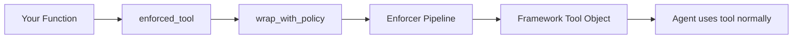

# Framework Integrations

EnforceCore provides drop-in adapters for popular agent frameworks. Each adapter replaces the framework's tool decorator with an enforced version — same API, full enforcement.

**Key properties:**
- **No hard dependencies** — framework packages are only imported at call time
- **Import always succeeds** — importing the adapter module never fails
- **Consistent API** — `@enforced_tool(policy=...)` pattern across all frameworks
- **Full enforcement** — policy, PII redaction, secret scanning, content rules, rate limiting, resource guards, cost tracking, and audit
- **Hook-compatible** — lifecycle hooks (`@on_violation`, `@on_post_call`, etc.) work with all adapters
- **Observable** — OpenTelemetry metrics and tracing apply to all enforced tools

---

## LangGraph / LangChain

```python
from enforcecore.integrations.langgraph import enforced_tool

@enforced_tool(policy="policy.yaml")
def search(query: str) -> str:
    """Search the web for information."""
    return web_search(query)

# With all options
@enforced_tool(
    policy="policy.yaml",
    tool_name="web_search",
    description="Custom description for LLM",
    args_schema=SearchInput,   # Pydantic model
    return_direct=True,
)
def search(query: str) -> str: ...

# Async support
@enforced_tool(policy="policy.yaml")
async def fetch(url: str) -> str: ...
```

**Returns:** `langchain_core.tools.StructuredTool`

| Parameter | Type | Default | Description |
|---|---|---|---|
| `policy` | `str \| Path \| Policy` | `None` | Policy to enforce |
| `tool_name` | `str` | `func.__name__` | Tool name for policy evaluation |
| `description` | `str` | docstring | Description shown to LLM |
| `args_schema` | `type` | `None` | Pydantic model for validation |
| `return_direct` | `bool` | `False` | Return output directly to user |

---

## CrewAI

```python
from enforcecore.integrations.crewai import enforced_tool

@enforced_tool(policy="policy.yaml")
def calculator(expression: str) -> str:
    """Evaluate a math expression."""
    return str(eval(expression))

# Custom name
@enforced_tool(policy="policy.yaml", tool_name="math_calculator")
def calc(expr: str) -> str: ...
```

| Parameter | Type | Default | Description |
|---|---|---|---|
| `policy` | `str \| Path \| Policy` | `None` | Policy to enforce |
| `tool_name` | `str` | `func.__name__` | Tool name for policy evaluation |

---

## AutoGen

```python
from enforcecore.integrations.autogen import enforced_tool

@enforced_tool(policy="policy.yaml", description="Get the weather")
async def get_weather(city: str) -> str:
    return await weather_api.get(city)

# Description from docstring
@enforced_tool(policy="policy.yaml")
def search(query: str) -> str:
    """Search the web for information."""
    return web_search(query)
```

**Returns:** `autogen_core.tools.FunctionTool`

| Parameter | Type | Default | Description |
|---|---|---|---|
| `policy` | `str \| Path \| Policy` | `None` | Policy to enforce |
| `tool_name` | `str` | `func.__name__` | Tool name for policy evaluation |
| `description` | `str` | docstring or name | Description shown to LLM |

---

## Plain Python

No adapter needed — use `@enforce()` directly:

```python
from enforcecore import enforce

@enforce(policy="policy.yaml")
async def my_tool(args: dict) -> str:
    return await do_something(args)
```

---

## Building Custom Adapters

Use `wrap_with_policy` to build adapters for any framework:

```python
from enforcecore.integrations import wrap_with_policy

def my_framework_tool(func, policy):
    """Adapter for MyFramework."""
    enforced = wrap_with_policy(func, policy=policy)
    return MyFramework.register_tool(enforced)
```

### Shared Utilities

```python
from enforcecore.integrations import require_package, wrap_with_policy
```

| Function | Description |
|---|---|
| `require_package(pkg, pip_name=...)` | Verify optional dep is installed, raise clear `ImportError` if not |
| `wrap_with_policy(func, policy=..., tool_name=...)` | Wrap any callable with enforcement |

---

## How It Works

Each adapter is ~20–50 lines of code. The pattern is always the same:

1. Import the framework's tool registration mechanism (lazy, at call time)
2. Wrap the user's function with `wrap_with_policy()` to add enforcement
3. Register the enforced function with the framework's tool system
4. Return the framework's expected tool type

The enforcement is transparent — the framework sees a normal tool, users get full protection.


