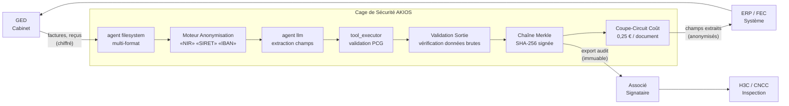

<header class="post-header">
  <div class="post-meta">6 Février 2026 &bull; <span>5 min de lecture</span></div>
  <h1>Construire une Cage de Sécurité IA Conforme au Plan Comptable en 15 Secondes</h1>
</header>

<div class="post-content">

Le plus grand obstacle à l'adoption de l'IA en comptabilité n'est pas la capacité des modèles — c'est la **confidentialité**. Comment utiliser des LLM puissants comme Grok ou GPT-4 sur des bilans trimestriels contenant des SIRET, des numéros de compte et des conclusions d'audit sensibles sans violer le RGPD ou les obligations du Code de Commerce ?

La réponse n'est pas d'éviter l'IA, mais de l'envelopper dans une **Cage de Sécurité**.

## Le Problème

Les cabinets comptables traitent des milliers de documents financiers chaque trimestre — factures, déclarations fiscales, relevés bancaires, bulletins de paie. Chacun contient des données dont la fuite expose le cabinet à une responsabilité professionnelle et des sanctions réglementaires. La revue manuelle est lente, coûteuse et source d'erreurs. L'IA peut le faire en secondes — mais les déploiements IA traditionnels n'ont aucun contrôle intégré pour la conformité PCG.

AKIOS change cela : analyse documentaire assistée par IA avec **zéro exposition de données brutes**.

## Le Cadre Réglementaire

La conformité IA en comptabilité en France couvre des exigences multiples :

<table>
  <thead>
    <tr><th>Réglementation</th><th>Périmètre</th><th>Comment AKIOS l'Applique</th></tr>
  </thead>
  <tbody>
    <tr>
      <td><strong>RGPD</strong></td>
      <td>Les données financières personnelles (NIR, salaires, RIB) sont des données personnelles</td>
      <td>Chaîne d'audit Merkle fournit une preuve cryptographique de chaque analyse</td>
    </tr>
    <tr>
      <td><strong>Code de Commerce (L123-22)</strong></td>
      <td>Conservation 10 ans des pièces comptables avec pistes d'audit vérifiables</td>
      <td>La politique-en-tant-que-code définit les contrôles avant exécution. Chaque contrôle est journalisé.</td>
    </tr>
    <tr>
      <td><strong>PCG</strong></td>
      <td>Les normes professionnelles gouvernent l'utilisation de la technologie dans les missions</td>
      <td>Sandbox déterministe assure des résultats reproductibles entre les missions</td>
    </tr>
    <tr>
      <td><strong>DGFiP / FEC</strong></td>
      <td>Le Fichier des Écritures Comptables exige la traçabilité de toute saisie automatisée</td>
      <td>L'anonymisation DCP assure que les NIR, SIRET et données financières n'atteignent jamais le modèle</td>
    </tr>
    <tr>
      <td><strong>OEC</strong></td>
      <td>L'Ordre des Experts-Comptables réglemente l'utilisation technologique par ses membres</td>
      <td>Chaque action IA produit une entrée de journal signée avec provenance de politique</td>
    </tr>
  </tbody>
</table>

## Le Concept : La Politique en tant que Code

AKIOS introduit le concept de « Cage de Sécurité » — un environnement d'exécution éphémère et sandboxé où les données sont traitées sous des politiques strictes définies par le code. La cage est détruite après chaque exécution. Aucun état persistant. Aucun vecteur de fuite.

## Le Workflow : Analyse Automatisée des Risques d'Audit

<table>
  <thead>
    <tr><th>Étape</th><th>Ce qui se passe</th><th>Contrôle de Sécurité</th></tr>
  </thead>
  <tbody>
    <tr>
      <td><strong>1. Ingestion</strong></td>
      <td>Fichier de revue financière chargé dans l'espace sécurisé</td>
      <td>Agent filesystem en lecture seule. Les documents ne peuvent être copiés hors de la cage.</td>
    </tr>
    <tr>
      <td><strong>2. Anonymisation</strong></td>
      <td>NIR, SIRET, numéros de compte, montants de salaires anonymisés en mémoire</td>
      <td>50+ motifs DCP remplacés par des jetons. Les originaux n'atteignent jamais le LLM.</td>
    </tr>
    <tr>
      <td><strong>3. Analyse</strong></td>
      <td>L'IA identifie les anomalies significatives, faiblesses de contrôle, indicateurs de continuité</td>
      <td>Budget plafonné (0,25 €/document), aucun accès réseau, aucun stockage persistant.</td>
    </tr>
    <tr>
      <td><strong>4. Intégration</strong></td>
      <td>Conclusions assainies déployées vers le système ERP/GRC autorisé</td>
      <td>Anomalies signalées pour revue humaine. L'IA ne peut approuver ni déclarer quoi que ce soit.</td>
    </tr>
    <tr>
      <td><strong>5. Audit</strong></td>
      <td>Chaque extraction, classification et validation journalisée avec signatures crypto</td>
      <td>Chaîne complète disponible pour inspection par les commissaires aux comptes.</td>
    </tr>
  </tbody>
</table>

### Architecture



### Configuration de la Politique

```yaml
# comptabilite-pcg-policy.yml
security:
  sandbox: strict
  network: isolated
  allowed_endpoints: []
  pii_redaction:
    enabled: true
    patterns: [nir, siret, iban, rib, compte_bancaire, salaire, date_naissance]
    mode: aggressive
  budget:
    max_cost_per_run: 0.25
    currency: EUR
  audit:
    merkle_chain: true
    export_format: jsonl
    retention_days: 3650  # 10 ans — exigence Code de Commerce
```

## Ce que l'Auditeur Voit

<table>
  <thead>
    <tr><th>Champ</th><th>Valeur</th></tr>
  </thead>
  <tbody>
    <tr><td>Document</td><td>facture-T4-2025-****3291.pdf</td></tr>
    <tr><td>Extraction</td><td>Fournisseur : [ANONYMISÉ] | Montant : 47 250,00 € | Date : 15/12/2025 | Compte : 6200</td></tr>
    <tr><td>Validation</td><td>✅ Compte 6200 conforme au PCG — Charges d'exploitation</td></tr>
    <tr><td>Signalement</td><td>⚠️ Montant supérieur à 25 000 € — envoyé en revue associé</td></tr>
    <tr><td>Confiance</td><td>96%</td></tr>
    <tr><td>Hash Audit</td><td><code>a2c7d4...e19b</code></td></tr>
    <tr><td>Données Exposées</td><td>❌ Aucune — toutes les DCP client anonymisées</td></tr>
  </tbody>
</table>

## Pourquoi C'est Important

- **Données Clients Protégées :** NIR, SIRET et données financières anonymisés avant tout contact IA.
- **Conformité RGPD Intégrée :** Chaque action IA produit un journal inviolable. La chaîne Merkle garantit l'intégrité.
- **Traitement Déterministe :** Le même document produit toujours le même résultat — essentiel pour la cohérence d'audit.
- **Prévisibilité des Coûts :** Limites strictes par document — pas de surprises en période fiscale.
- **Prêt pour le H3C :** Chaînes d'inférence exportables pour inspection, conformité 10 ans.

## Essayez-le Vous-même

```bash
pip install akios
akios init demo-comptabilite
akios run templates/accounting.yml
```

Sécurisez votre IA. Construisez avec AKIOS.

</div>

<div class="post-footer">
  <p>Connexe : <a href="banking-security-cage.html">IA Conforme DSP2 pour la Banque</a> | <a href="../case-studies/accounting-document-processing.html">Étude de Cas Comptabilité</a></p>
  <div class="share-links">
    <span>Partager :</span>
    <a href="#" target="_blank">Twitter</a>
    <a href="#" target="_blank">LinkedIn</a>
    <a href="#" target="_blank">Hacker News</a>
  </div>
  <a href="./">← Retour au Blog</a>
</div>
