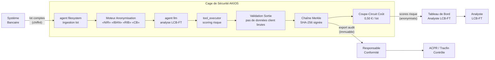

<header class="post-header">
  <div class="post-meta">6 Février 2026 &bull; <span>5 min de lecture</span></div>
  <h1>Construire une Cage de Sécurité IA Conforme DSP2 pour la Banque en 15 Secondes</h1>
</header>

<div class="post-content">

Le plus grand obstacle à l'adoption de l'IA en banque n'est pas la capacité des modèles — c'est la **conformité**. Comment utiliser des LLM puissants comme Grok ou GPT-4 sur les données de transaction client sans déclencher une violation RGPD ou LCB-FT ?

La réponse n'est pas d'éviter l'IA, mais de l'envelopper dans une **Cage de Sécurité**.

## Le Problème

Les banques traitent des millions de transactions quotidiennement. La détection de fraude, le filtrage LCB-FT et les déclarations de soupçon sont critiques mais coûteux en main-d'œuvre. L'IA peut analyser des schémas à travers des milliers de comptes en secondes — mais connecter un modèle aux données clients crée une nouvelle surface d'attaque. NIR, IBAN, RIB et historiques de transactions sont en jeu. Une fuite signifie une action réglementaire de l'ACPR, des poursuites et une perte de confiance.

AKIOS permet de déployer l'IA sur les données de transaction **sans exposer aucun identifiant client**.

## Le Cadre Réglementaire

La conformité IA bancaire en Europe couvre des exigences superposées :

<table>
  <thead>
    <tr><th>Réglementation</th><th>Périmètre</th><th>Comment AKIOS l'Applique</th></tr>
  </thead>
  <tbody>
    <tr>
      <td><strong>RGPD</strong></td>
      <td>Les données financières des clients doivent être protégées avec des mesures documentées</td>
      <td>L'anonymisation DCP supprime les identifiants avant traitement IA. La chaîne d'audit prouve la conformité.</td>
    </tr>
    <tr>
      <td><strong>DSP2 / DSP3</strong></td>
      <td>L'authentification forte et la protection des données de paiement sont obligatoires</td>
      <td>Isolation cage + politique-en-tant-que-code = mesures documentées et applicables.</td>
    </tr>
    <tr>
      <td><strong>LCB-FT / Tracfin</strong></td>
      <td>Les banques doivent détecter et signaler les activités suspectes avec pistes d'audit complètes</td>
      <td>La chaîne Merkle fournit un enregistrement inviolable de chaque analyse.</td>
    </tr>
    <tr>
      <td><strong>ACPR / AMF</strong></td>
      <td>La gouvernance des modèles IA exige l'explicabilité et la supervision humaine</td>
      <td>Chaînes d'inférence complètes exportables par analyse. Portail de revue humaine pour les DS.</td>
    </tr>
    <tr>
      <td><strong>DORA</strong></td>
      <td>La résilience opérationnelle numérique exige des contrôles sur les systèmes IA tiers</td>
      <td>Chaque action IA produit un journal signé avec provenance de politique.</td>
    </tr>
  </tbody>
</table>

## Le Concept : La Politique en tant que Code

AKIOS introduit le concept de « Cage de Sécurité » — un environnement d'exécution éphémère et sandboxé où les données sont traitées sous des politiques strictes. La cage est détruite après chaque exécution.

## Le Workflow : Analyse LCB-FT Automatisée

<table>
  <thead>
    <tr><th>Étape</th><th>Ce qui se passe</th><th>Contrôle de Sécurité</th></tr>
  </thead>
  <tbody>
    <tr>
      <td><strong>1. Ingestion</strong></td>
      <td>Lot de comptes clients chargé dans la Cage de Sécurité</td>
      <td>NIR, IBAN et données de carte anonymisés avant que l'IA ne voie quoi que ce soit.</td>
    </tr>
    <tr>
      <td><strong>2. Anonymisation</strong></td>
      <td>Identifiants clients supprimés et remplacés par des jetons</td>
      <td>50+ motifs DCP incluant IBAN, RIB, NIR, dates de naissance remplacés.</td>
    </tr>
    <tr>
      <td><strong>3. Analyse</strong></td>
      <td>L'IA analyse les schémas de transaction — fractionnement, superposition, vélocité inhabituelle</td>
      <td>Budget plafonné (0,50 €/lot), réseau isolé, aucun stockage persistant.</td>
    </tr>
    <tr>
      <td><strong>4. Classification</strong></td>
      <td>Comptes classés en risque faible/moyen/élevé avec scores de confiance</td>
      <td>L'IA ne peut pas déposer de DS ni geler de comptes. Confirmation humaine obligatoire.</td>
    </tr>
    <tr>
      <td><strong>5. Audit</strong></td>
      <td>Chaque inférence et accès aux données signé cryptographiquement</td>
      <td>L'ACPR peut tracer le chemin de décision complet pour tout compte signalé.</td>
    </tr>
  </tbody>
</table>

### Architecture



### Configuration de la Politique

```yaml
# banque-lcb-ft-policy.yml
security:
  sandbox: strict
  network: isolated
  allowed_endpoints: []
  pii_redaction:
    enabled: true
    patterns: [nir, iban, rib, carte_bancaire, cvv, date_naissance]
    mode: aggressive
  budget:
    max_cost_per_run: 0.50
    currency: EUR
  audit:
    merkle_chain: true
    export_format: jsonl
    retention_days: 1825  # 5 ans — exigence LCB-FT
  constraints:
    declaration_soupcon: disabled  # l'IA ne peut pas déposer de DS
    gel_compte: disabled
    human_review: required_for_high_risk
```

## Ce que l'Analyste LCB-FT Voit

<table>
  <thead>
    <tr><th>Champ</th><th>Valeur</th></tr>
  </thead>
  <tbody>
    <tr><td>Lot</td><td>LCB-2026-0206-****9274 (2 847 comptes)</td></tr>
    <tr><td>Risque Élevé</td><td>12 comptes signalés — schéma de fractionnement détecté</td></tr>
    <tr><td>Schéma</td><td>17 dépôts espèces de 9 500 €–9 900 € sur 3 agences en 14 jours (juste sous le seuil de 10 000 € Tracfin)</td></tr>
    <tr><td>Score Risque</td><td>0,94 (critique)</td></tr>
    <tr><td>Recommandation</td><td>DS recommandée — dépôts structurés cohérents avec du schtroumpfage</td></tr>
    <tr><td>Confiance</td><td>97%</td></tr>
    <tr><td>Hash Audit</td><td><code>c4e8b2...a73d</code></td></tr>
    <tr><td>Données Client Exposées</td><td>❌ Aucune — toutes les DCP anonymisées avant analyse</td></tr>
  </tbody>
</table>

Pas de NIR. Pas d'IBAN. Pas de détails de carte. Juste du renseignement de risque avec une chaîne de preuve cryptographique.

## Pourquoi C'est Important

- **Données Clients Protégées :** NIR, IBAN et numéros de compte anonymisés avant tout contact IA.
- **Conformité RGPD :** Les données des titulaires ne sont jamais stockées ni transmises hors de la cage.
- **LCB-FT / Tracfin :** Chaînes de décision complètes exportables pour contrôle ACPR.
- **Aucune Action Non Autorisée :** Contraintes codées en dur empêchent l'IA de déposer des DS ou geler des comptes.
- **Coûts Maîtrisés :** Limites de budget par lot — pas de surcoûts imprévus sur les millions de transactions.

## Essayez-le Vous-même

```bash
pip install akios
akios init demo-banque
akios run templates/banking.yml
```

Sécurisez votre IA. Construisez avec AKIOS.

</div>

<div class="post-footer">
  <p>Connexe : <a href="accounting-security-cage.html">IA Conforme PCG pour la Comptabilité</a> | <a href="../case-studies/banking-fraud-detection.html">Étude de Cas Détection de Fraude Bancaire</a></p>
  <div class="share-links">
    <span>Partager :</span>
    <a href="#" target="_blank">Twitter</a>
    <a href="#" target="_blank">LinkedIn</a>
    <a href="#" target="_blank">Hacker News</a>
  </div>
  <a href="./">← Retour au Blog</a>
</div>
