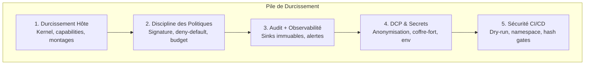

<header class="post-header">
  <div class="post-meta">
    26 Janvier 2026 &bull; <span>5 min de lecture</span>
  </div>
  <h1>Checklist de Durcissement pour AKIOS 1.0</h1>
</header>

<div class="post-content">

AKIOS est minimal par conception, mais vous avez quand même besoin de quelques garde-fous pour garder les agents contenus en environnement réel. Utilisez cette checklist avant de mettre en production.

## Pourquoi le Durcissement est Important

AKIOS fournit une isolation au niveau kernel dès l'installation. Mais le runtime n'est qu'une couche. L'hôte, le pipeline CI/CD, le processus de gestion des politiques et le stockage d'audit doivent aussi être durcis. Une Cage de Sécurité n'est aussi solide que la couche la plus faible de la pile.

Cette checklist couvre les cinq domaines de durcissement :



## La Checklist

<table>
  <thead>
    <tr><th>Domaine</th><th>Vérification</th><th>Commande / Action</th><th>Priorité</th></tr>
  </thead>
  <tbody>
    <tr>
      <td rowspan="3"><strong>Hôte</strong></td>
      <td>Kernel Linux récent avec <code>seccomp</code>, <code>userns</code>, <code>cgroups v2</code></td>
      <td><code>uname -r</code> → 5.15+</td>
      <td>🔴 Critique</td>
    </tr>
    <tr>
      <td>Supprimer les capabilities inutiles (<code>NET_ADMIN</code>, <code>SYS_ADMIN</code>)</td>
      <td><code>capsh --print</code></td>
      <td>🔴 Critique</td>
    </tr>
    <tr>
      <td>Monter <code>/tmp</code> en <code>noexec</code></td>
      <td><code>mount -o remount,noexec /tmp</code></td>
      <td>🟡 Recommandé</td>
    </tr>
    <tr>
      <td rowspan="3"><strong>Politique</strong></td>
      <td>Signer les politiques ; charger uniquement des artefacts signés en CI/CD</td>
      <td><code>akios policy sign policy.yml</code></td>
      <td>🔴 Critique</td>
    </tr>
    <tr>
      <td>Default-deny réseau et filesystem ; liste blanche stricte</td>
      <td>Vérifier <code>network: isolated</code></td>
      <td>🔴 Critique</td>
    </tr>
    <tr>
      <td>Budgets serrés par outil ; échec fermé sur dépassement</td>
      <td><code>budget.max_cost_per_run: 0.50</code></td>
      <td>🟡 Recommandé</td>
    </tr>
    <tr>
      <td rowspan="3"><strong>Audit</strong></td>
      <td>Envoyer les logs d'audit vers un sink immuable (bucket append-only)</td>
      <td><code>akios audit export --format jsonl</code></td>
      <td>🔴 Critique</td>
    </tr>
    <tr>
      <td>Activer l'export de preuves Merkle ; valider en tests CI</td>
      <td><code>akios audit verify</code></td>
      <td>🔴 Critique</td>
    </tr>
    <tr>
      <td>Alerter sur escapes sandbox, refus de politique, activations coupe-circuit</td>
      <td>Configurer les alertes dans le stack de monitoring</td>
      <td>🟡 Recommandé</td>
    </tr>
    <tr>
      <td rowspan="2"><strong>DCP</strong></td>
      <td>Garder l'anonymisation DCP activée pour tous les agents</td>
      <td><code>pii_redaction: { enabled: true, mode: aggressive }</code></td>
      <td>🔴 Critique</td>
    </tr>
    <tr>
      <td>Stocker les secrets dans un coffre-fort ; injecter via env avec moindre privilège</td>
      <td>Jamais de secrets dans les prompts ou fichiers de politique</td>
      <td>🔴 Critique</td>
    </tr>
    <tr>
      <td rowspan="3"><strong>CI/CD</strong></td>
      <td>Conditionner les PRs à <code>akios run --dry-run</code></td>
      <td>Ajouter au pipeline CI avant le merge</td>
      <td>🟡 Recommandé</td>
    </tr>
    <tr>
      <td>Exécuter les workflows dans un namespace/VM éphémère par PR</td>
      <td>Runners éphémères en CI</td>
      <td>🟡 Recommandé</td>
    </tr>
    <tr>
      <td>Bloquer les merges si la sortie d'audit dévie de la chaîne de hash attendue</td>
      <td><code>akios audit verify --expected-hash $HASH</code></td>
      <td>🟡 Recommandé</td>
    </tr>
  </tbody>
</table>

## Exemple : Politique Durcie

Voici une politique de production avec tout le durcissement appliqué :

```yaml
# production-durcie.yml
version: 1
name: "production-durcie"

security:
  sandbox: strict
  network: isolated
  allowed_endpoints: []  # default-deny

filesystem:
  allow:
    - path: "/workspace/input"
      mode: "r"
    - path: "/workspace/output"
      mode: "w"
  deny_writes: true

http:
  allow: []  # aucun accès HTTP
  redact_headers: ["authorization", "cookie", "x-api-key"]

llm:
  provider: "openai"
  model: "gpt-4.1"
  max_tokens: 500
  budget_usd: 0.50
  redact_prompts: true
  redact_responses: true

tools:
  allow:
    - name: "jq"
    - name: "grep"
  timeout_sec: 20

audit:
  merkle: true
  pii_redaction: true
  export_format: jsonl
  retention_days: 2555  # 7 ans

pii_redaction:
  enabled: true
  mode: aggressive
  patterns: [nir, siret, carte_bancaire, iban, email, telephone, cle_api]
```

## Vérifier votre Durcissement

```bash
# Vérifier la disponibilité système
akios doctor

# Valider la politique avant déploiement
akios run --dry-run templates/mon-workflow.yml

# Vérifier l'intégrité de la chaîne d'audit
akios audit verify

# Générer un rapport de conformité
akios compliance report --format detailed
```

## Erreurs Courantes

1. **Exécuter avec `--no-sandbox`** — Ne jamais désactiver le sandbox en production. Utilisez `--dry-run` pour le debugging.
2. **Autoriser `*` dans les politiques réseau** — Cela annule l'objectif. Listez les hôtes spécifiques.
3. **Stocker les clés API dans les fichiers de politique** — Utilisez des variables d'environnement ou un coffre-fort.
4. **Ignorer les cassures de chaîne d'audit** — Une chaîne cassée signifie une altération. Investiguer immédiatement.
5. **Mettre le budget en illimité** — Toujours définir un budget. Le coupe-circuit est votre dernière ligne de défense.

## Essayez-le Vous-même

```bash
pip install akios
akios doctor
akios run --dry-run templates/hello-workflow.yml
```

Déployez avec ces fondamentaux et votre sécurité restera solide pendant que vous itérez.

Sécurisez votre IA. Construisez avec AKIOS.

</div>

<div class="post-footer">
  <p>Connexe : <a href="release-notes-v0-1-0.html">Notes de Version AKIOS v1.0</a> | <a href="policy-schema-deep-dive.html">Plongée dans le Schéma de Politique</a></p>
  <div class="share-links">
    <span>Partager :</span>
    <a href="#" target="_blank">Twitter</a>
    <a href="#" target="_blank">LinkedIn</a>
    <a href="#" target="_blank">Hacker News</a>
  </div>
  <a href="./">← Retour au Blog</a>
</div>
