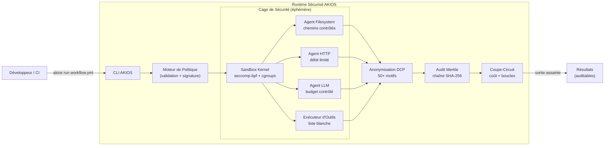

<header class="post-header">
  <div class="post-meta">
    14 Janvier 2026 &bull; <span>6 min de lecture</span>
  </div>
  <h1>Présentation d'AKIOS : un Runtime Sécurisé pour Agents IA Non Fiables</h1>
</header>

<div class="post-content">

Aujourd'hui, nous annonçons **AKIOS**, un nouveau runtime open source conçu spécifiquement pour exécuter des agents IA non fiables sur des machines locales.

## Le Problème : « curl | sh » pour les Agents

Nous entrons dans une ère où les développeurs exécutent couramment des agents IA qui génèrent et exécutent du code. Les pratiques actuelles consistent souvent à les exécuter directement sur la machine hôte ou dans des conteneurs Docker faiblement configurés.

C'est risqué. Les agents peuvent halluciner des commandes destructrices, exfiltrer des identifiants ou modifier accidentellement des fichiers système critiques. Nous avons besoin d'un runtime qui **considère l'agent comme non fiable par défaut**.

Les « solutions » typiques — conteneurs Docker, isolation VM, ou l'espoir — laissent des failles critiques :

<table>
  <thead>
    <tr><th>Approche</th><th>Contrôle Réseau</th><th>Anonymisation DCP</th><th>Coupe-Circuit Coût</th><th>Piste d'Audit</th><th>Mise en Place</th></tr>
  </thead>
  <tbody>
    <tr>
      <td><strong>Bare Metal</strong></td>
      <td>❌ Aucun</td>
      <td>❌ Aucune</td>
      <td>❌ Aucun</td>
      <td>❌ Aucune</td>
      <td>0 sec</td>
    </tr>
    <tr>
      <td><strong>Docker</strong></td>
      <td>⚠️ iptables manuel</td>
      <td>❌ Aucune</td>
      <td>❌ Aucun</td>
      <td>⚠️ Logs basiques</td>
      <td>~30 min</td>
    </tr>
    <tr>
      <td><strong>VM (Firecracker)</strong></td>
      <td>⚠️ Config NAT</td>
      <td>❌ Aucune</td>
      <td>❌ Aucun</td>
      <td>⚠️ Syslog</td>
      <td>~1 heure</td>
    </tr>
    <tr>
      <td><strong>AKIOS</strong></td>
      <td>✅ Contrôle par politique</td>
      <td>✅ 50+ motifs</td>
      <td>✅ Par workflow</td>
      <td>✅ Chaîne Merkle</td>
      <td>15 sec</td>
    </tr>
  </tbody>
</table>

## Découvrez AKIOS

AKIOS fournit un sandbox strict basé sur `seccomp-bpf` et les espaces de noms utilisateur. Il suit une philosophie **« tout interdire par défaut »** pour les accès réseau et filesystem.

### Vue d'Ensemble de l'Architecture



### Fonctionnalités Clés

**Sandboxing Strict** — Les agents s'exécutent dans des environnements isolés avec des privilèges minimaux. Sous Linux, cela utilise des contrôles au niveau kernel (cgroups v2 + seccomp-bpf). Sur les autres plateformes, Docker fournit une isolation conteneur forte.

**Politiques Explicites** — Vous définissez exactement quels domaines un agent peut contacter, quels fichiers il peut lire/écrire, et quelles commandes il peut exécuter. Tout le reste est bloqué.

```yaml
# Exemple : politique minimale pour un agent de résumé
version: 1
name: "resume-documents"
filesystem:
  allow:
    - path: "/workspace/docs"
      mode: "r"
http:
  allow:
    - host: "api.openai.com"
      methods: ["POST"]
      rate_limit_per_min: 10
llm:
  provider: "openai"
  model: "gpt-4.1"
  budget_usd: 0.50
audit:
  merkle: true
  pii_redaction: true
```

**Anonymisation DCP en Temps Réel** — Plus de 50 motifs détectés et anonymisés en moins de 50 ms — NIR, numéros de carte, clés API, emails, téléphones — avant qu'ils n'atteignent l'agent.

**Audit Inviolable** — Chaque action est journalisée cryptographiquement dans une chaîne Merkle. Si un seul octet est modifié, la chaîne se brise. Ce n'est pas du simple logging — c'est une preuve cryptographique.

**Coupe-Circuits de Coût** — Terminaison immédiate en cas de dépassement de budget ou de boucles infinies. Définissez une limite de 1,00 € par workflow et soyez sûr qu'elle sera appliquée.

## Démo en 30 Secondes

```bash
# Installer
pip install akios

# Initialiser un projet
akios init mon-projet
cd mon-projet

# Exécuter un workflow sandboxé
akios run templates/hello-workflow.yml
```

Ce que vous verrez :

```
[akios] sandbox: seccomp-bpf, cgroups v2 (Linux)
[akios] pii: anonymisation activée (50+ motifs)
[akios] audit: chaîne Merkle initialisée
[akios] budget: limite 0,50 € appliquée
[akios] workflow: terminé avec succès en 1,2s
[akios] audit: chaîne vérifiée ✓ (hash: a3b7c9...d2e1)
```

## Ce qui Rend AKIOS Différent

Ce n'est pas un autre framework IA. C'est un **runtime de sécurité**.

- Les **frameworks** vous donnent des outils pour construire des agents. AKIOS vous donne une cage pour les exécuter en sécurité.
- **Docker** vous donne l'isolation conteneur. AKIOS vous donne une exécution contrôlée par politique, anonymisée, limitée en coût, et auditée cryptographiquement.
- Les **architectures « faites-moi confiance »** reposent sur la bonne volonté des développeurs. AKIOS l'impose au niveau kernel.

## La Suite

Ce n'est que le début. Nous travaillons sur :

- **Orchestration multi-agents** — exécution parallèle avec portes de politique inter-agents
- **Connecteurs base de données** — PostgreSQL, SQLite avec contrôle de politique au niveau requête
- **Système de plugins** — agents communautaires avec architecture plugin sandboxée
- **Inférence accélérée** — accès GPU dans le sandbox avec isolation mémoire

Consultez le guide [Quickstart](../docs/quickstart.html) pour essayer, ou parcourez le [code source sur GitHub](https://github.com/akios-ai/akios).

## Essayez-le Vous-même

```bash
pip install akios
akios init mon-projet
akios run templates/hello-workflow.yml
```

Sécurisez votre IA. Construisez avec AKIOS.

</div>

<div class="post-footer">
  <p>Connexe : <a href="release-notes-v0-1-0.html">Notes de Version AKIOS v1.0</a> | <a href="secure-agent-communication.html">Communication Sécurisée entre Agents</a></p>
  <div class="share-links">
    <span>Partager :</span>
    <a href="#" target="_blank">Twitter</a>
    <a href="#" target="_blank">LinkedIn</a>
    <a href="#" target="_blank">Hacker News</a>
  </div>
  <a href="./">← Retour au Blog</a>
</div>
