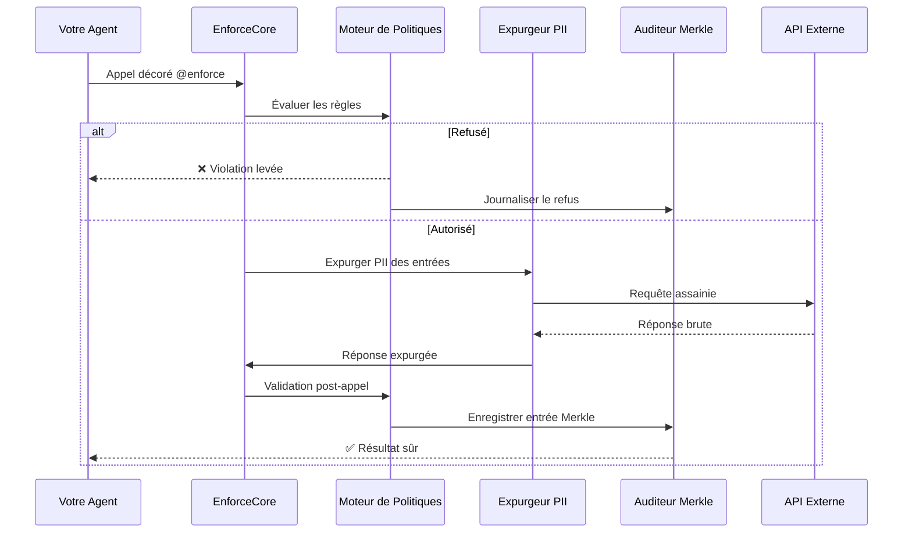
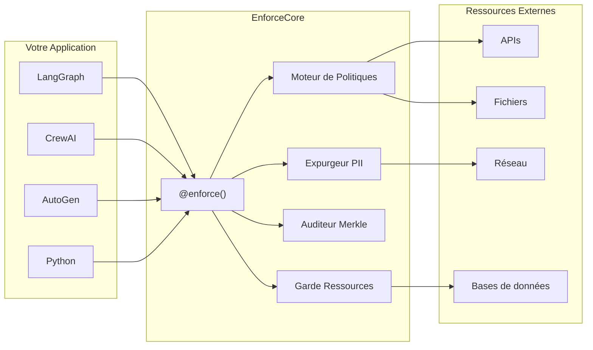
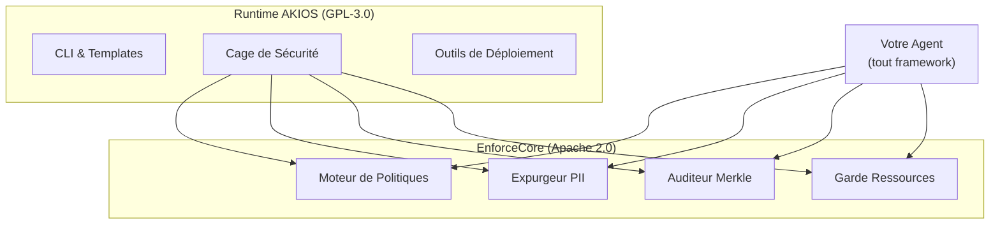

<header class="post-header">
  <div class="post-meta">
    20 février 2026 &bull; <span>5 min de lecture</span>
  </div>
  <h1>Présentation d'EnforceCore : Application des règles à l'exécution pour agents IA</h1>
</header>

<div class="post-content">

Nous publions aujourd'hui **EnforceCore**, le framework open source d'application des règles que nous avons conçu comme fondation du runtime de sécurité [AKIOS](../docs/index.html). Il est disponible sous licence **Apache 2.0** et fonctionne avec n'importe quel framework d'agents basé sur Python.

## Pourquoi EnforceCore ?

Les frameworks d'agents deviennent de plus en plus puissants. LangGraph, CrewAI, AutoGen, Semantic Kernel — chaque projet majeur construit des agents qui appellent des outils, naviguent sur le web, écrivent des fichiers et exécutent du code.

Mais presque personne ne construit la **couche de contrôle**.

Aujourd'hui, quand votre agent appelle un outil, il n'existe pas de moyen standard pour :
- **Vérifier** que l'appel est autorisé *avant* son exécution
- **Expurger** les données sensibles *avant* qu'elles n'atteignent les services externes
- **Prouver** à un auditeur que les violations étaient structurellement impossibles

La plupart des solutions de « sécurité » sont des garde-fous au niveau du prompt — des instructions au LLM qui peuvent être contournées, ignorées ou détournées. Elles opèrent à la mauvaise couche.

**EnforceCore opère à la frontière d'appel à l'exécution — la seule couche qui ne peut pas être contournée.**

## Comment ça fonctionne

EnforceCore encapsule tout appel externe avec un décorateur. Lorsque la fonction décorée est invoquée, l'appel passe par un pipeline d'application multi-étapes avant d'atteindre la ressource externe.



Chaque appel passe par le même pipeline : **vérification de politique → expurgation PII → exécution en bac à sable → expurgation de sortie → journalisation d'audit**. Sans exception.

## Quatre composants, un seul décorateur

EnforceCore est construit à partir de quatre composants indépendants qui se composent via un seul décorateur `@enforce()` :



### Moteur de politiques
Politiques YAML déclaratives validées par Pydantic. Définissez ce qu'un agent peut et ne peut pas faire — évalué à chaque frontière d'appel.

### Expurgeur PII
Détection et expurgation en temps réel sur 53 modèles. Les entrées sont nettoyées avant de quitter votre processus ; les sorties sont nettoyées avant d'atteindre votre agent. Stratégies configurables : masquer, hacher, supprimer ou remplacer.

### Auditeur Merkle
Piste d'audit en arbre Merkle SHA-256 pour chaque appel contrôlé. Chaque entrée est chaînée cryptographiquement à la précédente. Inviolable par conception.

### Garde de ressources
Limites de ressources multiplateformes : temps, mémoire, coût. Coupe-circuit automatique lorsque les limites sont dépassées. Durcissement complet sur Linux avec seccomp/cgroups.

## Démarrage rapide

Installez et protégez votre première fonction en moins d'une minute :

```bash
pip install enforcecore[all]
```

```python
from enforcecore import enforce

@enforce(policy="my_policy.yaml")
async def call_api(url: str, data: dict):
    return await httpx.post(url, json=data)
```

**Fichier de politique (`my_policy.yaml`) :**
```yaml
name: api_access_policy
version: "1.0"
rules:
  - action: http_request
    allow:
      domains: ["api.example.com"]
      methods: ["GET", "POST"]
    deny:
      domains: ["*"]
    redact:
      inputs: true
      outputs: true
```

Chaque appel à `call_api` passe désormais par l'évaluation de politique, l'expurgation PII, les contraintes de ressources et l'audit cryptographique — automatiquement. Aucun changement nécessaire dans votre code d'agent.

## Pourquoi pas des garde-fous au niveau du prompt ?

| Approche | Couche | Contournable ? | Auditable ? | Verrouillé framework ? |
|----------|--------|----------------|-------------|------------------------|
| Instructions prompt | Dans le LLM | Oui (jailbreaks) | Non | Souvent |
| Filtres de sortie | Après exécution | Dégâts déjà faits | Partiellement | Généralement |
| **EnforceCore** | **Frontière d'appel** | **Non** | **Oui (preuves Merkle)** | **Non** |

Les garde-fous de prompt disent au LLM ce qu'il ne faut pas faire. EnforceCore rend structurellement impossible de le faire. Ce sont des catégories différentes.

## Relation avec AKIOS

Nous avons conçu EnforceCore comme la fondation d'application des règles qui propulse AKIOS. Plutôt que de verrouiller la logique d'application dans le runtime, nous l'avons construit comme un framework indépendant — pour bénéficier à l'ensemble de l'écosystème.



- **Utilisez EnforceCore** si vous construisez des agents avec LangGraph, CrewAI, AutoGen ou votre propre système et avez besoin d'un contrôle à l'exécution.
- **Utilisez AKIOS** si vous voulez un runtime sécurisé complet avec CLI, templates et outils de déploiement construits sur EnforceCore.

## Performance

EnforceCore ajoute un surcoût minimal à vos appels d'agent :

| Composant | Surcoût |
|-----------|---------|
| Évaluation de politique | < 1ms |
| Expurgation PII (court) | 5–15ms |
| Expurgation PII (long) | 15–50ms |
| Entrée d'audit | < 1ms |
| **Total (typique)** | **8–20ms** |

Pour contexte, un seul appel API GPT-4 prend 500ms–3s. EnforceCore ajoute moins de 2 % de surcoût.

## Et après

- **Adaptateurs de framework** — Couches d'intégration fines pour LangGraph, CrewAI et AutoGen
- **Composition de politiques** — Hériter, remplacer et fusionner des politiques entre équipes
- **Templates de conformité** — Politiques pré-construites pour le Règlement IA de l'UE, SOC 2, HIPAA
- **Tableau de bord** — Éditeur visuel de politiques et visualiseur d'audit en temps réel

## Commencer

- **Documentation :** [Documentation EnforceCore](../docs/enforcecore.html)
- **GitHub :** [github.com/akios-ai/enforcecore](https://github.com/akios-ai/enforcecore)
- **PyPI :** [pypi.org/project/enforcecore](https://pypi.org/project/enforcecore/)
- **Licence :** Apache 2.0

```bash
pip install enforcecore[all]
```

Application des règles à l'exécution pour agents IA. Open source. Agnostique de framework.

</div>

<div class="post-footer">
  <p>En rapport : <a href="introducing-akios.html">Présentation d'AKIOS</a> | <a href="../docs/enforcecore.html">Documentation EnforceCore</a></p>
  <div class="share-links">
    <span>Partager cet article :</span>
    <a href="#" target="_blank">Twitter</a>
    <a href="#" target="_blank">LinkedIn</a>
    <a href="#" target="_blank">Hacker News</a>
  </div>
  <a href="./">← Retour au Blog</a>
</div>
