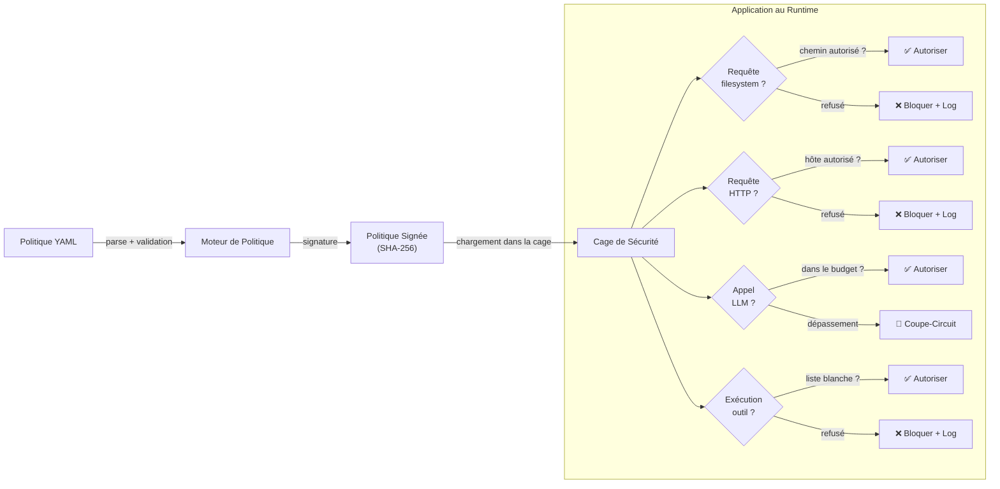

<header class="post-header">
  <div class="post-meta">
    22 Janvier 2026 &bull; <span>6 min de lecture</span>
  </div>
  <h1>Plongée dans le Schéma de Politique (v1)</h1>
</header>

<div class="post-content">

Le schéma de politique v1 est intentionnellement petit. Mais petit ne veut pas dire simple — chaque clé contrôle une frontière de sécurité réelle. Cet article explique ce que fait chaque bloc, pourquoi il existe, et comment l'utiliser.

## Pourquoi la Politique en tant que Code ?

La plupart de la sécurité IA est appliquée par convention : les développeurs promettent de ne pas faire de bêtises. AKIOS adopte une approche différente — la sécurité est appliquée par du **code**, validée avant exécution, et signée cryptographiquement. Si la politique ne l'autorise pas, ça n'arrive pas.



## Les Blocs du Schéma

La politique v1 a six blocs de premier niveau. Voici ce que chacun fait :

<table>
  <thead>
    <tr><th>Bloc</th><th>Contrôle</th><th>Défaut</th><th>Impact Sécurité</th></tr>
  </thead>
  <tbody>
    <tr>
      <td><strong>filesystem</strong></td>
      <td>Quels chemins les agents peuvent lire/écrire</td>
      <td>Tout interdire</td>
      <td>Empêche l'exfiltration de données via les fichiers locaux</td>
    </tr>
    <tr>
      <td><strong>http</strong></td>
      <td>Quels hôtes/méthodes/débits sont autorisés</td>
      <td>Tout interdire</td>
      <td>Empêche les appels réseau non autorisés</td>
    </tr>
    <tr>
      <td><strong>llm</strong></td>
      <td>Fournisseur, modèle, tokens, budget</td>
      <td>Aucun fournisseur</td>
      <td>Empêche les dépassements de coûts et l'abus de modèle</td>
    </tr>
    <tr>
      <td><strong>tools</strong></td>
      <td>Quelles commandes peuvent s'exécuter</td>
      <td>Tout interdire</td>
      <td>Empêche l'exécution arbitraire de commandes</td>
    </tr>
    <tr>
      <td><strong>audit</strong></td>
      <td>Chaîne Merkle, anonymisation DCP, export</td>
      <td>Activé</td>
      <td>Fournit une preuve inviolable de l'exécution</td>
    </tr>
    <tr>
      <td><strong>pii_redaction</strong></td>
      <td>Quels motifs détecter et anonymiser</td>
      <td>Activé (standard)</td>
      <td>Empêche les données sensibles d'atteindre l'agent</td>
    </tr>
  </tbody>
</table>

### Filesystem

Contrôle ce que l'agent peut voir et modifier sur le disque :

```yaml
filesystem:
  allow:
    - path: "/srv/akios/readme.md"
      mode: "r"           # lecture seule
    - path: "/workspace/output"
      mode: "w"           # écriture autorisée
  deny_writes: true       # bloqué partout ailleurs
```

**Règle clé :** Les chemins non listés sont invisibles pour l'agent. Il ne peut même pas détecter qu'ils existent.

### HTTP

Contrôle quels services externes l'agent peut contacter :

```yaml
http:
  allow:
    - host: "api.openai.com"
      methods: ["POST"]
      rate_limit_per_min: 30
    - host: "docs.example.com"
      methods: ["GET"]
      rate_limit_per_min: 60
  redact_headers: ["authorization", "cookie", "x-api-key"]
```

**Règle clé :** Chaque requête passe par le moteur d'anonymisation DCP. Même les requêtes autorisées voient leurs en-têtes sensibles supprimés.

### LLM

Contrôle le modèle IA et les dépenses :

```yaml
llm:
  provider: "openai"
  model: "gpt-4.1"
  max_tokens: 1200
  budget_usd: 0.25
  redact_prompts: true
  redact_responses: true
```

**Règle clé :** Quand `budget_usd` est dépassé, le workflow est **tué immédiatement** — pas après l'appel en cours. C'est un coupe-circuit dur, pas un avertissement.

### Tools (Commandes)

Contrôle quelles commandes shell l'agent peut exécuter :

```yaml
tools:
  allow:
    - name: "jq"
      args: ["."]
    - name: "grep"
      args: ["-n", "ERROR"]
  working_dir: "/workspace"
  timeout_sec: 20
```

**Règle clé :** Seules 17 commandes pré-approuvées sont disponibles. Chacune s'exécute dans un sous-processus sandboxé avec filtrage syscall et limites de sortie (1 Mo).

### Audit

Contrôle la journalisation inviolable :

```yaml
audit:
  merkle: true
  pii_redaction: true
  export_format: jsonl
  retention_days: 2555  # 7 ans
```

**Règle clé :** La chaîne Merkle est append-only. Si une entrée est modifiée, la chaîne de hash se brise et la vérification échoue. C'est une preuve cryptographique, pas un simple fichier de log.

### Anonymisation DCP

Contrôle quels motifs de données sensibles sont détectés :

```yaml
pii_redaction:
  enabled: true
  mode: aggressive
  patterns: [nir, siret, carte_bancaire, iban, email, telephone, cle_api]
```

**Règle clé :** En mode `aggressive`, le moteur favorise l'anonymisation excessive. Les faux positifs sont préférables aux fuites de données.

## Politique Complète

```yaml
version: 1
name: "resume-documents"

filesystem:
  allow:
    - path: "/workspace/docs"
      mode: "r"
http:
  allow:
    - host: "api.openai.com"
      methods: ["POST"]
      rate_limit_per_min: 10
  redact_headers: ["authorization", "cookie"]
llm:
  provider: "openai"
  model: "gpt-4.1"
  max_tokens: 1500
  budget_usd: 0.30
  redact_prompts: true
  redact_responses: true
tools:
  allow:
    - name: "jq"
    - name: "grep"
  working_dir: "/workspace"
  timeout_sec: 20
audit:
  merkle: true
  pii_redaction: true
  export_format: jsonl
pii_redaction:
  enabled: true
  mode: aggressive
```

## Valider votre Politique

Toujours valider avant de déployer :

```bash
# Le dry-run valide la politique sans l'exécuter
akios run --dry-run mon-workflow.yml

# Signer la politique pour l'utilisation en production
akios policy sign mon-workflow.yml

# Vérifier une politique signée
akios policy verify mon-workflow.yml.sig
```

## Essayez-le Vous-même

```bash
pip install akios
akios init mon-projet
akios run templates/hello-workflow.yml
```

Gardez les politiques petites, explicites et signées. C'est ainsi que la cage reste prévisible.

Sécurisez votre IA. Construisez avec AKIOS.

</div>

<div class="post-footer">
  <p>Connexe : <a href="hardening-checklist.html">Checklist de Durcissement</a> | <a href="secure-agent-communication.html">Communication Sécurisée entre Agents</a></p>
  <div class="share-links">
    <span>Partager :</span>
    <a href="#" target="_blank">Twitter</a>
    <a href="#" target="_blank">LinkedIn</a>
    <a href="#" target="_blank">Hacker News</a>
  </div>
  <a href="./">← Retour au Blog</a>
</div>
