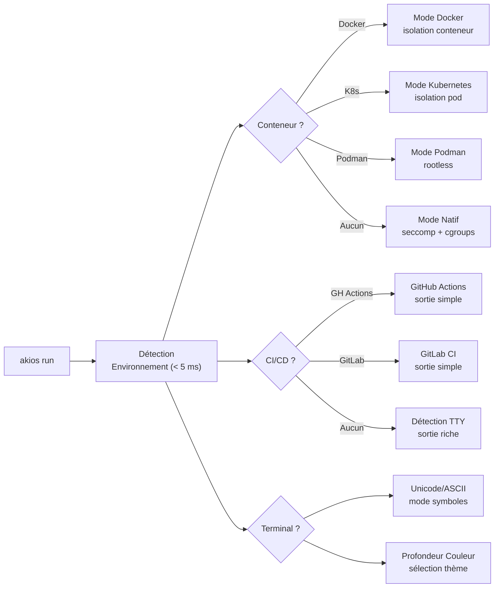

<header class="post-header">
  <div class="post-meta">
    7 Février 2026 &bull; <span>5 min de lecture</span>
  </div>
  <h1>AKIOS v1.0.5 : Interface Riche, Accessibilité et Correctifs Critiques</h1>
</header>

<div class="post-content">

AKIOS v1.0.5 apporte une interface terminal riche, la détection automatique d'environnement, un support complet d'accessibilité et un correctif critique pour le crash SIGTRAP lors de l'exécution avec `sudo`.

## Ce qui a Changé : v1.0 → v1.0.5

<table>
  <thead>
    <tr><th>Domaine</th><th>v1.0</th><th>v1.0.5</th></tr>
  </thead>
  <tbody>
    <tr>
      <td><strong>Interface Terminal</strong></td>
      <td>Sortie texte brut</td>
      <td>Couleurs sémantiques riches, tableaux de bord, badges de statut</td>
    </tr>
    <tr>
      <td><strong>Environnement</strong></td>
      <td>Configuration manuelle</td>
      <td>Auto-détection : Docker, K8s, Podman, CI/CD (&lt; 5 ms)</td>
    </tr>
    <tr>
      <td><strong>Accessibilité</strong></td>
      <td>Basique</td>
      <td>7 thèmes, 4 modes daltoniens, 3 modes symboles, NO_COLOR</td>
    </tr>
    <tr>
      <td><strong>Diagnostics</strong></td>
      <td>Vérifications manuelles</td>
      <td><code>akios doctor</code> — diagnostics système automatisés</td>
    </tr>
    <tr>
      <td><strong>Conformité</strong></td>
      <td>Rapports manuels</td>
      <td><code>akios compliance report</code> — basique, détaillé, exécutif</td>
    </tr>
    <tr>
      <td><strong>Exécution sudo</strong></td>
      <td>🐛 Crash SIGTRAP</td>
      <td>✅ Corrigé — filtre seccomp mis à jour pour les syscalls privilégiés</td>
    </tr>
    <tr>
      <td><strong>Config DCP</strong></td>
      <td>Toggle on/off</td>
      <td><code>pii_redaction_outputs</code> + <code>pii_redaction_aggressive</code></td>
    </tr>
    <tr>
      <td><strong>Tokens par Défaut</strong></td>
      <td>1000 max par appel</td>
      <td>500 max par appel (sécurité coût)</td>
    </tr>
  </tbody>
</table>

## Nouveautés

### 🎨 Interface Terminal Riche

Le CLI utilise maintenant des couleurs sémantiques et une sortie structurée. Les tableaux de bord, rapports de sécurité et résultats de workflow sont plus clairs et faciles à parcourir. Propulsé par Rich, avec repli complet pour les terminaux simples.

```bash
akios status
akios status --security
akios status --budget
```

### 🔍 Auto-Détection d'Environnement

AKIOS détecte maintenant automatiquement son environnement d'exécution au démarrage (&lt; 5 ms) :



- **Type de conteneur :** natif, Docker, Kubernetes, Podman
- **CI/CD :** GitHub Actions, GitLab CI, Jenkins
- **Capacités terminal :** support Unicode, profondeur couleur, TTY

Le runtime ajuste les modes symboles, couleurs et format de sortie automatiquement. Aucune configuration nécessaire.

### ♿ Accessibilité

Support complet d'accessibilité pour tous les utilisateurs :

<table>
  <thead>
    <tr><th>Fonctionnalité</th><th>Options</th><th>Configuration</th></tr>
  </thead>
  <tbody>
    <tr>
      <td><strong>Modes Symboles</strong></td>
      <td>Unicode (défaut), ASCII (CI/logs), Minimal (lecteurs d'écran)</td>
      <td><code>AKIOS_SYMBOL_MODE=minimal</code></td>
    </tr>
    <tr>
      <td><strong>Modes Daltoniens</strong></td>
      <td>Protanopie, Deutéranopie, Tritanopie, Achromatopsie</td>
      <td><code>AKIOS_COLORBLIND_MODE=deuteranopia</code></td>
    </tr>
    <tr>
      <td><strong>Thèmes</strong></td>
      <td>Défaut, Sombre, Clair, Nord, Solarized Sombre/Clair, Contraste Élevé</td>
      <td><code>AKIOS_THEME=nord</code></td>
    </tr>
    <tr>
      <td><strong>Standards</strong></td>
      <td>NO_COLOR, CLICOLOR_FORCE, FORCE_COLOR</td>
      <td>Définir la variable d'env par spec</td>
    </tr>
  </tbody>
</table>

```bash
# Mode daltonien
export AKIOS_COLORBLIND_MODE=deuteranopia

# Mode lecteur d'écran
export NO_COLOR=1
export AKIOS_SYMBOL_MODE=minimal

# Changer de thème
export AKIOS_THEME=nord
```

### 🩺 Nouvelles Commandes

- **`akios doctor`** — Diagnostics système (kernel, seccomp, cgroups, Docker)
- **`akios compliance report`** — Rapports de conformité (basique, détaillé, exécutif)
- **`akios output`** — Gestion des sorties de workflow (lister, nettoyer, archiver)

### 🐛 Correctif Critique : Crash SIGTRAP

Correction d'un crash lors de l'exécution de `sudo akios run` sous Linux. Le filtre seccomp BPF rejetait des syscalls essentiels pendant l'exécution privilégiée. Le correctif met à jour la liste blanche de syscalls pour le contexte `CAP_SYS_ADMIN`. **Mettez à jour immédiatement si vous utilisez `sudo` :**

```bash
sudo pip3 install --upgrade akios
```

## Mise à Jour

```bash
# Pip
pip install akios==1.0.5

# Docker
docker pull akiosai/akios:v1.0.5

# Vérifier
akios --version
# akios 1.0.5
```

## Changelog Complet

- Interface terminal riche avec couleurs sémantiques
- Auto-détection d'environnement (Docker, K8s, Podman, CI/CD)
- Accessibilité : modes daltoniens, modes symboles, thèmes
- Commande `akios doctor` de diagnostics
- Commande `akios compliance report`
- Commande `akios output` de gestion
- Correctif crash SIGTRAP pour exécution `sudo`
- Auto-détection de corruption de configuration
- Options `pii_redaction_outputs` et `pii_redaction_aggressive`
- `max_tokens_per_call` réduit de 1000 à 500 par défaut (sécurité coût)

## Essayez-le Vous-même

```bash
pip install akios==1.0.5
akios doctor
akios status --security
```

Sécurisez votre IA. Construisez avec AKIOS.

</div>

<div class="post-footer">
  <p>Connexe : <a href="release-notes-v0-1-0.html">Notes de Version AKIOS v1.0</a> | <a href="hardening-checklist.html">Checklist de Durcissement</a></p>
  <div class="share-links">
    <span>Partager :</span>
    <a href="#" target="_blank">Twitter</a>
    <a href="#" target="_blank">LinkedIn</a>
    <a href="#" target="_blank">Hacker News</a>
  </div>
  <a href="./">← Retour au Blog</a>
</div>
