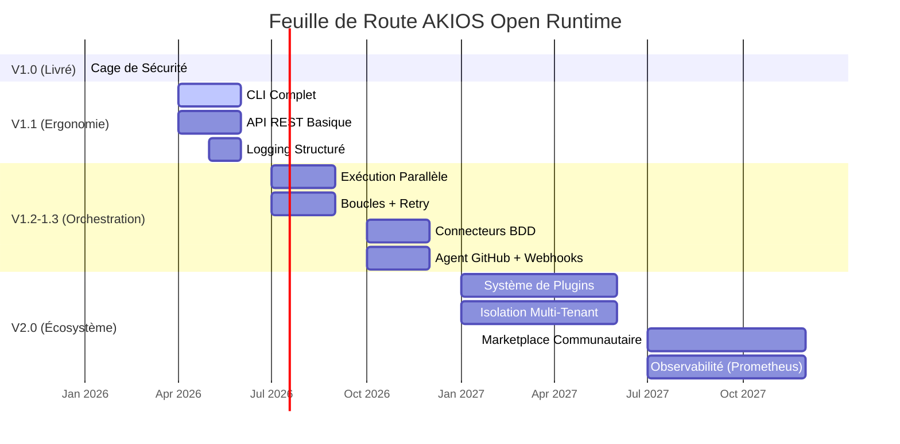

<header class="post-header">
  <div class="post-meta">
    19 Janvier 2026 &bull; <span>5 min de lecture</span>
  </div>
  <h1>Feuille de Route AKIOS : 2026 et Au-delà</h1>
</header>

<div class="post-content">

Cette feuille de route décrit la direction future d'AKIOS Open Runtime (gratuit, GPL-3.0-only). Les délais et priorités peuvent évoluer en fonction des retours de la communauté.

## Où Nous en Sommes

AKIOS v1.0 est sorti en janvier 2026 avec une cage de sécurité minimale et fiable. La fondation est solide :

- Sandbox kernel (cgroups + seccomp-bpf)
- Anonymisation DCP en temps réel (50+ motifs)
- Audit Merkle inviolable cryptographique
- Coupe-circuits de coût et de boucles appliqués
- Quatre agents de base (filesystem, HTTP, LLM, exécuteur d'outils)
- CLI soigné avec templates

Mais v1.0 n'est que le début. Voici la suite :

## Chronologie



## Feuille de Route par Version

<table>
  <thead>
    <tr><th>Version</th><th>Calendrier</th><th>Focus</th><th>Fonctionnalités Clés</th></tr>
  </thead>
  <tbody>
    <tr>
      <td><strong>V1.0</strong></td>
      <td>Jan 2026 ✅</td>
      <td>Fondation Sécurité</td>
      <td>Sandbox kernel, anonymisation DCP, audit Merkle, coupe-circuits, 4 agents, CLI</td>
    </tr>
    <tr>
      <td><strong>V1.1</strong></td>
      <td>T2 2026</td>
      <td>Ergonomie</td>
      <td>CLI complet (15–23 commandes), API REST locale, logging structuré, générateur de référence config</td>
    </tr>
    <tr>
      <td><strong>V1.2</strong></td>
      <td>T3 2026</td>
      <td>Orchestration I</td>
      <td>Exécution parallèle, workflows conditionnels, boucles & retry, fan-out / map-reduce</td>
    </tr>
    <tr>
      <td><strong>V1.3</strong></td>
      <td>T4 2026</td>
      <td>Intégrations</td>
      <td>Connecteurs BDD (PostgreSQL, SQLite), agent GitHub, webhooks, agent email</td>
    </tr>
    <tr>
      <td><strong>V2.0</strong></td>
      <td>2027</td>
      <td>Écosystème</td>
      <td>Système de plugins, isolation multi-tenant, marketplace communautaire, Prometheus / Jaeger</td>
    </tr>
  </tbody>
</table>

## V1.1 — Ergonomie (T2 2026)

La version 1.1 se concentre sur l'amélioration de l'utilisation quotidienne :

### CLI Complet

Extension de 12 commandes actuelles à 15–23 :

```bash
# Commandes actuelles v1.0
akios init | setup | run | files | audit | logs
akios status | templates | doctor | clean | compliance | output

# À venir en v1.1
akios policy sign       # Signer les politiques
akios policy verify     # Vérifier les politiques signées
akios config validate   # Valider les fichiers de config
akios agent list        # Lister les agents disponibles
akios agent inspect     # Inspecter les capacités d'un agent
akios workflow lint     # Lint des fichiers workflow
akios version           # Version et infos de build
```

### API REST Basique

Une API REST locale uniquement pour l'intégration avec d'autres outils :

```yaml
# akios-api.yml (à venir en v1.1)
api:
  enabled: true
  host: "127.0.0.1"    # local uniquement — jamais exposé
  port: 8080
  auth: "bearer-token"
  endpoints:
    - /api/v1/run       # déclencher des workflows
    - /api/v1/status    # vérifier le statut d'exécution
    - /api/v1/audit     # récupérer les logs d'audit
```

## V1.2–V1.3 — Orchestration (T3–T4 2026)

### Exécution Parallèle

Actuellement, AKIOS exécute les workflows séquentiellement. V1.2 ajoute l'exécution parallèle avec des portes de politique entre les branches :

```yaml
# Workflow parallèle (à venir en v1.2)
steps:
  - name: "extraction"
    agent: "filesystem"
    parallel:
      - file: "rapport-t1.pdf"
      - file: "rapport-t2.pdf"
      - file: "rapport-t3.pdf"
    max_parallel: 3
    policy: "per-branch"  # chaque branche a sa propre cage
```

### Connecteurs Base de Données

Accès sécurisé aux bases de données avec contrôle de politique au niveau requête :

```yaml
# Connecteur BDD (à venir en v1.3)
database:
  type: "postgresql"
  connection: "$DB_URL"  # depuis le coffre-fort
  allow:
    - query_type: "SELECT"
      tables: ["factures", "paiements"]
    - query_type: "INSERT"
      tables: ["journal_audit"]
  deny:
    - query_type: "DROP"
    - query_type: "DELETE"
  pii_redaction: true
```

## V2.0 — Écosystème (2027)

### Système de Plugins

Agents communautaires avec architecture plugin sandboxée :

```yaml
# Manifeste plugin (à venir en v2.0)
plugin:
  name: "slack-agent"
  version: "1.0.0"
  author: "community"
  sandbox: strict       # les plugins sont sandboxés aussi
  capabilities:
    - "http:hooks.slack.com"
    - "pii_redaction"
  audit: required
```

## Comment Nous Décidons de ce qui Sort

Chaque fonctionnalité doit passer la **barre de sécurité** :

1. **Maintient-elle la posture deny-by-default ?** Si une fonctionnalité ouvre une nouvelle surface d'attaque, elle nécessite des contrôles de politique explicites.
2. **Est-elle auditable ?** Chaque nouvelle capacité doit produire des entrées d'audit Merkle.
3. **Peut-elle être sandboxée ?** Si elle ne peut pas tourner dans la cage de sécurité, elle ne sort pas.
4. **L'anonymisation DCP est-elle intégrée ?** Toute fonctionnalité qui touche des données doit passer par le moteur d'anonymisation.

## Participez

AKIOS est open-source (GPL-3.0). La feuille de route est façonnée par les retours communautaires :

- **Demandes de fonctionnalités :** [GitHub Issues](https://github.com/akios-ai/akios/issues)
- **Discussions :** [GitHub Discussions](https://github.com/akios-ai/akios/discussions)
- **Contribuer :** Voir [CONTRIBUTING.md](https://github.com/akios-ai/akios/blob/main/CONTRIBUTING.md)

## Essayez-le Vous-même

```bash
pip install akios
akios init mon-projet
akios run templates/hello-workflow.yml
```

**Open Runtime** est la fondation technique de sécurité (gratuit). La cage est prête aujourd'hui. L'avenir est sécurisé.

Sécurisez votre IA. Construisez avec AKIOS.

</div>

<div class="post-footer">
  <p>Connexe : <a href="release-notes-v0-1-0.html">Notes de Version AKIOS v1.0</a> | <a href="introducing-akios.html">Présentation d'AKIOS</a></p>
  <div class="share-links">
    <span>Partager :</span>
    <a href="#" target="_blank">Twitter</a>
    <a href="#" target="_blank">LinkedIn</a>
    <a href="#" target="_blank">Hacker News</a>
  </div>
  <a href="./">← Retour au Blog</a>
</div>
