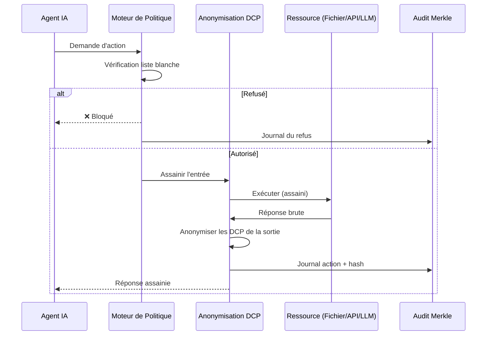

<header class="post-header">
  <div class="post-meta">
    20 Janvier 2026 &bull; <span>7 min de lecture</span>
  </div>
  <h1>Communication Sécurisée entre Agents : Comment AKIOS Isole les Interactions</h1>
</header>

<div class="post-content">

Quand les agents IA interagissent avec des outils et API externes, chaque échange de données est une frontière de sécurité potentielle. Voici comment AKIOS applique des contrôles stricts à chaque point de communication.

## Le Problème : I/O d'Agent Non Contrôlées

Les agents IA qui accèdent à des fichiers, appellent des API et exécutent des commandes doivent communiquer à travers des frontières de confiance. Sans contrôle, un agent peut :

- Lire des fichiers hors de son périmètre autorisé
- Envoyer des données sensibles vers des endpoints non autorisés
- Exécuter des commandes arbitraires sur l'hôte
- Exfiltrer des identifiants via les prompts LLM

La plupart des runtimes traitent la communication des agents comme un problème de plomberie. AKIOS la traite comme un **problème de sécurité**.

## L'Approche AKIOS : Communication Contrôlée par Politique

Dans AKIOS, chaque action d'agent passe par la Cage de Sécurité avant exécution. Il n'existe aucun chemin direct de l'agent vers la ressource — le runtime médiatise chaque interaction.



### Comment Ça Fonctionne

1. **Vérification de Politique :** Avant toute action, le runtime la valide contre les opérations autorisées du workflow.
2. **Anonymisation DCP :** Les entrées et sorties sont scannées pour les motifs de données sensibles (50+ catégories).
3. **Journalisation d'Audit :** Chaque action est cryptographiquement journalisée dans la piste d'audit Merkle.
4. **Application des Ressources :** Budget, limites de tokens, limites de débit et timeouts sont appliqués par action.

## Les Quatre Types d'Agents

Chaque type d'agent a sa propre frontière de sécurité :

<table>
  <thead>
    <tr><th>Agent</th><th>Fonction</th><th>Contrôles de Sécurité</th><th>État par Défaut</th></tr>
  </thead>
  <tbody>
    <tr>
      <td><strong>Filesystem</strong></td>
      <td>Lit/écrit des fichiers</td>
      <td>Liste blanche de chemins, mode (r/w), scan DCP sur le contenu</td>
      <td>Tous chemins interdits</td>
    </tr>
    <tr>
      <td><strong>HTTP</strong></td>
      <td>Fait des appels API</td>
      <td>Liste blanche d'hôtes, limitation de débit (10/min), suppression d'en-têtes, SSL requis</td>
      <td>Tous hôtes interdits</td>
    </tr>
    <tr>
      <td><strong>LLM</strong></td>
      <td>Appelle les modèles IA</td>
      <td>Coupe-circuit budget, limites de tokens, anonymisation prompt/réponse</td>
      <td>Aucun fournisseur</td>
    </tr>
    <tr>
      <td><strong>Exécuteur d'Outils</strong></td>
      <td>Exécute des commandes shell</td>
      <td>Liste blanche de commandes (17 pré-approuvées), limite sortie (1 Mo), timeout (30s)</td>
      <td>Toutes commandes interdites</td>
    </tr>
  </tbody>
</table>

### Agent Filesystem : Accès par Chemin

L'agent filesystem ne peut accéder qu'aux chemins explicitement autorisés. Tout contenu passe par l'anonymisation DCP :

```yaml
# Politique : contrôle d'accès filesystem
filesystem:
  allow:
    - path: "./workflows/"
      mode: "r"
    - path: "./templates/"
      mode: "r"
    - path: "./data/input/"
      mode: "r"
    - path: "./data/output/"
      mode: "w"
  deny_writes: true  # partout ailleurs
```

Toute tentative de lecture hors de ces chemins est bloquée et journalisée comme événement de sécurité. L'agent ne peut même pas détecter que d'autres fichiers existent.

### Agent HTTP : Débit Limité et Anonymisé

L'agent HTTP applique des contrôles stricts sur chaque requête :

```yaml
# Politique : contrôle d'accès HTTP
http:
  allow:
    - host: "api.openai.com"
      methods: ["POST"]
      rate_limit_per_min: 10
  redact_headers: ["authorization", "cookie", "x-api-key"]
  ssl_required: true
  timeout_sec: 30
```

Chaque corps de requête et réponse est scanné pour les DCP. Les en-têtes sensibles sont supprimés avant la journalisation.

### Agent LLM : Appels Contrôlés par Budget

Chaque appel LLM est suivi pour l'utilisation de tokens et le coût. Le coupe-circuit budget termine le workflow immédiatement si les coûts dépassent la limite configurée :

```yaml
# Politique : contrôle de budget LLM
llm:
  provider: "openai"
  model: "gpt-4.1"
  max_tokens: 1200
  budget_usd: 1.00
  redact_prompts: true
  redact_responses: true
```

Le coupe-circuit est une **terminaison dure** — pas un avertissement. Quand le budget atteint zéro, le workflow s'arrête.

### Exécuteur d'Outils : Liste Blanche de Commandes

Seules les commandes pré-approuvées peuvent s'exécuter. Chacune tourne dans un sous-processus sandboxé :

```yaml
# Politique : contrôle d'exécution d'outils
tools:
  allow:
    - name: "jq"
      args: ["."]
    - name: "grep"
      args: ["-n", "ERROR"]
    - name: "wc"
      args: ["-l"]
  working_dir: "/workspace"
  timeout_sec: 20
```

Le filtrage syscall via seccomp-bpf assure que même les commandes autorisées ne peuvent pas escalader les privilèges.

## Performance : Sécurité sans Sacrifice

La communication contrôlée par politique ajoute un surcoût minimal :

<table>
  <thead>
    <tr><th>Opération</th><th>Sans AKIOS</th><th>Avec AKIOS</th><th>Surcoût</th></tr>
  </thead>
  <tbody>
    <tr>
      <td>Lecture fichier (1 Mo)</td>
      <td>2 ms</td>
      <td>4 ms</td>
      <td>+2 ms (scan DCP)</td>
    </tr>
    <tr>
      <td>Requête HTTP</td>
      <td>150 ms</td>
      <td>153 ms</td>
      <td>+3 ms (vérification politique)</td>
    </tr>
    <tr>
      <td>Appel LLM</td>
      <td>1200 ms</td>
      <td>1205 ms</td>
      <td>+5 ms (budget + audit)</td>
    </tr>
    <tr>
      <td>Exécution outil</td>
      <td>50 ms</td>
      <td>55 ms</td>
      <td>+5 ms (setup sandbox)</td>
    </tr>
    <tr>
      <td>Anonymisation DCP (50+ motifs)</td>
      <td>N/A</td>
      <td>&lt; 50 ms</td>
      <td>N/A (nouvelle capacité)</td>
    </tr>
  </tbody>
</table>

Le surcoût est négligeable par rapport au temps réel de l'opération. Pour les appels LLM, les 5 ms de surcoût représentent moins de 0,5 % de la latence totale.

## Le Résultat

Avec AKIOS, la communication des agents n'est jamais « ouverte ». Chaque interaction est :

- **Validée** contre des politiques explicites avant exécution
- **Anonymisée** pour les DCP avant que les données ne quittent le sandbox
- **Auditée** avec intégrité cryptographique via chaîne Merkle
- **Bornée** par des budgets, limites de débit et timeouts

C'est ce qui rend AKIOS différent de l'exécution d'agents dans un conteneur Docker faiblement configuré. La cage ne fait pas que contenir — elle **médiatise**.

## Essayez-le Vous-même

```bash
pip install akios
akios init mon-projet
akios run templates/hello-workflow.yml
```

Sécurisez votre IA. Construisez avec AKIOS.

</div>

<div class="post-footer">
  <p>Connexe : <a href="policy-schema-deep-dive.html">Plongée dans le Schéma de Politique</a> | <a href="hardening-checklist.html">Checklist de Durcissement</a></p>
  <div class="share-links">
    <span>Partager :</span>
    <a href="#" target="_blank">Twitter</a>
    <a href="#" target="_blank">LinkedIn</a>
    <a href="#" target="_blank">Hacker News</a>
  </div>
  <a href="./">← Retour au Blog</a>
</div>
