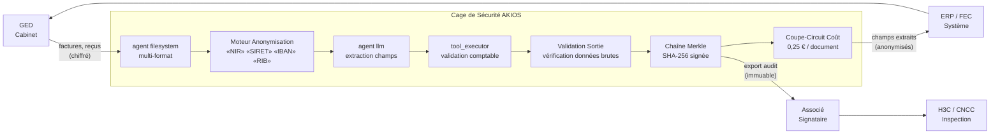

<header class="post-header">
  <div class="post-meta">9 Février 2026 · Ingénierie / Comptabilité · 5 min de lecture</div>
  <h1>IA Sécurisée pour la Comptabilité : Traitement Automatisé de Documents sous Contrôles RGPD</h1>
</header>

<div class="post-content">

Les cabinets comptables traitent des milliers de documents financiers — factures, déclarations fiscales, relevés bancaires — chaque trimestre. L'IA peut extraire et classer ces données en quelques secondes. Mais les documents financiers contiennent des données parmi les plus sensibles : **numéros de Sécu, SIRET, RIB, montants de salaires.**

Comment automatiser le traitement documentaire sans mettre les données clients en danger ?

AKIOS fournit une Cage de Sécurité : un runtime éphémère et sandboxé où l'IA traite les documents financiers sous des contrôles stricts et auditables.

## Le Problème

La période fiscale, ce sont des milliers de documents par mission : factures, bulletins de paie, relevés bancaires. L'IA peut lire, classifier et extraire les champs clés en quelques secondes — mais chacun de ces documents contient des données dont la fuite expose le cabinet à une responsabilité professionnelle, des sanctions réglementaires et un préjudice réputationnel. L'approche traditionnelle ? Un traitement manuel lent, coûteux et source d'erreurs.

AKIOS vous offre l'extraction documentaire assistée par IA **sans le risque sur les données**.

## Le Cadre Réglementaire

La comptabilité et le reporting financier en Europe sont encadrés par des cadres stricts et superposés :

<table>
  <thead>
    <tr><th>Réglementation</th><th>Périmètre</th><th>Comment AKIOS l'Applique</th></tr>
  </thead>
  <tbody>
    <tr>
      <td><strong>RGPD</strong></td>
      <td>Les données financières personnelles (RIB, salaires, NIR) sont des données personnelles. Minimisation et limitation de conservation.</td>
      <td>Chaîne d'audit Merkle — chaque extraction signée cryptographiquement et immuable.</td>
    </tr>
    <tr>
      <td><strong>Code de Commerce (L123-22)</strong></td>
      <td>Obligations de conservation des pièces comptables pendant 10 ans avec pistes d'audit vérifiables.</td>
      <td>Chaîne d'inférence complète exportée par document. Chaque extraction inclut sa provenance.</td>
    </tr>
    <tr>
      <td><strong>PCG (Plan Comptable Général)</strong></td>
      <td>Les traitements automatisés doivent maintenir la même rigueur que les procédures manuelles.</td>
      <td>Sandbox déterministe — même document produit toujours même résultat d'extraction.</td>
    </tr>
    <tr>
      <td><strong>DGFiP / FEC</strong></td>
      <td>Le Fichier des Écritures Comptables exige la traçabilité complète de toute saisie automatisée.</td>
      <td>Chemin de décision complet journalisé par document. Portail revue humaine pour les extractions fiscales.</td>
    </tr>
    <tr>
      <td><strong>OEC (Ordre des Experts-Comptables)</strong></td>
      <td>Les normes professionnelles réglementent l'utilisation technologique — conservation des dossiers de travail.</td>
      <td>Modèles de politique par juridiction. Les données client ne quittent jamais le périmètre de la cage.</td>
    </tr>
  </tbody>
</table>

AKIOS applique ces exigences au niveau du runtime.

## Le Concept : La Politique en tant que Code

AKIOS introduit le concept de "Security Cage" : un environnement d'exécution éphémère et cloisonné où les données sont traitées selon des politiques strictes définies par le code. La cage est détruite après chaque exécution. Aucun état persistant. Aucun vecteur de fuite de données.

## Le Flux de Travail : Extraction de Documents Financiers

<table>
  <thead>
    <tr><th>Étape</th><th>Ce qui se passe</th><th>Contrôle de sécurité</th></tr>
  </thead>
  <tbody>
    <tr>
      <td><strong>1. Ingestion</strong></td>
      <td>Factures scannées, reçus ou documents fiscaux chargés dans la cage</td>
      <td>Agent filesystem en lecture seule. Les documents ne peuvent pas être copiés hors de la cage.</td>
    </tr>
    <tr>
      <td><strong>2. Anonymisation</strong></td>
      <td>Identifiants clients (NIR, SIRET, numéros de compte) anonymisés en mémoire</td>
      <td>50+ motifs de DCP remplacés par des jetons. L'original n'atteint jamais le LLM.</td>
    </tr>
    <tr>
      <td><strong>3. Extraction IA</strong></td>
      <td>Le LLM identifie les champs clés — montants, dates, noms de fournisseurs, catégories fiscales</td>
      <td>Budget plafonné (0,25 €/document), aucun accès réseau, aucun stockage persistant.</td>
    </tr>
    <tr>
      <td><strong>4. Validation</strong></td>
      <td>Données extraites croisées avec le Plan Comptable Général et les tables de codes fiscaux</td>
      <td>Anomalies signalées pour revue humaine. L'IA ne peut ni approuver ni déclarer quoi que ce soit.</td>
    </tr>
    <tr>
      <td><strong>5. Audit</strong></td>
      <td>Chaque extraction, classification et validation journalisée avec signatures cryptographiques</td>
      <td>Chaîne complète disponible pour inspection par les commissaires aux comptes.</td>
    </tr>
  </tbody>
</table>

### Architecture



### Configuration de la Politique

```yaml
# comptabilite-documents-policy.yml
security:
  sandbox: strict
  network: isolated
  allowed_endpoints: []  # zéro accès réseau
  pii_redaction:
    enabled: true
    patterns: [nir, siret, iban, rib, compte_bancaire, salaire, date_naissance]
    mode: aggressive
  budget:
    max_cost_per_run: 0.25
    currency: EUR
  audit:
    merkle_chain: true
    export_format: jsonl
    retention_days: 3650  # 10 ans — exigence Code de Commerce
```

## Ce que l'Auditeur Voit

À la fin du flux de travail, l'équipe d'audit reçoit un rapport structuré :

<table>
  <thead>
    <tr><th>Champ</th><th>Valeur</th></tr>
  </thead>
  <tbody>
    <tr><td>Document</td><td>facture-T4-2025-****3291.pdf</td></tr>
    <tr><td>Extraction</td><td>Fournisseur : [ANONYMISÉ] | Montant : 47 250,00 € | Date : 15/12/2025 | Compte PCG : 6200</td></tr>
    <tr><td>Validation</td><td>✅ Compte 6200 conforme au Plan Comptable — Charges d'exploitation</td></tr>
    <tr><td>Signalement</td><td>⚠️ Montant supérieur à 25 000 € — envoyé en revue associé selon la politique du cabinet</td></tr>
    <tr><td>Confiance</td><td>96%</td></tr>
    <tr><td>Hash Audit</td><td><code>a2c7d4...e19b</code></td></tr>
    <tr><td>Données Brutes Exposées</td><td>❌ Aucune — toutes les DCP client anonymisées avant extraction</td></tr>
  </tbody>
</table>

Pas de NIR. Pas de SIRET. Pas de chiffres financiers bruts au-delà de l'extraction. Juste des données comptables structurées avec une chaîne de preuve cryptographique.

## Pourquoi C'est Important

- **Protection des Données Clients** : NIR, SIRET et données financières anonymisés avant tout contact IA. Même un modèle compromis ne peut rien fuiter.
- **Conformité RGPD Intégrée** : Chaque action IA produit une entrée de journal infalsifiable. La chaîne Merkle garantit qu'aucune étape ne peut être altérée.
- **Traitement Déterministe** : Le même document produit toujours le même résultat d'extraction — essentiel pour la cohérence d'audit entre les missions.
- **Prévisibilité des Coûts** : Les limites budgétaires strictes par document évitent les surprises lors du traitement de milliers de factures en période de clôture.
- **Prêt pour le H3C** : Les chaînes d'inférence complètes sont exportables pour inspection, conformément à l'exigence de conservation de 10 ans.

## Essayez-le Vous-même

```bash
pip install akios
akios init my-project
akios run templates/file_analysis.yml
```

Sécurisez votre IA. Construisez avec AKIOS.

</div>

<div class="post-footer">
  <p>Connexe : <a href="accounting-security-cage.html">Cage de Sécurité IA Conforme PCG</a> | <a href="legal-contract-review.html">IA pour la Revue de Contrats Juridiques</a></p>
  <a href="./">← Retour aux études de cas</a>
</div>
