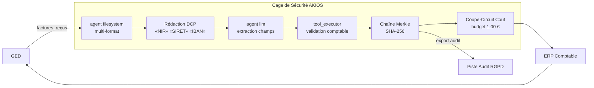

<header class="post-header">
  <div class="post-meta">9 Février 2026 · Ingénierie / Comptabilité · 5 min de lecture</div>
  <h1>IA Sécurisée pour la Comptabilité : Traitement Automatisé de Documents sous Contrôles RGPD</h1>
  <div class="post-author">
    
    <span>AJ</span>
  </div>
</header>

<div class="post-content">

Les cabinets comptables traitent des milliers de documents financiers — factures, déclarations fiscales, relevés bancaires — chaque trimestre. L'IA peut extraire et classer ces données en quelques secondes. Mais les documents financiers contiennent des données parmi les plus sensibles : **numéros de Sécu, SIRET, RIB, montants de salaires.**

Comment automatiser le traitement documentaire sans mettre les données clients en danger ?

AKIOS fournit une Cage de Sécurité : un runtime éphémère et sandboxé où l'IA traite les documents financiers sous des contrôles stricts et auditables.

## Le Cadre Réglementaire

La comptabilité et le reporting financier en Europe sont encadrés par :

- **RGPD** — Les données financières personnelles (RIB, salaires, numéros de Sécu) sont des données personnelles. Tout traitement IA doit respecter la minimisation et la limitation de conservation.
- **EU AI Act** — Les systèmes IA utilisés pour le traitement de documents financiers à des fins réglementaires sont soumis à des obligations de transparence et de traçabilité.
- **Loi NRE / Code de Commerce** — Les obligations de reporting financier exigent des pistes d'audit vérifiables pour tout processus automatisé.
- **Ordre des Experts-Comptables** — Les normes professionnelles imposent la même rigueur aux traitements automatisés qu'aux procédures manuelles.

AKIOS applique ces exigences au niveau du runtime.

## Le Flux de Travail : Extraction de Documents Financiers

1. **Ingestion** : Les factures scannées, reçus ou documents fiscaux sont chargés dans la Cage de Sécurité. Les identifiants clients (Sécu, SIRET) sont anonymisés en mémoire avant le traitement IA.
2. **La Cage** : AKIOS s'initialise avec la politique comptable : aucun accès réseau, budget plafonné à 0,25 € par document, et journalisation immuable conforme RGPD.
3. **Extraction** : L'agent IA sandboxé identifie les champs clés — montants, dates, noms de fournisseurs, catégories fiscales — à partir des documents anonymisés. Il ne peut pas accéder aux données brutes non anonymisées.
4. **Validation** : Les données extraites sont vérifiées contre des schémas connus (Plan Comptable Général, tables de codes fiscaux). Les anomalies sont signalées pour revue humaine.
5. **Audit** : Chaque extraction, classification et validation est journalisée avec des signatures cryptographiques. La chaîne complète est disponible pour inspection par les commissaires aux comptes.

### Architecture



## Pourquoi C'est Important

- **Protection des Données Clients** : Les numéros de Sécu, SIRET et données financières sont anonymisés avant tout contact IA. Même un modèle compromis ne peut rien fuiter.
- **Conformité RGPD Intégrée** : Chaque action IA produit une entrée de journal infalsifiable. La chaîne Merkle garantit qu'aucune étape ne peut être altérée ou supprimée après coup.
- **Traitement Déterministe** : Le même document produit toujours le même résultat d'extraction — essentiel pour la cohérence d'audit entre les missions.
- **Prévisibilité des Coûts** : Les limites budgétaires strictes par document évitent les surprises lors du traitement de milliers de factures en période de clôture.

## Essayez-le Vous-même

```bash
pip install akios
akios init my-project
akios run templates/file_analysis.yml
```

Sécurisez votre IA. Construisez avec AKIOS.

</div>

<div class="post-footer">
  <a href="./">← Retour aux études de cas</a>
</div>
