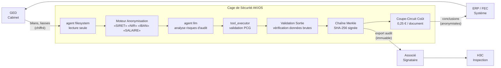

<header class="post-header">
  <div class="post-meta">6 Février 2026 · Ingénierie / Comptabilité · 5 min de lecture</div>
  <h1>Construire une Cage de Sécurité IA pour la Comptabilité Conforme au Plan Comptable en 15 Secondes</h1>
</header>

<div class="post-content">

Le principal obstacle à l'adoption de l'IA en comptabilité n'est pas la capacité des modèles, mais la **confidentialité**. Comment utiliser des LLM puissants comme Grok ou GPT-4 sur des états financiers trimestriels contenant des SIRET, des comptes bancaires et des données d'audit sensibles sans violer le secret professionnel ?

La réponse n'est pas d'éviter l'IA, mais de l'enfermer dans une **Cage de Sécurité**.

## Le Problème

La période fiscale, ce sont des milliers de documents : bilans, déclarations fiscales, correspondances clients. L'IA peut lire, classifier et signaler des anomalies en quelques secondes — mais chacun de ces documents contient des données dont la fuite expose le cabinet à une responsabilité professionnelle, des sanctions réglementaires et un préjudice réputationnel.

AKIOS vous offre l'analyse d'audit assistée par IA **sans le risque sur les données**.

## Le Cadre Réglementaire

La comptabilité et le reporting financier en France sont gouvernés par des cadres stricts et superposés :

<table>
  <thead>
    <tr><th>Réglementation</th><th>Périmètre</th><th>Comment AKIOS l'Applique</th></tr>
  </thead>
  <tbody>
    <tr>
      <td><strong>RGPD</strong></td>
      <td>Protection des données personnelles des clients. Minimisation, limitation des finalités.</td>
      <td>Anonymisation en mémoire — SIRET, NIR, comptes bancaires remplacés par des jetons avant traitement IA.</td>
    </tr>
    <tr>
      <td><strong>Code de Commerce (L823-10)</strong></td>
      <td>Secret professionnel du commissaire aux comptes. Obligation de confidentialité absolue.</td>
      <td>Isolation réseau totale. Aucune donnée ne quitte la cage. Les appels LLM utilisent uniquement des données anonymisées.</td>
    </tr>
    <tr>
      <td><strong>PCG (Plan Comptable Général)</strong></td>
      <td>Normalisation des écritures et classifications comptables.</td>
      <td>Validation croisée automatique des extractions IA contre le plan de comptes. Anomalies signalées pour revue humaine.</td>
    </tr>
    <tr>
      <td><strong>H3C / CNCC</strong></td>
      <td>Normes d'exercice professionnel. Preuves d'audit vérifiables et conservées.</td>
      <td>Chaîne d'inférence complète exportée par document. Sorties déterministes pour la reproductibilité.</td>
    </tr>
    <tr>
      <td><strong>EU AI Act</strong></td>
      <td>Les systèmes IA utilisés dans la prise de décision financière sont classés haut risque.</td>
      <td>Pistes d'audit complètes, supervision humaine et évaluations de conformité intégrées.</td>
    </tr>
  </tbody>
</table>

AKIOS applique ces exigences au niveau du runtime — pas comme un document de politique, mais comme du code exécutable.

## Le Concept : La Politique en tant que Code

AKIOS introduit le concept de "Security Cage" (Cage de Sécurité) : un environnement d'exécution éphémère et cloisonné où les données sont traitées selon des politiques strictes définies par le code. La cage est détruite après chaque exécution. Aucun état persistant. Aucun vecteur de fuite de données.

## Le Flux de Travail : Analyse Automatisée des Risques d'Audit

<table>
  <thead>
    <tr><th>Étape</th><th>Ce qui se passe</th><th>Contrôle de sécurité</th></tr>
  </thead>
  <tbody>
    <tr>
      <td><strong>1. Ingestion</strong></td>
      <td>Dossiers de revue financière (SIRET, comptes bancaires, noms d'employés) chargés dans la cage</td>
      <td>Agent filesystem en lecture seule. Les documents ne peuvent pas être copiés hors de la cage.</td>
    </tr>
    <tr>
      <td><strong>2. Anonymisation</strong></td>
      <td>Identifiants clients supprimés en mémoire avant traitement IA</td>
      <td>SIRET, NIR, numéros de compte remplacés par des jetons. Le LLM ne voit jamais les originaux.</td>
    </tr>
    <tr>
      <td><strong>3. Analyse IA</strong></td>
      <td>Le LLM identifie anomalies significatives, faiblesses de contrôle interne, risques de continuité</td>
      <td>Budget plafonné (0,25 €/document), aucun accès réseau, aucun stockage persistant.</td>
    </tr>
    <tr>
      <td><strong>4. Validation</strong></td>
      <td>Données extraites croisées avec le Plan de Comptes et les tables de codes fiscaux</td>
      <td>Anomalies signalées pour revue humaine. L'IA ne peut ni approuver ni déclarer quoi que ce soit.</td>
    </tr>
    <tr>
      <td><strong>5. Audit</strong></td>
      <td>Chaque extraction, classification et validation journalisée avec signatures cryptographiques</td>
      <td>Chaîne complète disponible pour inspection H3C. Immuable et exportable.</td>
    </tr>
  </tbody>
</table>

### Architecture



### Configuration de la Politique

L'ensemble de la posture de conformité est défini dans un seul fichier YAML :

```yaml
# comptabilite-rgpd-policy.yml
security:
  sandbox: strict
  network: isolated
  allowed_endpoints: []  # aucun accès réseau
  pii_redaction:
    enabled: true
    patterns: [nir, siret, iban, rib, compte_bancaire, salaire, date_naissance]
    mode: aggressive
  budget:
    max_cost_per_run: 0.25
    currency: EUR
  audit:
    merkle_chain: true
    export_format: jsonl
    retention_days: 3650  # 10 ans — exigence Code de Commerce
```

## Ce que l'Auditeur Voit

À la fin du flux de travail, l'équipe d'audit reçoit un rapport structuré :

<table>
  <thead>
    <tr><th>Champ</th><th>Valeur</th></tr>
  </thead>
  <tbody>
    <tr><td>Document</td><td>bilan-T4-2025-****3291.pdf</td></tr>
    <tr><td>Conclusion</td><td>Anomalie significative — Chiffre d'affaires comptabilisé avant livraison (non-conformité PCG Art. 313-1)</td></tr>
    <tr><td>Sévérité</td><td>🔴 Élevée — significative pour les états financiers</td></tr>
    <tr><td>Compte PCG</td><td>701 — Ventes de produits finis</td></tr>
    <tr><td>Montant Concerné</td><td>[ANONYMISÉ] (disponible dans le document source)</td></tr>
    <tr><td>Confiance</td><td>91%</td></tr>
    <tr><td>Hash Audit</td><td><code>d7e2a1...f4c8</code></td></tr>
    <tr><td>Données Brutes Exposées</td><td>❌ Aucune — toutes les DCP client anonymisées avant analyse</td></tr>
  </tbody>
</table>

Pas de NIR clients. Pas de SIRET. Pas de chiffres financiers bruts dans la sortie IA. Juste des conclusions d'audit actionnables avec une chaîne de preuve cryptographique que les inspecteurs H3C peuvent vérifier.

## Pourquoi C'est Important

- **Protection des Données Clients** : NIR, SIRET et chiffres financiers sont anonymisés avant que l'IA ne les touche. Même un modèle compromis ne peut pas fuiter les données clients.
- **Conformité RGPD Intégrée** : Chaque action IA produit une entrée de journal inviolable. La chaîne Merkle garantit qu'aucune étape ne peut être altérée ou supprimée après coup.
- **Traitement Déterministe** : Le même document produit toujours le même résultat d'extraction — critique pour la cohérence d'audit entre les missions.
- **Prévisibilité des Coûts** : Des limites de budget strictes par document empêchent les surprises lors du traitement de milliers de factures en période fiscale.
- **Responsabilité de l'Associé** : La chaîne d'audit complète est disponible pour revue par l'associé signataire et inspection H3C. L'IA devient un outil dont le cabinet peut se porter garant.

## Essayez-le Vous-même

AKIOS est open-source. Vous pouvez exécuter ce flux de travail dès aujourd'hui :

```bash
pip install akios
akios init my-project
akios run templates/file_analysis.yml
```

Sécurisez votre IA. Construisez avec AKIOS.

</div>

<div class="post-footer">
  <p>Connexe : <a href="banking-security-cage.html">Cage de Sécurité IA Conforme DSP2 pour la Banque</a> | <a href="healthcare-hipaa-security-cage.html">Cage de Sécurité IA Conforme RGPD pour la Santé</a></p>
  <a href="./">← Retour aux études de cas</a>
</div>
