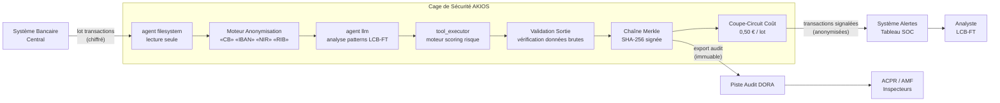

<header class="post-header">
  <div class="post-meta">8 Février 2026 · Ingénierie / Banque · 5 min de lecture</div>
  <h1>IA Sandboxée pour la Banque : Détection de Fraude sans Exposition de Données</h1>
</header>

<div class="post-content">

Les banques traitent des millions de transactions par jour. L'IA peut détecter des schémas de fraude invisibles à l'œil humain — mais seulement si elle accède aux données transactionnelles. Le problème : **comment donner à un agent IA accès aux enregistrements financiers sans créer une nouvelle surface d'attaque ?**

AKIOS résout cela avec la Cage de Sécurité : un runtime éphémère et sandboxé où l'IA traite les données sous des politiques strictes définies par le code.

## Le Problème

La détection de fraude est une course aux armements. Les équipes de revue manuelle ne suivent pas le volume de transactions, et les systèmes à règles génèrent trop de faux positifs. L'IA peut scanner des millions de transactions en minutes — mais connecter un modèle au système bancaire central crée une catégorie de risque entièrement nouvelle. Si le modèle est compromis, il pourrait exfiltrer les numéros de compte, IBAN et données financières personnelles.

AKIOS permet de déployer l'IA sur les données transactionnelles **sans lui donner accès aux identifiants bruts**.

## Le Cadre Réglementaire

Les établissements financiers en Europe opèrent sous des cadres réglementaires parmi les plus exigeants :

<table>
  <thead>
    <tr><th>Réglementation</th><th>Périmètre</th><th>Comment AKIOS l'Applique</th></tr>
  </thead>
  <tbody>
    <tr>
      <td><strong>RGPD</strong></td>
      <td>Les données financières personnelles sont protégées. Minimisation, limitation des finalités, droit à l'explication.</td>
      <td>Anonymisation à l'ingestion. L'IA ne voit jamais les numéros de compte, IBAN ou NIR bruts.</td>
    </tr>
    <tr>
      <td><strong>DORA</strong></td>
      <td>Résilience opérationnelle numérique — les entités financières doivent assurer la continuité des systèmes IA tiers.</td>
      <td>Sandbox déterministe — même entrée produit toujours même sortie. Pas de dérive du modèle dans la cage.</td>
    </tr>
    <tr>
      <td><strong>LCB-FT (6e Directive)</strong></td>
      <td>Obligations de lutte contre le blanchiment — pistes d'audit complètes pour la détection d'activités suspectes.</td>
      <td>Chemin de décision complet exporté par lot. Chaque signalement inclut sa provenance.</td>
    </tr>
    <tr>
      <td><strong>ACPR / AMF</strong></td>
      <td>Les régulateurs français exigent une traçabilité complète des décisions automatisées.</td>
      <td>Chaîne d'audit Merkle — chaque décision IA signée cryptographiquement et immuable.</td>
    </tr>
    <tr>
      <td><strong>DSP2 / DSP3</strong></td>
      <td>Sécurité des données de paiement, authentification forte, protection des données de carte.</td>
      <td>Données de carte anonymisées avant traitement. Isolation réseau empêche l'exfiltration.</td>
    </tr>
  </tbody>
</table>

AKIOS applique ces exigences au niveau du runtime — l'agent IA n'opère jamais en dehors du périmètre de conformité.

## Le Concept : La Politique en tant que Code

AKIOS introduit le concept de "Security Cage" (Cage de Sécurité) : un environnement d'exécution éphémère et cloisonné où les données sont traitées selon des politiques strictes définies par le code. La cage est détruite après chaque exécution. Aucun état persistant. Aucun vecteur de fuite de données.

## Le Flux de Travail : Analyse de Fraude Transactionnelle

<table>
  <thead>
    <tr><th>Étape</th><th>Ce qui se passe</th><th>Contrôle de sécurité</th></tr>
  </thead>
  <tbody>
    <tr>
      <td><strong>1. Ingestion</strong></td>
      <td>Lot de transactions chargé dans la Cage de Sécurité</td>
      <td>Données entrées via agent filesystem en lecture seule. Aucune copie hors de la cage.</td>
    </tr>
    <tr>
      <td><strong>2. Anonymisation</strong></td>
      <td>Numéros de compte, IBAN et données de carte anonymisés</td>
      <td>50+ motifs de DCP remplacés par des jetons. L'original n'atteint jamais le LLM.</td>
    </tr>
    <tr>
      <td><strong>3. Analyse IA</strong></td>
      <td>Le LLM scanne les schémas transactionnels — contrôles de vélocité, incohérences géographiques</td>
      <td>Budget plafonné (0,50 €/lot), isolation réseau, aucun stockage persistant.</td>
    </tr>
    <tr>
      <td><strong>4. Signalement</strong></td>
      <td>Transactions suspectes signalées avec scores de confiance et références réglementaires</td>
      <td>L'IA ne peut ni modifier ni déplacer de fonds. Sortie en lecture seule uniquement.</td>
    </tr>
    <tr>
      <td><strong>5. Audit</strong></td>
      <td>Chaque inférence et accès aux données signé cryptographiquement</td>
      <td>Chaîne Merkle — si une entrée est altérée, toute la chaîne est invalidée.</td>
    </tr>
  </tbody>
</table>

### Architecture



### Configuration de la Politique

```yaml
# banking-fraud-policy.yml
security:
  sandbox: strict
  network: isolated
  allowed_endpoints:
    - api-bancaire.interne:443
  pii_redaction:
    enabled: true
    patterns: [carte_bancaire, iban, rib, nir, compte_bancaire]
    mode: aggressive
  budget:
    max_cost_per_run: 0.50
    currency: EUR
  audit:
    merkle_chain: true
    export_format: jsonl
    retention_days: 1825  # 5 ans — exigence LCB-FT
```

## Ce que l'Analyste Voit

À la fin du flux de travail, l'analyste LCB-FT reçoit un rapport structuré :

<table>
  <thead>
    <tr><th>Champ</th><th>Valeur</th></tr>
  </thead>
  <tbody>
    <tr><td>ID Transaction</td><td>TXN-2026-0208-****9143</td></tr>
    <tr><td>Score de Risque</td><td>0,91 / 1,00 (Critique)</td></tr>
    <tr><td>Schéma Détecté</td><td>Fractionnement — 6 dépôts de 9 800 € dans 3 agences en 48 heures</td></tr>
    <tr><td>Référence Réglementaire</td><td>Art. L561-15 CMF — Déclaration de soupçon Tracfin</td></tr>
    <tr><td>Confiance</td><td>91%</td></tr>
    <tr><td>Hash Audit</td><td><code>e7f3b2...a41c</code></td></tr>
    <tr><td>Données Brutes Exposées</td><td>❌ Aucune — toutes les DCP anonymisées avant analyse</td></tr>
  </tbody>
</table>

Pas de numéros de compte. Pas de NIR. Pas de données financières brutes. Juste du renseignement actionnable avec une chaîne de preuve cryptographique.

## Pourquoi C'est Important

- **Zéro Exposition de Données** : Les numéros de compte et DCP sont anonymisés avant tout traitement IA. Même un modèle compromis ne peut rien fuiter.
- **Décisions Auditables** : Chaque signalement de fraude inclut une chaîne de preuve cryptographique. L'ACPR peut tracer exactement comment une décision a été prise.
- **Maîtrise des Coûts** : Les limites budgétaires strictes par lot empêchent les dérapages — un vrai sujet quand on scanne des millions de transactions.
- **Gestion du Risque Modèle** : La sandbox empêche l'IA d'agir au-delà de son périmètre. Elle peut signaler, mais ne peut ni déplacer de fonds, ni clôturer de comptes.
- **Rétention LCB-FT** : Les logs Merkle sont exportables en JSONL, conformément à l'exigence de conservation de 5 ans.

## Essayez-le Vous-même

```bash
pip install akios
akios init my-project
akios run templates/file_analysis.yml
```

Sécurisez votre IA. Construisez avec AKIOS.

</div>

<div class="post-footer">
  <p>Connexe : <a href="banking-security-cage.html">Cage de Sécurité IA Conforme DSP2</a> | <a href="insurance-claims-processing.html">IA Sécurisée pour l'Assurance</a></p>
  <a href="./">← Retour aux études de cas</a>
</div>
