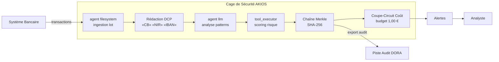

<header class="post-header">
  <div class="post-meta">8 Février 2026 · Ingénierie / Banque · 5 min de lecture</div>
  <h1>IA Sandboxée pour la Banque : Détection de Fraude sans Exposition de Données</h1>
  <div class="post-author">
    
    <span>AJ</span>
  </div>
</header>

<div class="post-content">

Les banques traitent des millions de transactions par jour. L'IA peut détecter des schémas de fraude invisibles à l'œil humain — mais seulement si elle accède aux données transactionnelles. Le problème : **comment donner à un agent IA accès aux enregistrements financiers sans créer une nouvelle surface d'attaque ?**

AKIOS résout cela avec la Cage de Sécurité : un runtime éphémère et sandboxé où l'IA traite les données sous des politiques strictes définies par le code.

## Le Cadre Réglementaire

Les établissements financiers en Europe opèrent sous des cadres réglementaires parmi les plus exigeants au monde :

- **RGPD** — Les données financières personnelles sont protégées. Tout traitement IA doit respecter la minimisation des données, la limitation des finalités et le droit à l'explication.
- **DORA (Digital Operational Resilience Act)** — Entré en vigueur en janvier 2025, il impose aux entités financières la résilience opérationnelle numérique, y compris pour les systèmes IA tiers.
- **EU AI Act** — Les systèmes IA de scoring de crédit et de détection de fraude sont classés haut risque : supervision humaine, audit complet et évaluation de conformité requis.
- **ACPR / AMF** — Les régulateurs français exigent une traçabilité complète des décisions automatisées affectant les clients.

AKIOS applique ces exigences au niveau du runtime — l'agent IA n'opère jamais en dehors du périmètre de conformité.

## Le Flux de Travail : Analyse de Fraude Transactionnelle

1. **Ingestion** : Un lot de transactions est chargé dans la Cage de Sécurité. Les numéros de compte et identifiants personnels sont anonymisés avant que l'IA ne les voie.
2. **La Cage** : AKIOS s'initialise avec la politique bancaire : isolation réseau, budget plafonné à 0,50 € par lot d'analyse, et journalisation d'audit conforme DORA.
3. **Analyse** : L'agent IA sandboxé scanne les schémas transactionnels pour détecter les anomalies — contrôles de vélocité, incohérences géographiques, déviations de montants — en utilisant uniquement des données anonymisées.
4. **Signalement** : Les transactions suspectes sont signalées avec des scores de confiance et des références réglementaires. L'IA ne peut ni modifier ni déplacer de fonds.
5. **Audit** : Chaque inférence, accès aux données et sortie est signé cryptographiquement dans une chaîne Merkle. Les régulateurs peuvent vérifier le chemin de décision complet.

### Architecture



## Pourquoi C'est Important

- **Zéro Exposition de Données** : Les numéros de compte et DCP sont anonymisés avant tout traitement IA. Même si le modèle est compromis, il n'y a rien à fuiter.
- **Décisions Auditables** : Chaque signalement de fraude inclut une chaîne de preuve cryptographique. L'ACPR peut tracer exactement comment une décision a été prise.
- **Conformité DORA** : La résilience opérationnelle est assurée par l'isolation du runtime et les coupe-circuits automatiques.
- **Maîtrise des Coûts** : Les limites budgétaires strictes par lot empêchent les dérapages de coûts API — un vrai sujet quand on scanne des millions de transactions.

## Essayez-le Vous-même

```bash
pip install akios
akios init my-project
akios run templates/file_analysis.yml
```

Sécurisez votre IA. Construisez avec AKIOS.

</div>

<div class="post-footer">
  <a href="./">← Retour aux études de cas</a>
</div>
