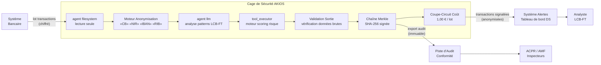

<header class="post-header">
  <div class="post-meta">6 Février 2026 · Ingénierie / Services Financiers · 5 min de lecture</div>
  <h1>Construire une Cage de Sécurité IA Conforme DSP2 pour la Banque en 15 Secondes</h1>
</header>

<div class="post-content">

Le principal obstacle à l'adoption de l'IA dans la banque n'est pas la capacité des modèles, mais la **conformité**. Comment utiliser des LLM puissants comme Grok ou GPT-4 sur des données de transactions clients sans risquer une violation du RGPD ou des obligations LCB-FT ?

La réponse n'est pas d'éviter l'IA, mais de l'enfermer dans une **Cage de Sécurité**.

## Le Problème

Tout responsable conformité bancaire connaît le dilemme : les modèles IA ont besoin de données pour être utiles, mais les données dont ils ont besoin — numéros de compte, IBAN, historiques de transactions — sont exactement celles que la réglementation impose de protéger. Les approches traditionnelles forcent un choix : **utiliser l'IA et accepter le risque**, ou **rester conforme et rester manuel**.

AKIOS élimine ce compromis.

## Le Cadre Réglementaire

Les établissements financiers en Europe opèrent sous des cadres réglementaires parmi les plus exigeants au monde :

<table>
  <thead>
    <tr><th>Réglementation</th><th>Périmètre</th><th>Comment AKIOS l'Applique</th></tr>
  </thead>
  <tbody>
    <tr>
      <td><strong>RGPD</strong></td>
      <td>Protection des données personnelles financières, minimisation, droit à l'explication</td>
      <td>Anonymisation à l'ingestion. L'IA ne voit jamais les identifiants clients bruts.</td>
    </tr>
    <tr>
      <td><strong>DSP2 / DSP3</strong></td>
      <td>Sécurité des données de paiement, accès aux comptes, authentification forte</td>
      <td>Isolation réseau — aucune connexion sortante sauf endpoints autorisés. Données de carte anonymisées avant traitement IA.</td>
    </tr>
    <tr>
      <td><strong>DORA</strong></td>
      <td>Résilience opérationnelle numérique, gestion des risques TIC et tiers</td>
      <td>Sandbox déterministe — même entrée produit toujours même sortie. Pas de dérive du modèle dans la cage.</td>
    </tr>
    <tr>
      <td><strong>LCB-FT (6e Directive)</strong></td>
      <td>Pistes d'audit complètes pour la détection d'activités suspectes</td>
      <td>Chemin de décision complet exporté par lot d'analyse. Chaque signalement inclut sa provenance.</td>
    </tr>
    <tr>
      <td><strong>EU AI Act</strong></td>
      <td>Les systèmes IA de scoring et détection de fraude sont classés haut risque</td>
      <td>Chaîne d'audit Merkle — chaque action IA signée cryptographiquement et immuable.</td>
    </tr>
  </tbody>
</table>

AKIOS applique ces exigences au niveau du runtime — l'agent IA n'opère jamais en dehors du périmètre de conformité.

## Le Concept : La Politique en tant que Code

AKIOS introduit le concept de "Security Cage" (Cage de Sécurité) : un environnement d'exécution éphémère et cloisonné où les données sont traitées selon des politiques strictes définies par le code. Contrairement à la conformité traditionnelle basée sur la documentation et la confiance, la Cage de Sécurité rend les violations **physiquement impossibles** au niveau infrastructure.

## Le Flux de Travail : Analyse Automatisée du Risque LCB-FT

<table>
  <thead>
    <tr><th>Étape</th><th>Ce qui se passe</th><th>Contrôle de sécurité</th></tr>
  </thead>
  <tbody>
    <tr>
      <td><strong>1. Ingestion</strong></td>
      <td>Fichier client brut (NIR, IBAN, numéros de compte) chargé dans la cage</td>
      <td>Données entrées via agent filesystem en lecture seule. Aucune copie hors de la cage.</td>
    </tr>
    <tr>
      <td><strong>2. Anonymisation</strong></td>
      <td>50+ motifs de DCP détectés et masqués avant traitement IA</td>
      <td>IBAN, NIR, numéros de compte remplacés par des jetons. L'original n'atteint jamais le LLM.</td>
    </tr>
    <tr>
      <td><strong>3. Analyse IA</strong></td>
      <td>Le LLM analyse les schémas transactionnels pour les indicateurs de risque LCB-FT</td>
      <td>Budget plafonné (1,00 €/lot), isolation réseau, aucun stockage persistant.</td>
    </tr>
    <tr>
      <td><strong>4. Scoring</strong></td>
      <td>Transactions suspectes signalées avec scores de confiance et références réglementaires</td>
      <td>L'IA ne peut ni modifier ni déplacer de fonds. Sortie en lecture seule uniquement.</td>
    </tr>
    <tr>
      <td><strong>5. Audit</strong></td>
      <td>Chaque octet lu, écrit et transmis journalisé avec empreinte cryptographique</td>
      <td>Chaîne Merkle — si une entrée est altérée, toute la chaîne est invalidée.</td>
    </tr>
  </tbody>
</table>

### Architecture



### Configuration de la Politique

L'ensemble de la posture de conformité est défini dans un seul fichier YAML :

```yaml
# banking-lcbft-policy.yml
security:
  sandbox: strict
  network: isolated
  allowed_endpoints:
    - api-bancaire.interne:443
  pii_redaction:
    enabled: true
    patterns: [carte_bancaire, nir, iban, rib, compte_bancaire]
    mode: aggressive
  budget:
    max_cost_per_run: 1.00
    currency: EUR
  audit:
    merkle_chain: true
    export_format: jsonl
    retention_days: 1825  # 5 ans — exigence LCB-FT
```

## Ce que l'Analyste Voit

À la fin du flux de travail, l'analyste LCB-FT reçoit un rapport structuré :

<table>
  <thead>
    <tr><th>Champ</th><th>Valeur</th></tr>
  </thead>
  <tbody>
    <tr><td>ID Transaction</td><td>TXN-2026-0206-****7832</td></tr>
    <tr><td>Score de Risque</td><td>0,87 / 1,00 (Élevé)</td></tr>
    <tr><td>Schéma Détecté</td><td>Anomalie de vélocité — 14 transactions en 3 minutes dans 4 régions</td></tr>
    <tr><td>Référence Réglementaire</td><td>Art. L561-15 CMF — Déclaration de soupçon Tracfin</td></tr>
    <tr><td>Confiance</td><td>87%</td></tr>
    <tr><td>Hash Audit</td><td><code>a3f8c2...e91d</code></td></tr>
    <tr><td>Données Brutes Exposées</td><td>❌ Aucune — toutes les DCP anonymisées avant analyse</td></tr>
  </tbody>
</table>

Pas de NIR. Pas de numéros de compte. Pas de données brutes. Juste du renseignement actionnable avec une chaîne de preuve cryptographique.

## Pourquoi C'est Important

- **Zéro Exposition de Données** : Les numéros de compte et DCP sont anonymisés avant tout traitement IA. Même si le modèle est compromis, il n'y a rien à fuiter.
- **Décisions Auditables** : Chaque signalement de fraude inclut une chaîne de preuve cryptographique. Les inspecteurs ACPR peuvent tracer exactement comment une décision a été prise.
- **Maîtrise des Coûts** : Des limites de budget strictes par lot empêchent les factures API incontrôlées — une préoccupation réelle lors du scan de millions de transactions.
- **Gestion du Risque Modèle** : Le sandbox empêche l'IA d'agir au-delà de son périmètre. Elle peut signaler, mais elle ne peut ni déplacer de fonds, ni clôturer de comptes, ni modifier d'enregistrements.
- **Rétention d'Audit 5 Ans** : Les logs de la chaîne Merkle sont exportables en format JSONL, conformément à l'exigence de conservation LCB-FT de 5 ans.

## Essayez-le Vous-même

AKIOS est open-source. Vous pouvez exécuter ce flux de travail dès aujourd'hui :

```bash
pip install akios
akios init my-project
akios run templates/file_analysis.yml
```

Sécurisez votre IA. Construisez avec AKIOS.

</div>

<div class="post-footer">
  <p>Connexe : <a href="accounting-security-cage.html">Cage de Sécurité IA Conforme PCG pour la Comptabilité</a> | <a href="healthcare-hipaa-security-cage.html">Cage de Sécurité IA Conforme RGPD pour la Santé</a></p>
  <a href="./">← Retour aux études de cas</a>
</div>
