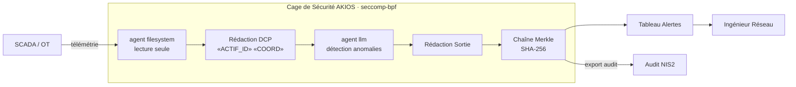

<header class="post-header">
  <div class="post-meta">10 Février 2026 · Ingénierie / Énergie · 5 min de lecture</div>
  <h1>IA pour l'Énergie : Sécuriser les Infrastructures Critiques avec AKIOS</h1>
  <div class="post-author">
    
    <span>AJ</span>
  </div>
</header>

<div class="post-content">

Les opérateurs énergétiques gèrent des réseaux électriques, des pipelines et des installations de production qui desservent des millions de personnes. L'IA peut optimiser l'équilibrage de charge, prédire les pannes d'équipements et détecter les cybermenaces. Le problème : **un agent IA compromis connecté aux systèmes de technologie opérationnelle (OT) pourrait causer des dommages physiques aux infrastructures ou perturber la fourniture d'électricité à des régions entières.**

AKIOS résout cela avec la Cage de Sécurité : un runtime éphémère et sandboxé où l'IA analyse les données du réseau sous des politiques strictes définies par le code — sans accès direct aux systèmes de contrôle.

## Le Cadre Réglementaire

Les opérateurs énergétiques en Europe font face à des exigences de protection parmi les plus strictes :

- **RGPD** — Les données de consommation et les données clients des opérateurs sont des données personnelles. Tout traitement IA doit respecter la minimisation des données et les droits des personnes.
- **EU AI Act** — Les systèmes IA utilisés dans les infrastructures critiques sont classés haut risque : supervision humaine obligatoire, transparence et évaluation de conformité.
- **Directive NIS2** — Depuis octobre 2024, les opérateurs d'importance essentielle (OIE) dans le secteur énergétique doivent implémenter des mesures de cybersécurité renforcées, incluant les systèmes IA.
- **ANSSI / LPM** — L'Agence Nationale de la Sécurité des Systèmes d'Information impose la conformité des opérateurs d'importance vitale (OIV), avec des exigences spécifiques pour les systèmes automatisés.
- **Code de l'énergie** — Obligations de sécurité et de continuité de service pour les réseaux de transport et de distribution d'électricité.

AKIOS applique ces exigences au niveau du runtime — l'agent IA n'opère jamais en dehors du périmètre de conformité.

## Le Flux de Travail : Détection d'Anomalies Réseau

1. **Ingestion** : La télémétrie SCADA et les relevés de capteurs sont chargés dans la Cage de Sécurité. Les identifiants d'actifs, coordonnées géographiques et détails des installations sont abstraits avant que l'IA ne les voie.
2. **La Cage** : AKIOS s'initialise avec la politique énergie : isolation réseau totale des systèmes OT, accès données en lecture seule, aucune capacité d'exécution de commandes, et journalisation d'audit conforme NIS2.
3. **Analyse** : L'agent IA sandboxé analyse les schémas de capteurs pour détecter les anomalies — déséquilibres de charge, signatures de dégradation d'équipements, schémas d'accès inhabituels — en utilisant uniquement de la télémétrie abstraite.
4. **Alerte** : Les anomalies sont classées par sévérité et type avec des scores de confiance. L'IA peut recommander des actions mais ne peut exécuter aucune commande sur les systèmes opérationnels.
5. **Audit** : Chaque inférence, accès aux données et sortie est signé cryptographiquement dans une chaîne Merkle. Les auditeurs ANSSI peuvent vérifier le chemin d'analyse complet.

### Architecture



## Pourquoi C'est Important

- **Séparation OT/IT** : La Cage de Sécurité est complètement isolée des réseaux de technologie opérationnelle. L'IA lit la télémétrie — elle ne peut jamais envoyer de commandes aux systèmes de contrôle.
- **Traitement Sans Persistance** : Les données de capteurs sont traitées dans des conteneurs éphémères détruits après analyse. Aucune donnée réseau n'est jamais stockée, mise en cache ou retenue par le modèle IA.
- **Conformité NIS2 / ANSSI** : La sandbox satisfait les exigences de périmètre de sécurité. Chaque accès aux données est journalisé, chaque sortie signée, chaque session conteneurisée.
- **Sécurité Physique** : Des règles de politique codées en dur empêchent l'IA de générer quoi que ce soit ressemblant à une commande de contrôle. La frontière entre analyse et action est absolue.

## Essayez-le Vous-même

```bash
pip install akios
akios init my-project
akios run templates/file_analysis.yml
```

Sécurisez votre IA. Construisez avec AKIOS.

</div>

<div class="post-footer">
  <a href="./">← Retour aux études de cas</a>
</div>
